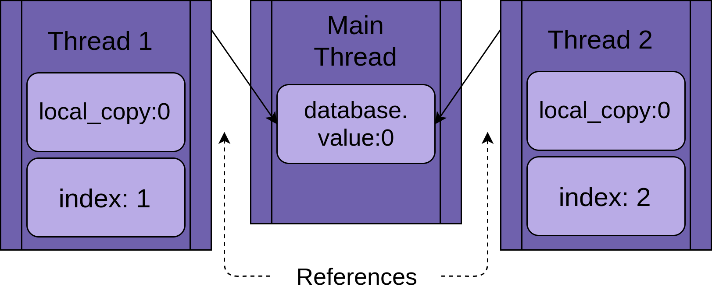
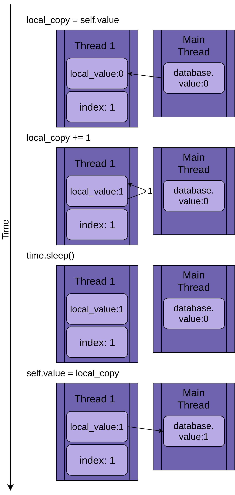
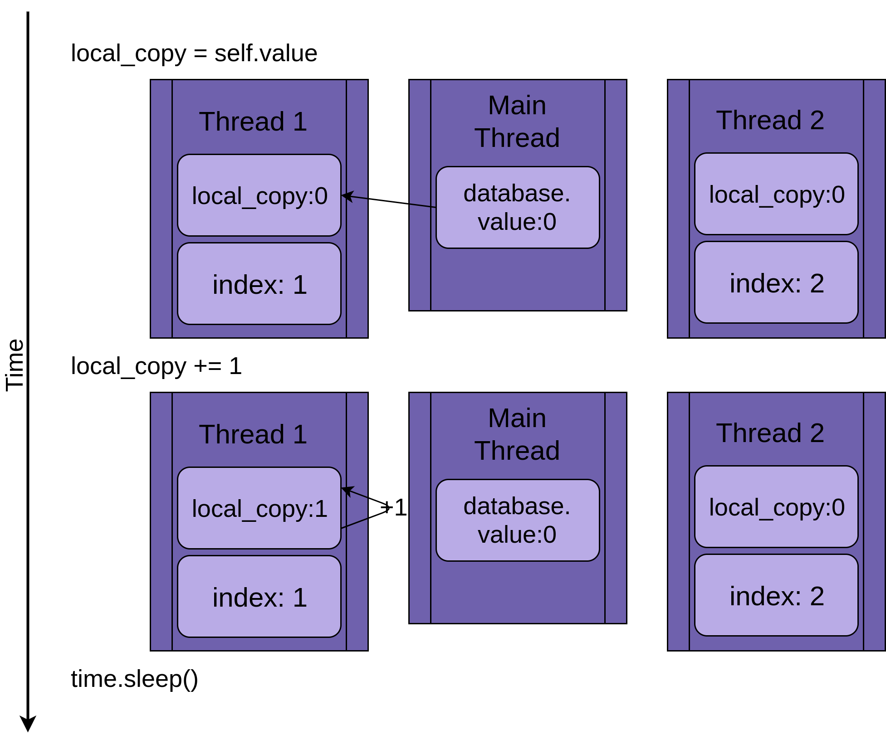
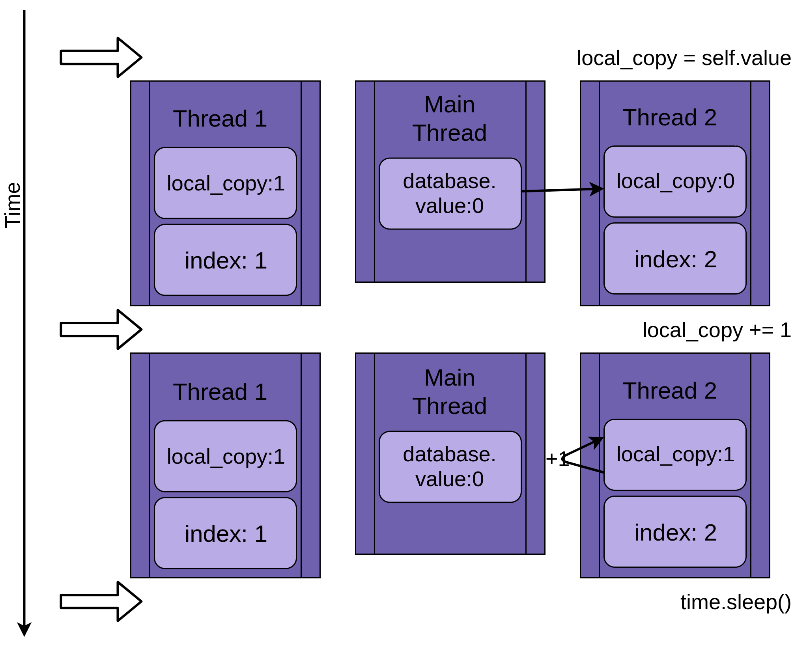
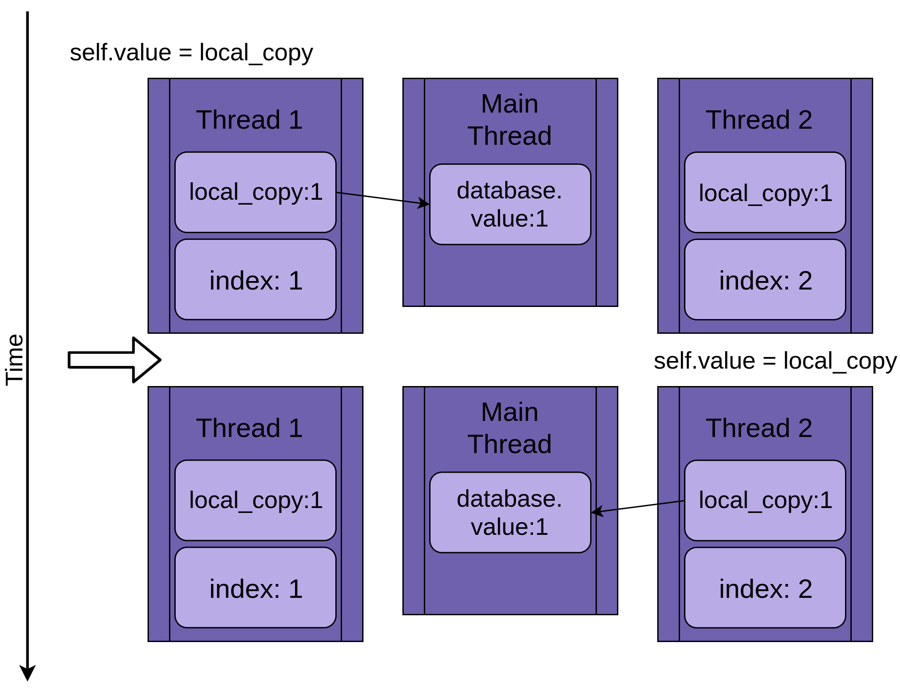

<p align="center">
   
</p>

## Python中的线程

### 目录

- 什么是线程
- 启动线程
  - 守护线程
  - join()一个线程
- 使用多线程
- 使用ThreadPoolExecutor
- 竞态条件
  - 一个线程
  - 两个线程
  - 为什么这不是一个愚蠢的例子
- 使用锁完成基本同步
- 死锁
- 生产者-消费者线程
  - 使用锁的生产者-消费者
  - 使用Queue的生产者-消费者
- 线程对象
  - Semaphore
  - Timer
  - Barrier
- 总结：Python中的线程

Python线程允许同时运行程序的不同部分，并可以简化设计。如果你对Python有一定的经验，并且希望使用线程加快程序的速度，那么本教程就是为你准备的！

在本文中，你将学习到：

- 什么是线程？
- 如何创建线程并等待它们完成
- 如何使用ThreadPoolExecutor
- 如何防止竞态条件
- 如何使用Python线程提供的常用工具

本文假设你已经具有Python基础知识，并且至少使用了3.6版本运行示例。如果你需要复习，可以从[Python Learning Paths](https://realpython.com/learning-paths/)开始，快速进入状况。

如果你不确定是否要使用Python线程，asyncio或multiprocessing，那么你可以查看[Speed Up Your Python Program With Concurrency](https://realpython.com/python-concurrency/)。

### 什么是线程?

线程是一个独立的执行流。这意味着你的程序将同时发生两件事。但是对于大多数Python3实现来说，不同的线程实际上并不是同时执行的:它们只是看起来是同时执行的。

很容易将线程视为在程序上运行两个（或更多）不同的处理器，每个处理器同时执行一项独立的任务。 这几乎是正确的。 线程可能在不同的处理器上运行，但它们一次只运行一个。

同时运行多个任务需要一个非标准的Python实现，用不同的语言编写部分代码，或者使用带有一些额外开销的**multiprocessing**。

由于CPython实现Python的工作方式，线程可能无法加速所有任务。这是因为与[GIL](https://realpython.com/python-gil/)的交互本质上限制了一次运行一个Python线程。

花费大量时间等待外部事件的任务通常是线程化的良好候选者。需要大量CPU计算并且花费很少时间等待外部事件的问题可能根本不会运行得更快。

这适用于用Python编写并运行在使用标准CPython实现的代码。如果线程是用C语言编写的，那么它们就能够释放GIL并同时运行。 如果代码运行在不同的Python实现，请查看文档，了解它如何处理线程。

如果你正在运行标准的Python实现，只使用Python编写，并且遇到计算密集型问题，则应该检查**multiprocessing**模块。

构建程序以使用线程也可以提高设计清晰度。你将在本教程中学习的大多数示例，因为使用线程，它们都不一定会运行得更快。在它们中使用线程有助于使设计更清晰、更容易推理。

那么，让我们停止谈论线程，开始使用它！

### 启动线程

既然你已经知道了线是什么，让我们来学习如何制作一个。Python标准库提供了[threading](https://docs.python.org/3/library/threading.html)，它包含了你将在本文中看到的大部分基本类型。在这个模块中，Thread很好地封装了线程，提供了一个清晰的接口来使用它们。

要启动一个单独的线程，你需要创建一个thread实例，然后告诉它.start()。

```python
import logging
import threading
import time

def thread_function(name):
    logging.info("Thread %s: starting", name)
    time.sleep(2)
    logging.info("Thread %s: finishing", name)

if __name__ == "__main__":
    format = "%(asctime)s: %(message)s"
    logging.basicConfig(format=format, level=logging.INFO,
                        datefmt="%H:%M:%S")

    logging.info("Main    : before creating thread")
    x = threading.Thread(target=thread_function, args=(1,))
    logging.info("Main    : before running thread")
    x.start()
    logging.info("Main    : wait for the thread to finish")
    # x.join()
    logging.info("Main    : all done")
```

如果查看日志语句，可以看到主部分正在创建和启动线程。

```python
x = threading.Thread(target=thread_function, args=(1,))
x.start()
```

创建线程时，将传递一个函数和一个包含该函数参数的列表。在本例中，你告诉线程运行thread_function()并将1作为参数传递。

对于本文，你将使用顺序整数作为线程的名称。有一个threading.get_ident()方法，它为每个线程返回一个惟一的名称，但是这些名称通常既不短也不容易读。

thread_function()本身没有多大作用。它只是记录一些消息，其中包含time.sleep()。

当你按原样运行这个程序时(注释掉第20行)，输出将如下所示：
```shell
$ ./single_thread.py
Main    : before creating thread
Main    : before running thread
Thread 1: starting
Main    : wait for the thread to finish
Main    : all done
Thread 1: finishing
```

您将注意到，线程在代码的主部分完成之后才结束。你将会再次回到这里细究原因，在下一节中讨论神秘的第20行。

### 守护线程

在计算机科学中，[守护进程](https://en.wikipedia.org/wiki/Daemon_(computing))是在后台运行的进程。

Python线程对守护进程具有更具体的含义。程序退出时，守护线程将立即关闭。思考这些定义的一种方法是将守护线程视为在后台运行的线程，而不必担心将其关闭。

如果程序运行的线程不是守护线程，那么程序将等待这些线程完成后再终止。但是，如果线程是守护线程，当程序退出时，无论守护线程是什么状态都会被kill。

让我们更仔细地看一下上面程序的输出。最后两行是有趣的一点。当你运行程序时，你会注意到在__main__打印完*all done*之后和线程完成之前有一个暂停（约2秒）。

这个暂停是Python等待非守护线程完成。当Python程序结束时，关闭过程的一部分是清理线程例程(threading routine)。

如果查看[Python线程的源代码](https://github.com/python/cpython/blob/df5cdc11123a35065bbf1636251447d0bfe789a5/Lib/threading.py#L1263)，你会看到threading._shutdown()遍历所有正在运行的线程，并在没有设置**daemon**标志的每个线程上调用.join()。

所以你的程序等待退出，因为线程本身在睡眠中等待。一旦完成并打印了消息，.join()将返回，程序退出。

通常，这种行为是你想要的，但我们还有其他选择。让我们首先使用守护线程重复该程序。你可以通过更改线程的构造方式，添加**daemon=True**标志来实现这一点：

```python
x = threading.Thread(target=thread_function, args=(1,), daemon=True)
```

现在运行程序，你应该看到以下输出：

```shell
$ ./daemon_thread.py
Main    : before creating thread
Main    : before running thread
Thread 1: starting
Main    : wait for the thread to finish
Main    : all done
```

这里的不同之处在于缺少输出的最后一行。thread_function()没有机会完成。它是一个守护线程，所以当__main__到达其代码的末尾并且程序想要完成时，该守护线程被终止。


### join()线程

守护程序线程很方便，但是当你想等待一个线程停止呢？当你想要这样做而不退出你的程序呢？现在让我们回到你的原始程序，看看第二十条注释掉的内容：

```python
# x.join()
```

要让一个线程等待另一个线程完成，可以调用.join()。如果取消对该行的注释，主线程将暂停并等待线程x完成运行。

你是否使用守护线程或普通线程在代码上测试了此功能?结果证明这无关紧要。如果使用.join()线程，则该语句将一直等待，直到任何一种线程完成。

### 使用多线程

到目前为止，示例代码只使用了两个线程:主线程和一个你通过threading.Thread对象启动的线程。

通常，你会希望启动一些线程，并让它们执行有趣的工作。我们先看一下比较复杂的方法，然后再看比较简单的方法。

启动多线程的较困难的方法是你已经知道的方案：

```python
import logging
import threading
import time

def thread_function(name):
    logging.info("Thread %s: starting", name)
    time.sleep(2)
    logging.info("Thread %s: finishing", name)

if __name__ == "__main__":
    format = "%(asctime)s: %(message)s"
    logging.basicConfig(format=format, level=logging.INFO,
                        datefmt="%H:%M:%S")

    threads = list()
    for index in range(3):
        logging.info("Main    : create and start thread %d.", index)
        x = threading.Thread(target=thread_function, args=(index,))
        threads.append(x)
        x.start()

    for index, thread in enumerate(threads):
        logging.info("Main    : before joining thread %d.", index)
        thread.join()
        logging.info("Main    : thread %d done", index)
```

此代码使用你在上述看到的相同机制来启动线程，创建Thread对象，然后调用.start()。程序保存一个线程对象列表，以便稍后使用.join()等待它们。

多次运行这段代码可能会产生一些有趣的结果。这是我的机器输出的一个例子：

```shell
$ ./multiple_threads.py
Main    : create and start thread 0.
Thread 0: starting
Main    : create and start thread 1.
Thread 1: starting
Main    : create and start thread 2.
Thread 2: starting
Main    : before joining thread 0.
Thread 2: finishing
Thread 1: finishing
Thread 0: finishing
Main    : thread 0 done
Main    : before joining thread 1.
Main    : thread 1 done
Main    : before joining thread 2.
Main    : thread 2 done
```

如果仔细查看输出，你将看到所有三个线程都按照期望的顺序开始，但是在本例中，它们的结束顺序是相反的! 多次运行将产生不同的顺序。查找**Thread x: finishing**的消息，告诉你每个线程何时完成。

线程的运行顺序由操作系统决定，并且很难预测。它可能(也很可能)因运行而异，所以在设计使用线程的算法时需要注意这一点。

幸运的是，Python提供了几个基本类型，稍后你将看到它们，以帮助协调线程并使其一起运行。在此之前，让我们看看如何使管理一组线程变得更容易一些。

### 使用ThreadPoolExecutor

有一种方法比上面看到的方法更容易启动一组线程。它被称为ThreadPoolExecutor，是concurrent.futures(Python 3.2)标准库的一部分。

创建它的最简单方法是通过上下文管理器，使用with语句管理池的创建和销毁。

下面的__main__是使用ThreadPoolExecutor重写的上述示例：

```python
import concurrent.futures

# [rest of code]

if __name__ == "__main__":
    format = "%(asctime)s: %(message)s"
    logging.basicConfig(format=format, level=logging.INFO,
                        datefmt="%H:%M:%S")

    with concurrent.futures.ThreadPoolExecutor(max_workers=3) as executor:
        executor.map(thread_function, range(3))
```

代码创建一个ThreadPoolExecutor作为上下文管理器，告诉它在池中需要多少工作线程。然后，它使用.map()遍历可迭代对象，比如以range(3)为例，将每个对象传递给池中的线程。

with的末尾使ThreadPoolExecutor对池中的每个线程执行.join()。强烈建议在可能的情况下使用ThreadPoolExecutor作为上下文管理器，这样就不会忘记.join()线程。

    注意：使用ThreadPoolExecutor可能会导致一些令人困惑的错误
    例如，如果您调用一个不接受参数的函数，但将参数传入.map()，则线程将抛出异常。
    不幸的是，ThreadPoolExecutor将隐藏该异常，并且(在上面的例子中)程序在没有输出的情况下终止。
    刚开始调试时，这可能会让人很困惑

运行经过修正的示例代码将生成如下所示的输出：

```shell
$ ./executor.py
Thread 0: starting
Thread 1: starting
Thread 2: starting
Thread 1: finishing
Thread 0: finishing
Thread 2: finishing
```

同样，请注意Thread 1是如何在Thread 0之前完成的。线程的调度是由操作系统完成的，并不遵循一个容易理解的计划。

### 竞态条件

在继续介绍Python线程中隐藏的其他一些特性之前，让我们先讨论一下在编写线程程序时会遇到的一个更困难的问题:[竞态条件](https://en.wikipedia.org/wiki/Race_condition)。

一旦了解了竞态条件是什么，并且看到其中一个正在发生，你将继续学习标准库提供的一些基本类型，以防止竞态条件的发生。

当两个或多个线程访问共享的数据或资源时，可能会出现竞争条件。在本例中，你将创建一个每次都会发生的大型竞态条件，但是请注意，大多数竞态条件并没有这么明显。通常情况下，它们很少发生，并且会产生令人困惑的结果。可以想象，这使得调试非常困难。

幸运的是，这种竞态条件每次都会发生，你将详细地浏览一遍以解释发生了什么。

对于本例，你将编写一个更新数据库的类。好吧，实际上并不需要数据库:你只需要伪造它，因为这不是本文的重点。

你的FakeDatabase会有.__init__()和.update()方法。

```python
class FakeDatabase:
    def __init__(self):
        self.value = 0

    def update(self, name):
        logging.info("Thread %s: starting update", name)
        local_copy = self.value
        local_copy += 1
        time.sleep(0.1)
        self.value = local_copy
        logging.info("Thread %s: finishing update", name)
```

FakeDatabase跟踪一个数字:.value。这将是你看到竞态条件的共享数据。

.__init__()只是将.value初始化为0。到目前为止，一切顺利。

.update()看起来有点奇怪。它模拟从数据库中读取值，对其进行一些计算，然后将新值写回数据库。

在这种情况下，从数据库中读取只意味着将.value赋值到本地变量。将本地变量加一，然后再.sleep()。最后，再将本地变量赋值给.value。

以下是你将如何使用此FakeDatabase：

```python
if __name__ == "__main__":
    format = "%(asctime)s: %(message)s"
    logging.basicConfig(format=format, level=logging.INFO,
                        datefmt="%H:%M:%S")

    database = FakeDatabase()
    logging.info("Testing update. Starting value is %d.", database.value)
    with concurrent.futures.ThreadPoolExecutor(max_workers=2) as executor:
        for index in range(2):
            executor.submit(database.update, index)
    logging.info("Testing update. Ending value is %d.", database.value)
```

程序创建了一个包含两个线程的ThreadPoolExecutor，然后在每个线程上调用.submit()，告诉它们运行database.update()。

.submit（）有一个签名，允许将位置和命名参数传递给在线程中运行的函数：

```python
.submit(function, *args, **kwargs)
```

在上面的用法中，index作为第一个也是惟一一个位置参数传递给database.update()。在本文的后面章节中，你可以以类似的方式传递多个参数。

由于每个线程运行.update()，.update()将.value与1相加，所以你可能希望在最后，database.value打印出来的是2。但如果是这样的话，你就不会看到这个例子了。如果运行上面的代码，输出如下所示：

```shell
$ ./racecond.py
Testing unlocked update. Starting value is 0.
Thread 0: starting update
Thread 1: starting update
Thread 0: finishing update
Thread 1: finishing update
Testing unlocked update. Ending value is 1.
```

你可能已经预料到会发生这种情况，但让我们看一下其中的具体细节，因为这将使这个问题的解决方案更容易理解。

#### 一个线程

在使用两个线程深入研究这个问题之前，让我们先后退一步，讨论一下线程如何工作的一些细节。

你不会深入了解这里的所有细节，因为这在这个级别并不重要。我们还将以一种技术上不准确的方式简化一些事情，但会让你对正在发生的事情有正确的认识。

当你告诉ThreadPoolExecutor运行每个线程时，你告诉它运行哪个函数以及传递给它什么参数: executor.submit(database.update, index)。

这样做的结果是池中的每个线程都将调用database.update(index)。注意，database是对__main__中创建的一个FakeDatabase对象的引用。对该对象调用.update()将调用该对象的[实例方法](https://realpython.com/instance-class-and-static-methods-demystified/)。

每个线程都有一个对同一个FakeDatabase对象database的引用。每个线程还将有一个惟一的值index，以使日志语句更易于阅读:



当线程开始运行.update()时，它拥有当前函数所有局部数据的自己版本。对于.update()，就是local_copy。这绝对是一件好事。否则，运行相同函数的两个线程总是会相互混淆。这意味着对函数作用域（或本地）的所有变量都是**线程安全**的。

现在，你可以开始了解如果使用单个线程和单个调用.update（）运行上述程序时会发生的情况。

下图展示了在如果只运行一个线程运行的情况下，.update()的逐步执行情况。语句显示在左侧，后面是一个图表，显示了线程的local_value和共享的database.value的值：



图表的布局是随着时间，从上到下的移动。它在Thread 1创建时开始，在终止时结束。

当Thread 1启动时，FakeDatabase.value是0。方法中的第一行代码local_copy = self.value,，将0赋值给局部变量。接下来，使用local_copy += 1语句递增local_copy的值。可以看到Thread 1中的.value被设置为1。

调用time.sleep()，这会使当前线程暂停，并允许其他线程运行。因为在这个例子中只有一个线程，所以没有效果。

当Thread 1醒来并继续时，它将新值从local_copy赋值到FakeDatabase.value，然后线程就完成了。你可以看到database.value被设置为1。

到目前为止，一切顺利。你运行了一次.update()而且FakeDatabase.value增加到1。

#### 两个线程

回到竞态条件，这两个线程将并发运行，但不是同时运行。它们将各自拥有local_copy的版本，并指向相同的database。正是这个共享database对象导致了这些问题。

程序从Thread 1运行.update()开始：



当Thread 1调用time.sleep()时，它允许另一个线程开始运行。这就是事情变得有趣的地方。

Thread 2启动并执行相同的操作。它还复制database.value到它的私有local_copy，而且这个共享database.value尚未更新：



当Thread 2最终进入休眠时，共享database.value仍然未修改，值还是0，并且local_copy的两个私有版本的值都是1。

Thread 1现在唤醒并保存其local_copy版本然后终止，为Thread 2提供最终运行机会。Thread 2不知道Thread 1在睡眠时运行并更新了database.value，它将其local_copy的版本存储到database.value中，并将其设置为1：



这两个线程交错访问一个共享对象，覆盖彼此的结果。当一个线程释放内存或在另一个线程完成访问之前关闭文件句柄时，可能会出现类似的竞态条件。

#### 为什么这不是一个愚蠢的例子

以上示例旨在确保每次运行程序时都会出现竞争情况。因为操作系统可以随时交换线程，所以可以在读取x的值之后但在写回增量值之前中断x = x + 1之类的语句。

有关这种情况的详细信息非常有趣，但本文其余部分并不需要，因此请随意跳过此隐藏部分。

既然您已经看到了实际的竞态条件，让我们来看看如何解决它们!

### 使用锁完成基本同步

有许多方法可以避免或解决竞争条件。你不会在这里看到所有这些，但有一些经常使用。让我们从Lock开始吧。

要解决上面的竞争条件，你需要找到一种方法，一次只允许一个线程进入代码的 读-修改-写 部分。最常用的方法是Python中的Lock。在其他一些语言中，这个想法被称为mutex。 Mutex来自MUTual EXclusion，这正是Lock所做的。

锁是一种类似于通行证的对象。每次只有一个线程可以拥有锁。任何其他想要锁的线程必须等待，直到锁的所有者放弃它。

完成此任务的基本函数是.acquire()和.release()。一个线程将调用my_lock.acquire()来获取锁。如果锁已被持有，则调用线程将等待它被释放。这里有一点很重要。如果一个线程获得了锁，但从不将它释放，你的程序将被卡住。稍后你会读到更多。

幸运的是，Python的锁也将作为上下文管理器运行，所以你可以在with语句中使用它，并且当with块出于任何原因退出时，它会自动释放。

让我们看看添加了Lock的FakeDatabase。调用函数保持不变：

```python
class FakeDatabase:
    def __init__(self):
        self.value = 0
        self._lock = threading.Lock()

    def locked_update(self, name):
        logging.info("Thread %s: starting update", name)
        logging.debug("Thread %s about to lock", name)
        with self._lock:
            logging.debug("Thread %s has lock", name)
            local_copy = self.value
            local_copy += 1
            time.sleep(0.1)
            self.value = local_copy
            logging.debug("Thread %s about to release lock", name)
        logging.debug("Thread %s after release", name)
        logging.info("Thread %s: finishing update", name)
```

除了添加一些调试日志以便更清楚地查看锁定之外，这里的主要更改是添加一个名为._lock的成员，这是一个threading.Lock()对象。._lock在未锁定状态下初始化，并由with语句锁定和释放。

这里值得注意的是，运行这个函数的线程将一直持有这个锁，直到它完全更新完数据库为止。在本例中，这意味着它将在复制、更新、休眠并将值写回数据库时持有锁。

如果运行此版本并将日志记录设置为警告级别，你将看到：

```shell
$ ./fixrace.py
Testing locked update. Starting value is 0.
Thread 0: starting update
Thread 1: starting update
Thread 0: finishing update
Thread 1: finishing update
Testing locked update. Ending value is 2.
```

看看这个。你的程序终于可以正常工作了。

在__main__中配置日志记录输出后，你可以通过添加此语句将级别设置为DEBUG来打开完整日志记录：

```python
logging.getLogger().setLevel(logging.DEBUG)
```

在打开DEBUG日志的情况下运行这个程序，如下所示：

```shell
$ ./fixrace.py
Testing locked update. Starting value is 0.
Thread 0: starting update
Thread 0 about to lock
Thread 0 has lock
Thread 1: starting update
Thread 1 about to lock
Thread 0 about to release lock
Thread 0 after release
Thread 0: finishing update
Thread 1 has lock
Thread 1 about to release lock
Thread 1 after release
Thread 1: finishing update
Testing locked update. Ending value is 2.
```

在这个输出中，您可以看到Thread 0获得锁，并且在它进入睡眠状态时仍然持有锁。然后Thread 1启动并尝试获取相同的锁。因为线程0仍然持有它，线程1必须等待。这就是Lock提供的互斥。

本文其余部分中的许多示例都将具有WARNING和DEBUG级别日志记录。 我们通常只显示WARNING级别输出，因为DEBUG日志可能非常冗长。在记录日志的情况下试用这些程序并查看它们做了什么。

### 死锁

在继续之前，你应该看看使用锁时的一个常见问题。正如所看到的，如果已经获得了锁，那么对.acquire()的第二个调用将一直等待，直到持有锁的线程调用.release()。你认为运行这段代码时会发生什么：

```python
import threading

l = threading.Lock()
print("before first acquire")
l.acquire()
print("before second acquire")
l.acquire()
print("acquired lock twice")
```

当程序第二次调用l.acquire()时，它会挂起等待Lock被释放。在此示例中，可以通过删除第二个调用来修复死锁，但在以下两个微妙的事情下通常发生死锁：

1. 实现错误,未能正确的释放Lock
2. 设计问题，其中一个工具程序需要由可能具有或不具有锁的函数调用

第一种情况有时会发生，但使用Lock作为上下文管理器会大大减少频率。编写代码时建议尽可能以使用上下文管理器，因为它们有助于避免异常跳过.release()调用的情况。

在某些语言中，设计问题可能有点棘手。值得庆幸的是，Python线程有第二个对象，称为RLock，专为这种情况而设计。它允许一个线程在调用.release()之前多次.acquire()一个RLock。该线程仍然需要调用.release()与调用.acquire()相同的次数，但无论如何都应该这样做。

Lock和RLock是线程编程中用于防止竞态条件的两个基本工具。还有一些以不同方式工作的工具。在查看它们之前，让我们转向一个稍微不同的问题领域。

### 生产者-消费者线程

[生产者-消费者](https://en.wikipedia.org/wiki/Producer%E2%80%93consumer_problem)问题是一个标准的计算机科学问题，用于研究线程或进程同步问题。你将看一下它的一个变体，以了解Python threading模块提供的基本类型。

对于此示例，你将想象一个程序需要从网络读取消息并将其写入磁盘。程序在需要时不会请求消息。它必须监听，当消息到达时接收它们。这些信息不会以固定的速度，而是会以突发的方式发送。程序的这一部分称为生产者。

另一方面，一旦有消息，你需要将其写入数据库。数据库访问速度很慢，但速度足以保持平均消息速度。当一连串的消息进入时，它还不足以跟上。这部分是消费者。

在生产者和消费者之间，您将创建一个**Pipeline**，当了解不同的同步对象时，该**Pipeline**将会发生变化。

这是基本布局。让我们看一下使用Lock的解决方案。它不能很完美地工作，但它是用你已经知道的工具，所以它是一个很好的起点。

#### 使用锁的生产者-消费者

由于这是一篇关于Python线程的文章，而且你刚刚阅读了Lock基本类型，所以让我们尝试使用一个或两个锁的两个线程来解决这个问题。

一般的设计是，有一个producer线程从伪网络中读取消息并将其放入Pipeline中：

```python
import random 

SENTINEL = object()

def producer(pipeline):
    """Pretend we're getting a message from the network."""
    for index in range(10):
        message = random.randint(1, 101)
        logging.info("Producer got message: %s", message)
        pipeline.set_message(message, "Producer")

    # Send a sentinel message to tell consumer we're done
    pipeline.set_message(SENTINEL, "Producer")
```

要生成假消息，producer将获得一个介于1到100之间的随机数。它调用pipeline的.set_message()将其发送给consumer。

生产者还使用SENTINEL值来指示消费者在其发送十个值后停止消费。这有点笨拙，但不要担心，在完成此示例后，你将看到摆脱此SENTINEL值的方法。

pipeline的另一端是消费者：
```python
def consumer(pipeline):
    """Pretend we're saving a number in the database."""
    message = 0
    while message is not SENTINEL:
        message = pipeline.get_message("Consumer")
        if message is not SENTINEL:
            logging.info("Consumer storing message: %s", message)
```

消费者从pipeline中读取一条消息并将其写入一个伪数据库，在本例中，该数据库只是将其打印到显示中。如果它获取了SENTINEL值，它将从函数返回，函数将终止线程。

在查看真正有趣的部分，管道之前，先展示__main__，生成线程的部分：

```python
if __name__ == "__main__":
    format = "%(asctime)s: %(message)s"
    logging.basicConfig(format=format, level=logging.INFO,
                        datefmt="%H:%M:%S")
    # logging.getLogger().setLevel(logging.DEBUG)

    pipeline = Pipeline()
    with concurrent.futures.ThreadPoolExecutor(max_workers=2) as executor:
        executor.submit(producer, pipeline)
        executor.submit(consumer, pipeline)
```

