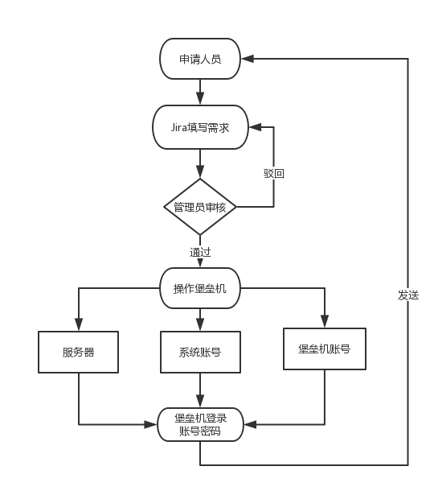
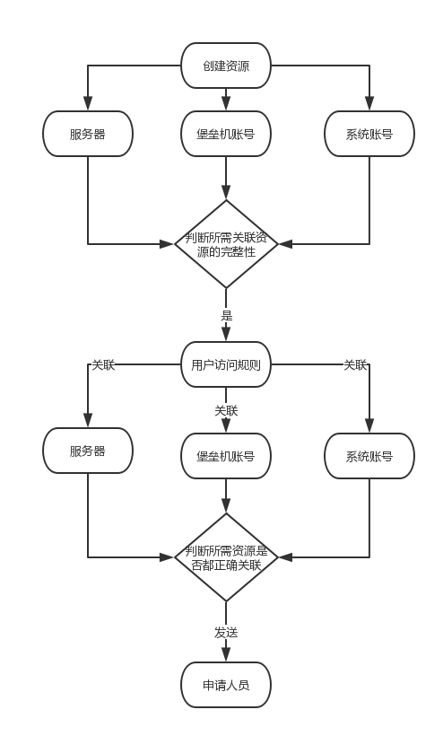

## 章节1：场景分析与需求确认

##### 一：场景  
基于安全考虑，很多服务器是不允许直接登录，如果需要，则要通过堡垒机。
此时，有需求的人员，需要向管理员提供一系列的数据，如服务器的系统账号，服务器的地址，堡垒机登录账号，申请说明等。

大概流程如下：

通过此图，可以发现有两处繁琐的环节：
1. 审核
  - 管理员需要人工去审核申请人员提交的材料，很多情况下无法从字面上获取其关联的业务数据
  - 申请人员提供的材料，可能包含错误，这些为后期的无意义的沟通都埋下了伏笔
  - 申请人员提供的材料，很难归档入库，即使有统一的标准，很难做到强制性

2. 创建资源
  - 管理员需要在各种页面下创建相应的资源，才能在堡垒机中完成一次授权
  - 如果管理员每天操作多次，管理人员很容易疲惫，而且是手工操作，不可避免的会出现错误
  - 不同的管理人员，在创建资源时所遵循的标准也可能不一样，后期维护很麻烦

##### 二：需求
结合堡垒机的API文档与我们的场景，希望能做到以下功能：
  - 统一入口，强制标准，在提交申请之前，已经对数据进行各种审核，避免人为失误
  - 统一在堡垒机中创建资源的标准
  - 简化管理员人工审核（管理员只需要简单的操作，就可以自动化完成后续所有的行为）
  - 所有数据归档入库，为后期的数据维护提供便利

##### 三：分析
对堡垒机的API的阅读：
  - 每一个资源的创建与关联，都是独立的
  - 在为用户授权资源之前，要创建三个列别的资源
  - 资源创建成功后（或者资源已存在）才能关联所需资源

大概流程如下:

##### 四：总结
通过申请流程图与api调用流程图，发现在整个申请流程中，有并行，有串行。
  1. 步骤a完成后才能到步骤b，如果要进行下一步，需要判断所有子操作的结果
  2. 步骤a在向步骤b中，需要同时并行调用几个API（尽管顺序执行理论上可行）

###### 如何合理的设计整个流程，
###### 如何做到解耦与易拓展性，
###### 如何做到跨语言的开发（功能模块与语言独立）
###### 将决定开发的难易度与人员之间的协助性

下一章，我们将介绍如何实现这一切。