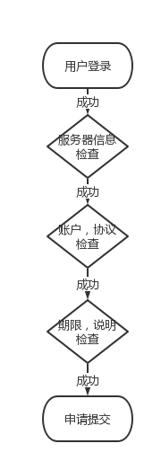

## 章节2：需求详细介绍

上一章节，介绍了人工受理堡垒机申请下的繁琐与业务场景需求分析。

本章节，从繁琐的实际业务场景出发，提取出必需的业务功能并进行简要说明

#### 统一入口  
用户申请的前端入口中，我们使用了wizard（向导）模式，
1. 申请人员信息的确认，申请人员必须登录到管理平台，这样就保证了申请人员信息的准确性；
2. 服务器信息的检查，用户必须填写合法的ip或者hostname，在此步骤中，基于cmdb中的数据，对ip或者hostname做强制性检查；
3. 系统账户，协议等，可以根据用户填写的服务器信息，做出相应的改变，比如windows系统无法选择ssh协议；
4. 授权期限，用户需填写授权期限，这为后期的授权撤回提供数据支持；
5. 申请说明，填写用途，管理员可依据此来审核；

#### 堡垒机中资源创建的标准
 1. 资源标签，由于不再是人工创建，我们可以在调用堡垒机的API时创建资源时，添加更多的说明。
     比如，可以在创建服务器时，添加工单号等来源信息；
 2. 创建规则的标准
 	在堡垒机中创建规则时，将按照统一的标准创建规则id，实现整个链路的跟踪；

#### 简化管理员人工审核
 1. 当用户提交申请后，管理员将收到一封邮件（尽管页面中我们添加了人工审核入口），邮件中包含一个链接（需添加安全检查，例加密链接），管理员只需点击此链接，即可完成审核；
 2. 由于是内部管理平台，不对公网开放，所以，如果管理员下班或者无法连接到公司内网时，我们希望管理员也可以只通过邮件，就可以完成审核。管理员按照指定的格式，回复邮件，后台就可以检测到管理员对此申请做出的审核动作；

#### 数据入库
 - 所有数据按照标准化流程生成，易于归档与使用。
   1. 突破传统堡垒机固有的数据存储格式，从需求出发，自定义数据类型进行存储与归档；
   2. 多维度进行数据统计，满足各项统计指标，促进自动化管理，对外提供数据支持；
 - 解决实际业务场景需求，比如：
   1. 统计某位员工历史申请资源情况与开通权限；
   2. 计算审核人员工作量，评估安全运维岗位工作强度；
   3. 审核人员疏忽或申请信息错误等特殊情况，撤回已授权；

下一章节，将介绍整个实现过程中的架构层选型与设计方案