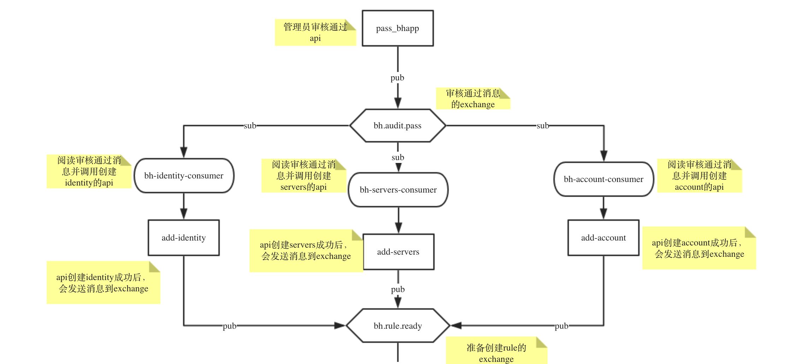
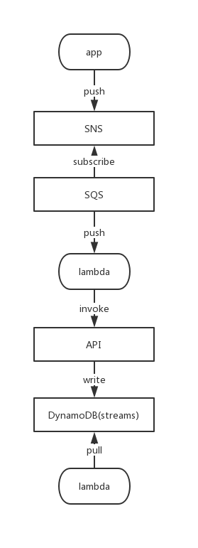

## 章节4：方案实现优化

在上一章节中，我们介绍了流程中核心问题的解决方案。但是，该流程，由于底层基础设施的差异，具体实现可能会有差异。

本章节将介绍具体优化与如何基于底层设施做出做优的选择。

#### 抛弃框架

在上一章节中，应该有读者可能想到，可以使用一些框架来实现业务流程，比如[celery](http://www.celeryproject.org/)，但是，这也同时带来问题：
- 框架是依赖于语言的；比如celery，是使用python，那么我们就不得不使用python语言编写其中某些模块
- 学习成本；学习与掌握一个框架，需要考虑成本
- 可扩展性；由于依赖了某个框架，那么后期的扩展必须都要使用这个框架，提高了后期的维护成本

总之，框架带来了便利，但也会形成依赖。

#### 原子性

[上图](https://www.processon.com/view/link/5c492dbfe4b056ae29fb2676)，有一个问题，当消费者从exchange中消费信息，并调用相应的API，该API在创建相应资源后，必须要发送消息到下一个exchange。
比如：bh-identity-consumer从bh.audit.pass中消费消息，然后调用API：add-identity。API：add-identity在成功添加资源后，需要向exchange：bh.rule.ready发送消息。

此案例中的原子性，就是说成功添加资源与发送消息，必须是原子的，要么同时成功，要么同时失败。

基于公司现有的基础设施与业务场景，可以有以下两种方案：
- 非原子性：在某些业务场景下，我们不一定强制保障该功能的原子性，比如我们成功添加资源，但是并没有发送消息到mq。我们可以为记录添加消息成功发送属性或者标志位，比如用户请求了该API，虽然资源创建成功了，但是并没有成功发送消息到mq。业务维护人员可以定期查看到有哪些记录没有成功发送消息。然后再次向mq发送消息。

- 实现原子性：微服务下的最终一致性，可以通过更成熟的基础设施服务来保障。比如，当用户成功请求API后（在数据库中添加记录），有后台程序会解析数据库记录（比如监控binlog）。如果发现符合场景的记录，则调用响应的脚本，完成消息发送操作。但是这就要求公司必须拥有成熟的基础设施。大家也可以借鉴下AWS的成熟产品，提供了完整与成熟的解决方案，[DynamoDB Streams](https://docs.aws.amazon.com/amazondynamodb/latest/developerguide/Streams.html).

原子性的解决方案有多种，每一种不同的解决方案对开发人员与基础设施都提供了不同的要求，有兴趣的读者可以参考[微服务的事件驱动数据管理](https://github.com/liubq919/microservices-design-deploy_cn/blob/master/chapter5.md)

#### 无服务器
在整个流程图中，用户可以看到我们有很多的consumer从mq中消费消息。consumer是一种时刻监听mq的后台程序，虽然能几乎实时消费消息，但是也带来了资源浪费。如果公司对成本控制比较严格，大家可以考虑使用成熟的方案，比如serverless，当有消息发送到mq中，mq将自动启动消费者（serverless）来消费消息。

serverless支持不同的事件源，通过配合不同的事件源，也能很简单的处理原子性的问题。因此，无论在资源的消耗，还是在架构的实现上，serverless都比传统方案具有更明显的优势。

上图是基于AWS产品与服务实现的架构方案。此方案做到了按照计算收费（而非资源），同样，由于AWS提供了多种事件源，我们也能解决原子性的问题。

通过以上的三点，可以看到有很多细节与点需要优化，如果大家不局限于堡垒机的业务场景，可以思考如何参照成熟的公有云方案，为公司的服务架构提供一定的借鉴。

最后，提供参考资料，由NGINX官方出版的[微服务的设计与部署](https://github.com/liubq919/microservices-design-deploy_cn)电子书（已翻译成中文版）。该书从多个方面完整介绍了微服务的各种优缺点与各种解决方案。有兴趣的读者可以参考下。

## 系列总结
在堡垒机申请的整个系列中，我们从需求讨论，方案探讨，核心问题的解决与架构调优四个方面，完整介绍了该功能的实现。

堡垒机申请，只是公司诸多场景中的一个，但是它包含众多模块，实现相对复杂，对开发人员有一定的要求，同时需要对微服务架构有一定程度的理解与实践。

基于现有基础设施，能否更好地解决公司现有问题，才能衡量实际价值。
