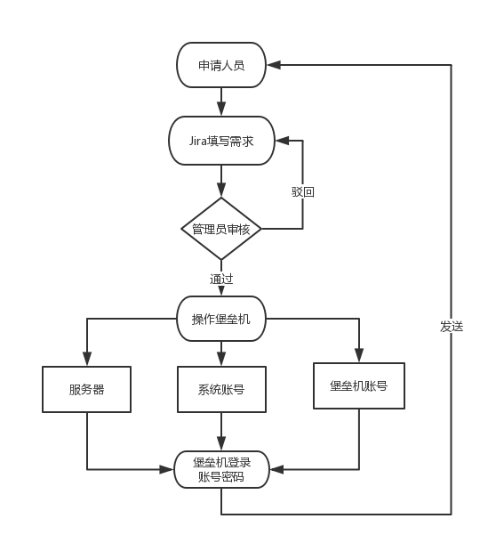
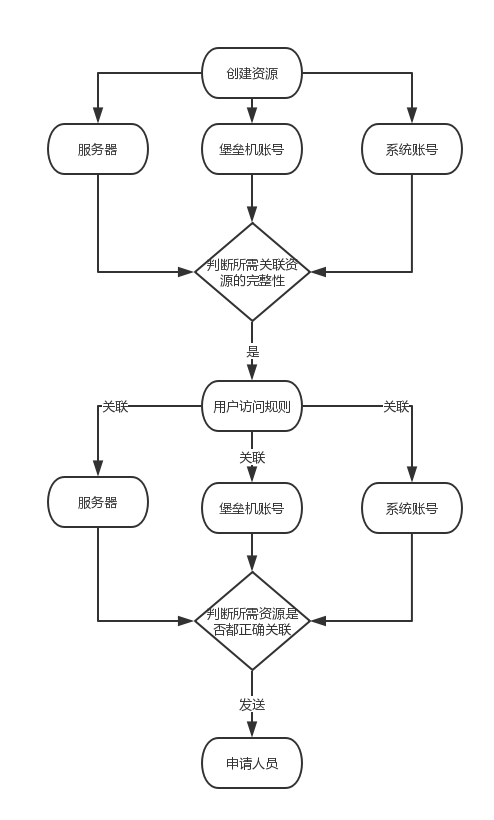

   

 堡垒机自助化申请 

 (一) 

### 在各公司中，资源申请，一直是一个人工参与度高，流程繁琐，审核慢的话题。堡垒机申请，就是其中的一个案例。

> 堡垒机的申请，由于流程或者堡垒机的差异，一个简单的需求，都可能变的十分繁琐。 
> 基于此，我们经过一系列的迭代，完成了基于某堡垒机的自助化申请。 
> 在整个系列中，我将会从需求，分析，开发，优化等环节，逐个讲解我们是如何实现这个降低人工成本的功能。 

#### 本篇是整个系列的第一章节，将介绍在人工受理堡垒机申请下的繁琐与对业务场景需求的分析。

一：场景  
基于安全考虑，很多服务器是不允许直接登录，如果需要，则要通过堡垒机。
此时，有需求的人员，需要向管理员提供一系列的数据，如服务器的系统账号，服务器的地址，堡垒机登录账号，申请说明等。

大概流程如下：

通过此图，可以发现有两处繁琐的环节： 
1:审核
  1. 管理员需要人工去审核申请人员提交的材料，很多情况下无法从字面上获取其关联的业务数据
  2. 申请人员提供的材料，可能包含错误，这些为后期的无意义的沟通都埋下了伏笔
  3. 申请人员提供的材料，很难归档入库，即使有统一的标准，很难做到强制性

2:创建资源
  1. 管理员需要在各种页面下创建相应的资源，才能在堡垒机中完成一次授权
  2. 如果管理员每天操作多次，管理人员很容易疲惫，而且是手工操作，不可避免的会出现错误
  3. 不同的管理人员，在创建资源时所遵循的标准也可能不一样，后期维护很麻烦

二：需求 
结合堡垒机的API文档与我们的场景，希望能做到以下功能：
  1. 统一入口，强制标准，在提交申请之前，已经对数据进行各种审核，避免人为失误
  2. 统一在堡垒机中创建资源的标准
  3. 简化管理员人工审核（管理员只需要简单的操作，就可以自动化完成后续所有的行为）
  4. 所有数据归档入库，为后期的数据维护提供便利

三：分析 
对堡垒机的API的阅读：
  1. 每一个资源的创建与关联，都是独立的
  2. 在为用户授权资源之前，要创建三个列别的资源
  3. 资源创建成功后（或者资源已存在）才能关联所需资源

大概流程如下:

四：总结  
通过申请流程图与api调用流程图，发现在整个申请流程中，有并行，有串行。
  1. 步骤a完成后才能到步骤b，如果要进行下一步，需要判断所有子操作的结果
  2. 步骤a在向步骤b中，需要同时并行调用几个API（尽管顺序执行理论上可行）

如何合理的设计整个流程，
如何做到解耦与易拓展性，
如何做到跨语言的开发（功能模块与语言独立）
将决定开发的难易度与人员之间的协助性

下一章，我们将介绍如何实现这一切。