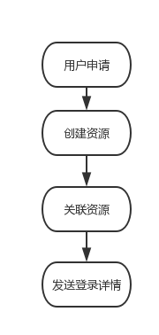
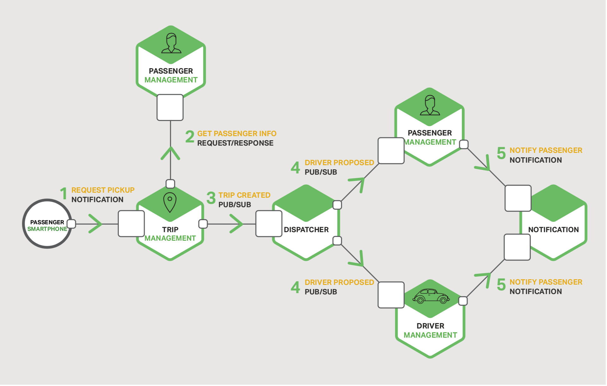

   

 堡垒机自助化申请(二) 

 架构设计讨论 

上一章节，我们讨论了场景与业务需求，在最后，我们也留下了几个小问题。

    如何合理的设计整个流程
    如何做到解耦与易拓展性
    如何做到跨语言的开发（功能模块与语言独立）
    将决定开发的难易度与人员之间的协助性

这一章节，将介绍具体的架构设计。

通过第三方的api文档可以看出，操作任何资源，都是独立的操作，这样，就增加了整个系统服务的数量。大概可以看出，至少有六七个接口。

但是我们可以总结出以下关键的几点：

    一个申请创建的同时，可能需要调用好几个接口
    每一个接口之间，没有直接调用的联系
    在步骤创建资源中的接口，并不关心关联资源中的接口
    创建资源步骤只需要向关联资源步骤发送请求，但两者之间都不关心对方的状态
    整个流程可以是异步的，并不需要一定控制在毫秒级的调用链

实现方案一：

    使用传统，很暴力的实现方式，完全顺序执行：

此方案有几个问题：

1. 编写复杂，任何一个独立的步骤，将需要调用几个接口，调试与编写都变的很麻烦
2. 接口之间，如果用同步实现，很难保证可用性
3. 子操作太粗，比如创建资源中的某个一个操作，创建账号失败，如果想再次创建账号，则需要再重新通过创建资源的流程
4. 拓展性差，如果需要更新某个步骤中的某一个子操作，则需要与同步骤的接口一起调试

实现方案二：

    IPC(Inter-Process Communication)（进程通信）
    （我们借鉴了由Nginx官方发布的关于微服务的文档（后续将提供翻译版））

下图，是实际应用中，一个很好的通过订阅，推送机制，来实现复杂业务场景的例子。

从此图可以看出，

1. 业务逻辑之间，通过推送与订阅的机制来进行消息沟通，一对多，还是一对一，只依赖具体的业务场景
2. 由于划分了众多子步骤，可以允许多语言开发，极大的提高了协作效率
3. 子操作更新，则只需要更新此子操作，而不会影响其他模块、
4. 添加新接口，只需要添加一个订阅，消息的推送方完全不需要关心消费者

看完此实现方案后，大家可以思考下，如何借鉴此方案，基于我们的场景，实现这一套流程。

下一章，将提供我们设计的流程图。