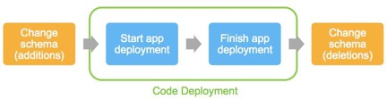

## 数据同步管理和schema更改的最佳实践

跨两个不同环境管理数据同步可能很复杂，具体取决于所使用的数据存储的数量，数据模型的复杂性以及数据一致性要求。

蓝色和绿色环境都需要最新数据：
- 绿色环境需要最新的数据访问，因为它正在成为新的生产环境
- 在回滚的情况下，蓝色环境需要最新的数据，此时生产要么被回滚，要么保持在蓝色环境中。

从广义上讲，可以通过让绿色和蓝色环境共享相同的数据存储来实现此目的。非结构化数据存储，通常更容易在两个环境之间共享，比如Amazon Simple Storage Service（Amazon S3）对象存储，NoSQL数据库和共享文件系统。结构化数据存储，例如关系数据库管理系统（RDBMS），其中数据schema可能在不同的环境中出现差异，通常需要额外的考虑因素。

### schema更新与代码修改间的解耦

一般建议是将schema更改与代码更改分离。这样，关系数据库位于为蓝/绿部署定义的环境边界之外，并在蓝色和绿色环境之间共享。执行schema更改的两种方法经常同时使用。
- 在蓝/绿代码部署之前，先修改schema。数据库更新必须向后兼容，因此旧版本的应用仍然可以与数据进行交互
- 在蓝/绿代码部署之后，最后修改schema。新版本应用中的代码更改必须向后兼容旧版本schema

前一种schema修改方案通常是附加法。在表中添加新字段，添加新实体和关系。如果需要，可以使用触发器或异步流程，基于旧应用版本所执行的数据更改，用数据填充这些新构造。
在开发应用时，需要遵循编码最佳实践，以确保应用可以容忍当前表中存在其它字段，即使它们未被使用。当读取表行值并将其映射到源代码结构（对象，数组哈希等）时，代码应忽略无法映射的字段，而不是导致应用运行时错误。

前一种schema修改方案通常是删除法。删除不需要的字段，实体和关系，或合并和联合它们。到目前为止，旧版本应用已不再可用。

以这种方式管理schema更改会增加风险：schema修改过程中的失败会影响生产环境。由于没有遵循最佳实践或新应用版本仍然依赖于代码中某个已删除字段的无文档化问题，添加的更改可能会导致旧应用崩溃。为了适当降低风险，此模式非常强调预部署软件生命周期步骤。确保拥有强大的测试阶段和框架以及强大的QA阶段。在推出生产之前，在测试环境中执行部署有助于尽早识别这些问题。