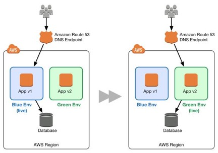

## 介绍

在传统的应用部署方法中，通常通过重新部署较旧的，稳定版本的应用来修复失败的部署。由于需要配置额外资源的成本和工作量，传统数据中心的重新部署通常在同一组资源上完成。虽然这种方法有效，但它有许多缺点。回滚并不容易，因为它是通过从头开始重新部署旧版本来实现的。此过程需要时间，使应用程序可能长时间不可用。甚至应用只有受损的情况下，覆盖错误版本的回滚才被需要。结果，没有机会调试错误的应用程序。

践行AWS平台的敏捷性，可伸缩性，公共设施消耗和自动化功能的原则可以改变应用程序部署的范式。这样可以实现更好的部署方法，即蓝/绿部署。

### 蓝绿部署方法论

蓝/绿部署提供接近零停机时间的发布和回滚功能。蓝/绿部署背后的基本思想是在运行不同版本应用的两个相同环境之间转移流量。蓝色环境代表服务于生产流量的当前应用程序版本。与此同时，绿色环境是即将服务的环境，运行另一个版本的应用。绿色环境准备就绪并经过测试后，生产流量将从蓝色重定向到绿色。如果发现任何问题，可以通过将流量恢复到蓝色环境以实现回滚。

  

图1: 基本的蓝色/绿色示例  

虽然蓝/绿部署不是一个新概念，由于配置其他资源所需的成本和工作量，通常不会在传统的本地托管环境中看到它。云计算的出现极大地改变了采用蓝/绿方法部署软件的简单性和成本效益。

### 蓝/绿的优点
传统上，通过就地升级，很难在生产部署中验证新的应用版本的同时还能继续运行旧版本的应用。蓝/绿部署在蓝和绿应用环境之间提供了一定程度的隔离。它保证创建的平行绿色环境不会影响支撑蓝色环境的资源。这种隔离降低了部署的风险。

在部署完绿色环境之后，你有机会对其进行验证。在将生产流量发送到绿色环境之前，可以通过测试流量或者使用一小部分的生产流量来验证绿色环境，以更好的反映实际用户的流量。这种方法称为金丝雀分析或者金丝雀测试。即使发现绿色环境没有达到预期，这一切也不会对蓝色环境有什么影响。可以将流量重新返回蓝色环境，最小化受损操作或停机时间，限制影响的冲击半径。

这种简单地将流量回滚到仍然运行的蓝色环境的能力是蓝/绿部署的主要优势。可以在部署过程中随时回滚到蓝色环境。由于影响仅限于绿色环境问题检测和流量转移回蓝色环境之间的时间窗口，因此受损操作或停机时间能做到最小化。此外，影响仅限于流向绿色环境的流量，而不是所有流量。如果部署错误的冲击半径降低了，则整体部署风险也会降低。

蓝/绿部署也适用于持续集成和持续部署（CI / CD）工作流，在许多情况下限制了它们的复杂性。部署自动化必须考虑对现有环境，状态或配置的较少依赖性。新绿色环境将部署到一组全新的资源上。

在AWS中，蓝色/绿色部署还提供成本优化优势。不需要依赖于相同的底层资源。因此，如果应用程序的性能范围从一个版本更改为另一个版本，则只需启动有优化资源的新环境，无论是更少的资源还是仅仅是不同的计算资源。也不必长时间运行过度配置的体系结构。在部署过程中，随着更多流量被发送到绿色环境，可以扩展绿色环境，同时，蓝色环境会收到较少的流量，可以缩减蓝色环境。一旦部署成功，可以退役蓝色环境，不再需要为蓝色环境的资源付费。

### 定义环境边界
在规划蓝/绿部署时，必须考虑环境边界 - 哪里有变更，哪些需要部署以实现这些变更。环境边界受许多因素的影响，如下表所述。

|    因素         | 准则 |
| ----------- | ----------- |
| 应用架构    | 依赖性，松/紧耦合   |
| 组织结构    | 迭代的速度和次数 |
| 风险和复杂性 | 冲击半径和部署失败的影响   |
| 人员       | 团队的专长 |
| 流程       | 测试/QA，回滚能力   |
| 成本      | 运营预算，额外资源 |

表格1: 影响环境边界的因素

例如，运行基于微服务架构模式的应用程序的组织可能具有较小的环境边界，因为各个服务之间存在松散耦合和明确定义的接口。运行传统的巨石应用的组织仍然可以利用蓝/绿部署，但环境范围可能更宽泛，测试更广泛。无论环境边界如何，都应该尽可能利用自动化来简化流程，减少人为错误并控制成本。

