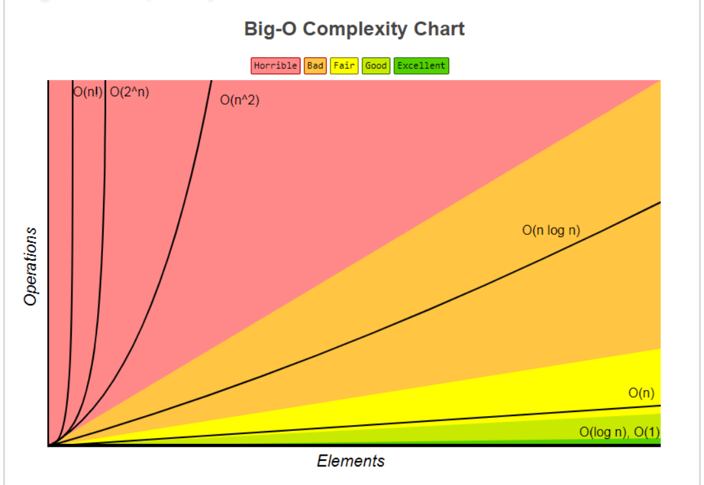
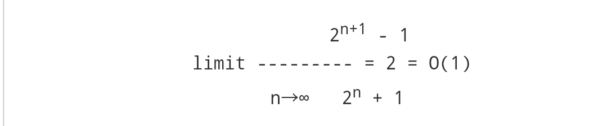

## Time Complexity

### Introduction

Algorithmetic time complexity is caoncerned about how fast or slow particular algorithm performs. We define complexity as a numberical function T(n) - time versus the input size **n**. A given algorithm will take different amounts of time on the same inputs depending on such factors as: processor speed; instruction set, disk speed, brand of compiler and etc.

The way around is to estimate efficiency of each algorithm **asymptotically**. We will measure time **T(n)** as the number of elementary **steps**(defined in any way), provided each such step takes contant time.

### Asymptotic Notations

The goal of computional complexity is to classify algorithms according to their performance. We will represent the time function T(n) using the "big-O" notation to express an algorithm runtime complexity. For example, the statement T(n) = O(n^2) says that an algorithm has a quadratic time complexity.

Definition of "big-O"

Big O specifically describe the **worst-case scenario**, and can be used to describe the execution time required or the space used(e.g in memory of on disk) by an algorithm.

Examples:

    1 = O(n)
    n = O(n2)
    log(n) = O(n)
    2 n + 1 = O(n)

#### Big-O Complexity Chart



##### Constant Time: O(1)

An algorithm is said to run in constant time if it requires the same amount of time regardless of the input size.

```java
boolean isFirstElementNull(List<String> elements) {
    return elements[0] == null;
}
```

Examples:
- array: accessing any element
- fixed-size stack: push and pop methods
- fixed-size queue: enqueue and dequeue methods

##### Linear Time: O(n)

An algorithm is said to run in linear time if its time execution is directly proportional to the input size, i.e. time grows linearly as input size increases.

In the following example, a matching string could be found during any iteration of the for loop and the function would return early, but Big O notation will always assume the upper limit where the algorithm will perform the maximum number of iterations.

```java
boolean containsValue(List<String> elements, String value)
{
    for(String element : elements) {
        if (element == value) return true;
    }
    return false;
}
```

Examples:
- array: linear search, traversing, find minimum
- ArrayList: contains method
- queue: contains method

##### Logarithmic Time: O(log n)

An algorithm is said to run in logarithmic time if its time execution is proportional to the logarithm of the input size.

```java
// Java implementation of recursive Binary Search
int binarySearch(int arr[], int l, int r, int x) {
    if (r>=l) {
        int mid = l + (r - l)/2;
        if (arr[mid] == x)
           return mid;
         // If element is smaller than mid, then it can only
        // be present in left subarray
        if (arr[mid] > x)
           return binarySearch(arr, l, mid-1, x);
         // Else the element can only be present in right
        // subarray
        return binarySearch(arr, mid+1, r, x);
    }
     // We reach here when element is not present in array
    return -1;
}
```

Example:
 - binary search

##### Quadratic Time: O(n2)

An algorithm is said to run in logarithmic time if its time execution is proportional to the square of the input size.

This is common with algorithms that involve nested iterations over the data set. Deeper nested iterations will result in O(N3), O(N4) etc.

```java
boolean containsDuplicates(List<String> elements) {
    for (int outer = 0; outer < elements.size(); outer++) {
        for (int inner = 0; inner < elements.size(); inner++) {
            // Don't compare with self
            if (outer == inner) continue;

            if (elements[outer] == elements[inner]) return true;
        }
    }

    return false;
}
```

Examples:
- bubble sort, selection sort, insertion sort

##### Exponential Time: O(2n)

O(2N) denotes an algorithm whose growth doubles with each addition to the input data set. The growth curve of an O(2N) function is exponential - starting off very shallow, then rising meteorically. An example of an O(2N) function is the recursive calculation of Fibonacci numbers:

```java
int fibonacci(int number) {
    if (number <= 1) return number;
    return fibonacci(number - 2) + fibonacci(number - 1);
}
```

##### Definition of "big Omega"

We need the notation for the **lower bound** i.e the **best-case scenario**. A capital omega Ω notation is used in this case.
Examples
- n = Ω(1)
- n^2 = Ω(n)
- n^2 = Ω(n log(n))
- 2 n + 1 = O(n)

##### Definition of "big Theta"

This is used to measure **average-case** complexity of a particular algorithm, i.e.to find the **upper and lower bounds**. Examples
2 n = Θ(n)
n^2 + 2 n + 1 = Θ(n^2)

##### Analysis of Algorithms

The term analysis of algorithms is used to describe approaches to the study of the performance of algorithms. In this course we will perform the following types of analysis:

- the **worst-case runtime complexity** of the algorithm is the function defined by the maximum number of steps taken on any instance of size a.
- the **best-case runtime complexity** of the algorithm is the function defined by the minimum number of steps taken on any instance of size a.
- the **average case runtime complexity** of the algorithm is the function defined by an average number of steps taken on any instance of size a.
- the **amortized runtime complexity** of the algorithm is the function defined by a sequence of operations applied to the input of size a and averaged over time.

**Example**. Let us consider an algorithm of sequential searching in an array.of size n.

- Its **worst-case runtime complexity** is O(n) 
- Its **best-case runtime complexity** is O(1) 
- Its **average case runtime complexity** is O(n/2)=O(n)

#### Amortized Time Complexity

Consider a dynamic array stack. In this model push() will double up the array size if there is no enough space. Since copying arrays cannot be performed in constant time, we say that push is also cannot be done in constant time. In this section, we will show that push() takes amortized constant time.

Let us count the number of copying operations needed to do a sequence of pushes.

|  push() |  copy  |  old array size |  new array size |
| --------| ------ | --------------- | --------------- |
|    1    |   0    |        1        |        -        |
|    2    |   1    |        1        |        2        |
|    3    |   2    |        2        |        4        |
|    4    |   0    |        4        |        -        |
|    5    |   4    |        4        |        8        |
|    6    |   0    |        8        |        -        |
|    7    |   0    |        8        |        -        |
|    8    |   0    |        8        |        -        |
|    9    |   8    |        8        |        16       |

We see that 3 pushes requires 2 + 1 = 3 copies.

We see that 5 pushes requires 4 + 2 + 1 = 7 copies.

We see that 9 pushes requires 8 + 4 + 2 + 1 = 15 copies.

In general, 2n+1 pushes requires 2n + 2n-1+ ... + 2 + 1 = 2n+1 - 1 copies.

Asymptotically speaking, the number of copies is about the same as the number of pushes.



We say that the algorithm runs at amortized constant time.