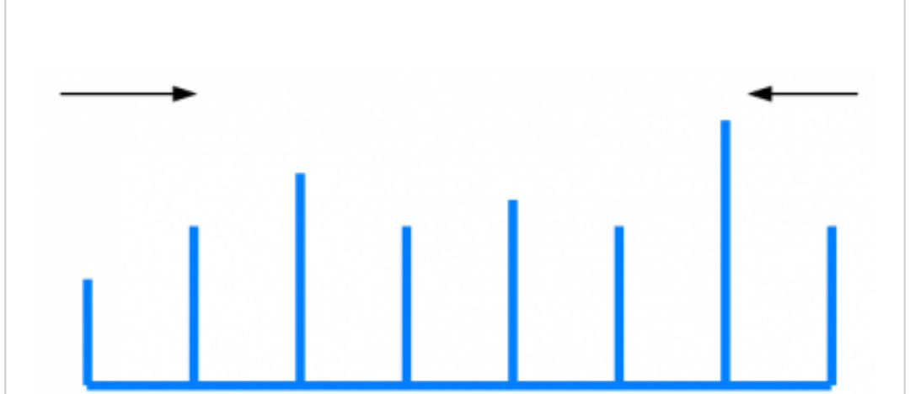

Problem:  
Given a non-negative integers a1, a2, ..., an, where each represents a point at coordinate(i, ai). n verticals lines are drawn such that the two endpoints of lines i is at (i, ai) and (i, 0). Find two lines, which together with x-axis forms a container, such that the container contains the most water.

Note: You may not slant the container and n is at least 2.

Program structure:
```java
public class Solution{
    public int maxArea(int[ height]) {

    }
}
```

Solution:  
AKA, the general idea to find some max is to go through all cases where max value can possibly occur and keep updating the max value. The efficiency of the scan depends on the size of cases you plan to scan.

To increase efficiency, all we need to do is to find a smart way of can to cut off the useless cases and meanwhile 100* guarantee the max calue can be reached through the rest of class.

In this problem, the smart way is to set tow pointers initialized at both ends of the array. Every time move the smaller value pointer to inner array. Then after the two pointers meet, all possible max cases have been scanned and the max sistuation is 100% reached somewhere in the can. Following is a brief prove of this.

Given a1, a2, a3 ...an as input array. Lets assume a10 and a20 are the max area situation. We need to prove that a10 can be reached by left pointer and udring the time left pointer stays at a10, a20 can be rache by right pointer. That is to say, the core problem is to prove: when left pointer is at a10 and right pointer ai at a21, the nex move must be right pointer to a20.

 Since we are always moving the pointer with the small value, i.e if a10 > a21, we should move pointer at a21 to a20, as we hope. Why a10> a21? Beacase if a21 > a10, the area of a10 and a20 must by less athe area of a10 and a21. Because the area of a10 and a21 is at most height[a10] * (20 - 10). So there is a contradiction of assumption at a10 and a 20 has the max area. So, a10 must be greater than a21, then next move a21 has to be move to a20. The max cases must be reached.

 

 ```java
 public class Solution {

     public int maxArea(int[] height) {

        int left = 0, right = height.length -1;
        int maxArea = 0;

        while (left < right) {

            maxArea = Math.max(maxArea, Math.min(height[left], height[right]) * (right - left));

            if (height[left] < height[right])
                left++;
            else
                right--;
        }

        return maxArea;  
     }
 }
 ```

Time Complexity: O(N)
this solution runs is O(N) the complexity where N is the size of the array. 

Space Complexity: O(1)
This algorithm uses a contant extra space.

Difficulty: Medium