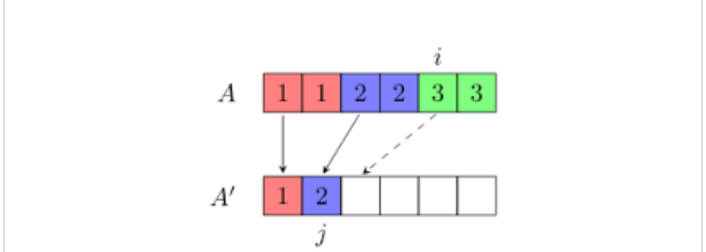

Problem:

Given a sorted array, remove the duplciated in place such that each element appear only once and return the new length.

Do not allocate extra space for another array, you must od this in place with constant memory.

For exapmle,
Given input array nums = [1, 1, 2].

Your function should return length =2, with the first tow elements of nums being 1 and 2 respectively. It does not matter what you leave beyond the new length.

Program structure:
```java
public class Solution {
    public int removeDuplicates(int[] nums) {

    }
}
```

Soltion

Since we have a sorted array in hand we can solve this problem by iterating through the array element in one pass. We need to have two indices(fast and slow) and iterate through the array elements to check if the elements pointed by the indices are same. If different, replace the slow index value with the fast index value. If the values are same, skip it and move to the fast index to the next element, return the slow + 1 value as the number of elements in the resulting array.



```java
public class Solution{

    public int removeDuplicates(int[] A) {

        /* handle empty list */
        if ( A.length == 0 )
            return 0;

        int j = 0;
        for (int i = 1; i < A.length; i++) {
            if (A[i] != A[j])
                A[++j] = A[i];
        }

        return ++j;
    }
}
```

Time Complexity: O(N)

This solution runs in O(N) time complexity where N is the size of the array.

Space complexity: O(1)

This algorithm user a constant extra space.