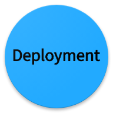

   

部署策略，一直是一个很重要的课题。从web时代，就一直存在。但是近十年，由于公有云的普及与微服务架构模式的流行，部署策略不仅诞生了很多新的概念，对人员的技术要求也发生了很大的改变。

传统的IDC时代，由于业务量少，工具相对单一，管理员可能更关注业务的可用性。

到了公有云时代，由于微服务变的及其庞大，架构更加复杂，管理人员不仅仅需要熟练掌握相应的工具，更要熟知公司当前的整体架构。此时，只考虑业务可用性，可能已经不能完全符合业务场景的需求：
- 产生的账单 - 每一种发布模式所消耗的资源
- 对目标用户的影响 - 能否精确定位到用户
- 回滚时间 - 如果发生异常，需要多长时间才能回滚
- 服务不可用时间 - 是否影响业务连续性

管理员综合考虑才能做出最符合当前场景下的方案。

同样，应用运行的载体，有虚拟机，也有容器。在每一种载体下，实现相应的部署策略，都有差异，管理人员都必须熟练掌握。

[DevOps Engineering on AWS](https://aws.amazon.com/training/course-descriptions/devops-engineering/)，其整个课程体系对于在AWS下的Devops做出了详细的介绍与实践。同样，[AWS Certified DevOps Engineer - Professional](https://aws.amazon.com/certification/certified-devops-engineer-professional/)的考试中，对于[发布策略与自动化实现](https://d1.awsstatic.com/training-and-certification/docs-devops-pro/AWS_certified_devops_engineer_professional_blueprint.pdf)的考核，也占据了55%，看来发布策略与自动化实现是一个合格的Devops人员必须要掌握的技能了。

|           Domain             |             % of Examination            |
| --------------------------| ---------------------------- |
| Domain 1: Continuous Delivery and Process Automation     |  55%|
| Domain 2: Monitoring, Metrics, and Logging      |  20%|
| Domain 3: Security, Governance, and Validation      |  10%|
| Domain 4: High Availability and Elasticity     |  15%|
| TOTAL      |  100%|

本系列，将借鉴AWS的Devops培训方案与在工作中对kubernetes的实践，将在每一个策略下，阐述每一个实现方案的细节，以及综合维度下的各种对比，给读者一个综合的参考。

注：本系列所使用的平台  

|   运行载体  |     平台  |
| -----------| ----------|
| 虚拟机 |   AWS（EC2）   |
| 容器 |  Kubernetes |

##### [1: 就地部署(In-Place Deployment)](in_place/in_place_deployment.md)
##### [2: 滚动部署(Rolling Deployment)](rolling/rolling_deployment.md)
##### [3: 蓝绿部署(Blue/Green Deployment)](blue_green/blue_green_deployment.md)
##### [4: 重建部署(Recreate Deployment)](recreate/recreate_deployment.md)
##### [5: 红黑部署(Red/Black Deployment)](red_black/red_black_deployment.md)
##### [6: 金丝雀部署(Canary Deployment)](canary/canary_deployment.md)
##### [7: 不可变/用完及丢弃部署(Immutable/Disposable Deployment)](immutable_disposable/immutable_disposable_deployment.md)
##### [8: A/B部署(A/B Deployment)](a_b/a_b_deployment.md)

#### 综合比较

|部署方案| 部署速度 |  资源消耗  | Downtime  | 回滚时间  | 对用户的负面影响| 目标用户|
|-------| -------| ---------| --------| --------| --------|--------|
| 就地部署 | :sun_with_face: :sun_with_face: :sun_with_face: :sun_with_face: :sun_with_face: |  :sun_with_face:   | :o:   | :sun_with_face: | :o:  | :x: | 
| 滚动部署 | :sun_with_face: :sun_with_face:  |  :sun_with_face:   | :x:   | :sun_with_face: :sun_with_face: :sun_with_face: | :x: | :x:|
| 蓝绿部署 | :sun_with_face: :sun_with_face: :sun_with_face:  |  :sun_with_face: :sun_with_face: | :x:   | :sun_with_face: | :x: | :x: |
| 重建部署 | :sun_with_face: :sun_with_face: :sun_with_face: :sun_with_face: :sun_with_face: |  :sun_with_face: | :o:  | :sun_with_face: :sun_with_face: | :o: | :x: |
| 红黑部署 | :sun_with_face: :sun_with_face: :sun_with_face:  |  :sun_with_face: :sun_with_face: :sun_with_face:   | :x:   | :sun_with_face: | :x: | :x: |
| 金丝雀部署 | :sun_with_face: :sun_with_face: :sun_with_face:  |  :sun_with_face: :sun_with_face: | :x:   | :sun_with_face: | :x: | :x: |
| 不可变/用完及丢弃部署 | :sun_with_face: |  :sun_with_face: :sun_with_face:| :x: | :sun_with_face: :sun_with_face: :sun_with_face:| :x: | :x: |
| A/B部署 | :sun_with_face: :sun_with_face: :sun_with_face:  |  :sun_with_face: :sun_with_face:  | :x:   | :sun_with_face:  | :x: | :o: |
