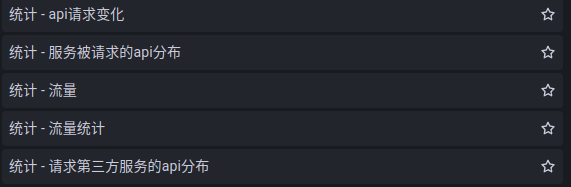
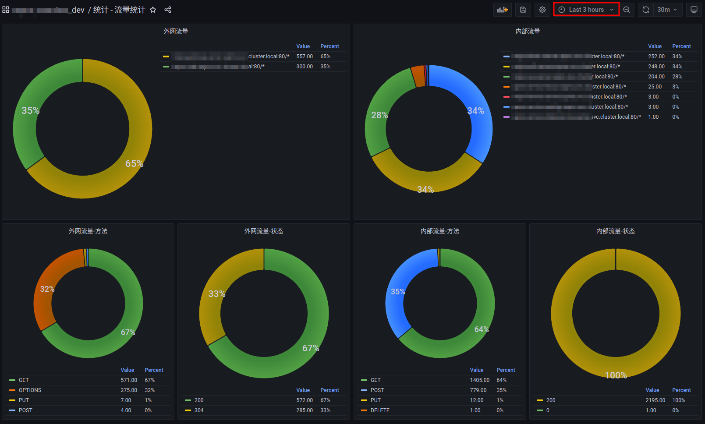
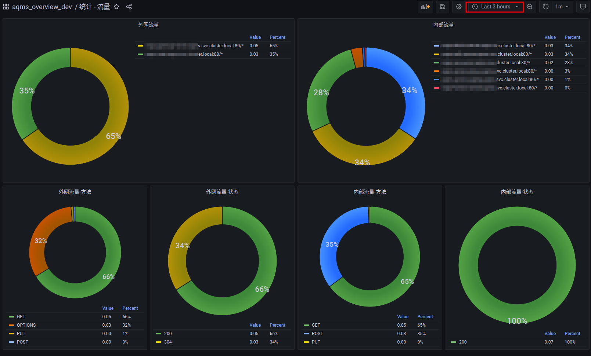
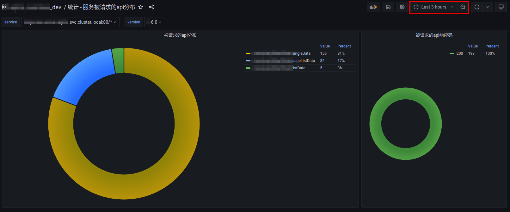
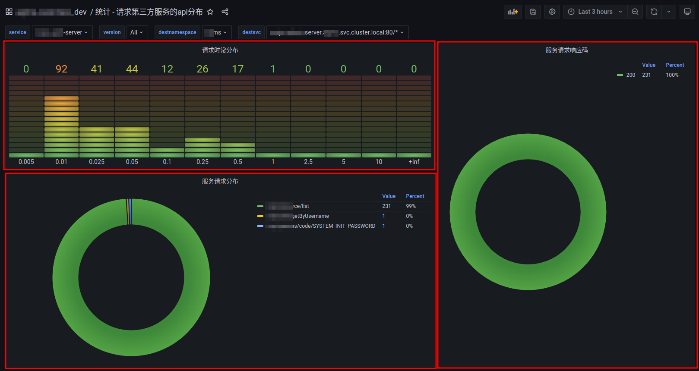

## 业务团队

### 功能概览

   

#### 流量与流量统计
    时间范围内的访问总量

   

    
    时间范围内的每秒访问次数

   

通过上图，可以看出过去的**三个小时**内，通过***外网访问***与***内网访问***流量的概览以及***状态码***与***请求方法***的分布

#### 服务被请求的api分布
    时间范围内的单个服务的具体版本

   

通过上图，可以看出过去的**三个小时**内，该服务被访问的api的分布以及响应码

#### 请求第三方服务的api分布
    时间范围内的单个服务请求外部服务的分布

   

通过上图，可以看出过去的**三个小时**内，当前服务请求第三方服务具体api的分布，响应时长分布以及响应码
