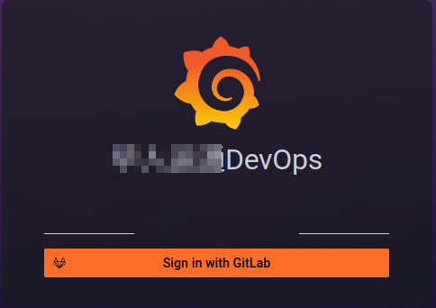

## 平台工程

当下，很多公司使用云原生作为其架构，云原生作为当下各公司的新一代基建，将上一个时代大家很难获取的众多能力进行沉淀，赋能基建，以标准化的服务提供给各个组织，使公司更能聚焦于业务价值。  

在实现云原生的道路上，很多公司采用了容器集群管理(kubernetes)，服务网格(istio)，监控(prometheus, victoriametrics), 数据展示(grafana)等平台。 云原生的项目虽然带来了众多便利，但是在将各平台与工具中所产生的各类型数据服务于各团队与部门上，却变得异常艰难。  

数据的爆炸式增长，管理理念的停滞，各团队对数据维度要求的不同，平台分散，沟通渠道少，信息不对称带来的频繁低成本会议，冗余无效的流程等，给团队管理与部门协调带来了诸多障碍。  

在过去的几年中 ，一直在思考什么样的平台可以解决上述问题，学习成本低，数据关联度高，在后续的文章中，将通过各大板块阐述对devops云原生一体化平台的思考与实践。  

1. [发布平台](deployment_platform/README.md) - 全自研，将服务运营载体与代码解耦，可扩展性强，灵活支持各种发布模式
2. [服务运营状态分析平台](tracing_platform/README.md) - 全自研，基于isito基础数据，支持链路跟踪，上下游数据报文复现，与日志平台的对接，对平台运营状态从宏观到微观的各维度数据展示
3. [日志平台](logging/README.md) - 半自研，基于社区loki设计思想，简化其功能，对接服务运营状态分析平台，多维度检索日志，快速定位日志与数据重现

## 一体化平台工程
    一个完善的DevOps平台，往往要包括多个功能，链路跟踪，日志，监控，业务等等。  
    传统方案中，每一个子功能划分为一个独立的平台
    一： 学习成本高，维护成本高
    二： 多平台下，数据关联度低下，微服务下，如果想精确的查出问题，往往需要查看多个平台的数据，联合会诊才能定位

秉持着一体化平台思维，我们基于社区的[Grafana](https://grafana.com/)，对其前端展示与后台数据结构进行改造，优化与自定义第三方平台的对接，自定义前端展示插件与后台数据源插件的编写，完成了一体化平台，集成众多子功能平台

### 账户关联
    很多公司都有自己的代码仓库平台，如Gitlab，Gitlab中已经继承了很完善的账号管理体系，所以我们使用基于Gitlab的oatuh2登录，避免再去维护一套账户体系

   

1. 