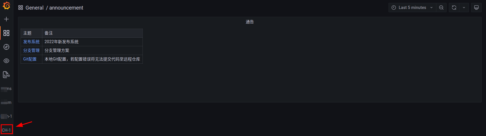

## 账户
    很多公司都有自己的代码仓库平台，如Gitlab，Gitlab中已经继承了很完善的账号管理体系，所以我们使用基于Gitlab的oatuh2登录，避免再去维护一套账户体系

   

### 权限管理
    在gitlab中，用户往往是关联到组与工程，平台工程根据用户在gitlab中的组权限开启对特定组的访问

   

上图中可以看出，当用户在gitlab中有对**CH-1**的访问权限时，平台工程将在左侧添加响应的菜单
