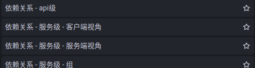
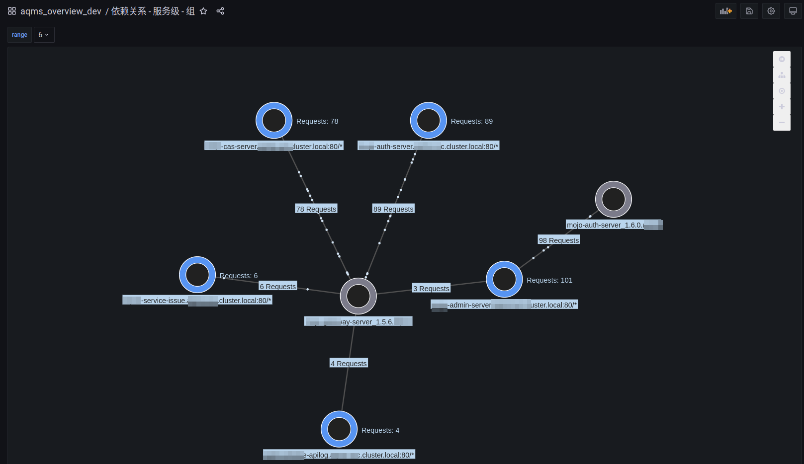
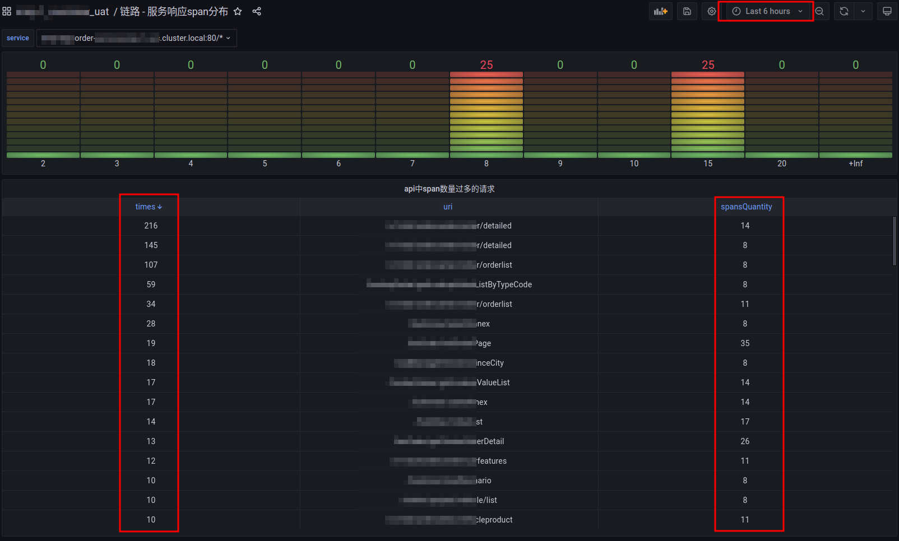
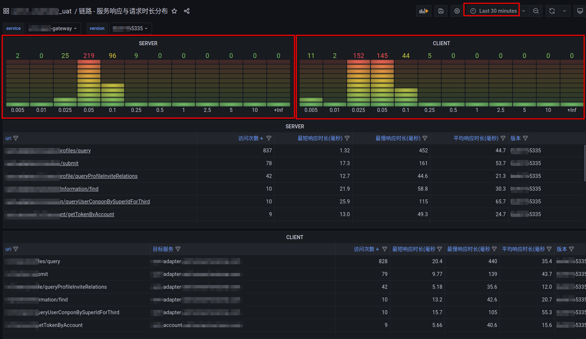

## 架构师

### 功能概览

   
     
   

#### 依赖关系 - 服务级 - 组
    过去一段时间内服务间的调用关系，
    请求方的具体版本，服务方的逻辑版本

   

#### 链路 - 服务响应span分布
    一段时间内，以api分组，统计链路过长的请求

   

#### 链路 - 服务响应与请求时长分布
    一段时间内，
    服务进出流量的细则
    作为服务端 - 被访问的服务版本，api的次数，最短时间，最长时间，平均响应时间等
    作为客户端 - 定位到具体的客户端版本，目标服务，访问的uri，访问次数，最短时间，最长时间，平均响应时间等
    

   

