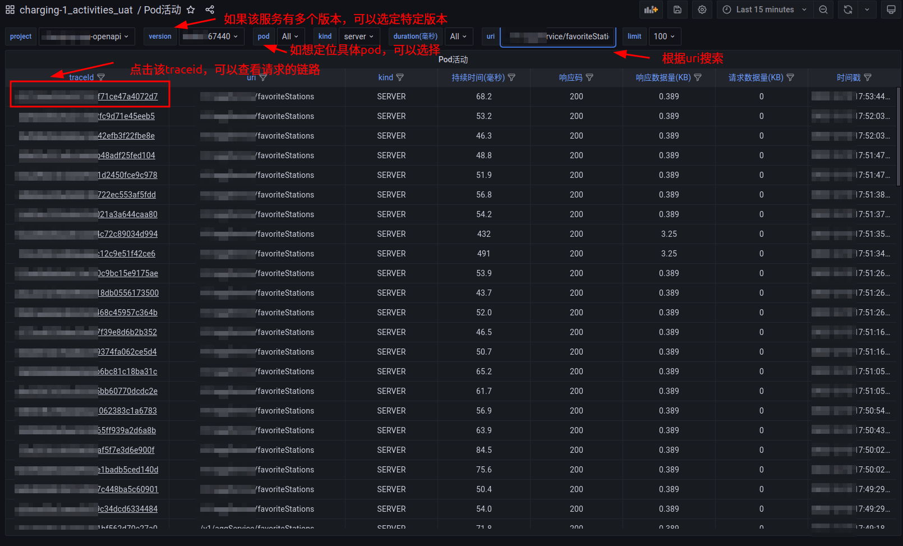
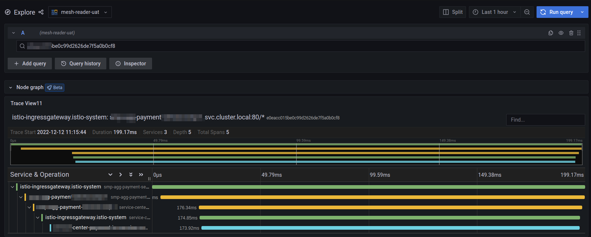
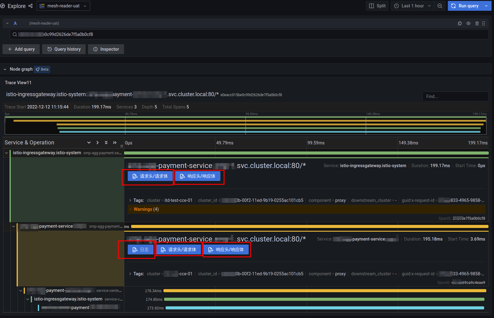

## 开发团队
    这一章节中，我们将提供更细粒度的数据重现。
    不仅仅是链路，更能提供该次请求上的所有数据

### kubernetes pod进出记录
    以版本分类，记录该版本下所有pod的进出记录

   

    
    该服务在某个特定版本下，最近的100次请求的详情，
    也可以根据uri进行搜索
    点击左侧的traceid即可定位到该次请求的链路详情

#### 单次链路跟踪
    通过traceoid复现该次请求的详情

   

#### 数据复现
    通过traceid，复现该次请求进出的所有数据与关联日志

   

traceid复原了那一刻发生的事情，但是我们更希望能获取那一刻的具体数据，
1. 根据traceid，复原请求头请求体，复原那一刻请求方具体带了什么数据，服务方响应了什么数额
2. 日志 - 通过日志的格式约束，可以立刻定位到当前服务在处理该次请求时具体的日志
3. 跨集群链路 - 由于使用了统一的日志平台，即使该请求是跨集群的，链路平台一样也能复原该次请求的所有信息
