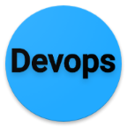

   

Devops，在从工具的使用，组织架构的调整再到文化层的采纳，每一步都能带来众多改变。

在Devops方案的推进中，我们实践与总结了一些方案，在我们团队内部获得了一定的认可，并且在管理上与工作效率上都为团队带来了一定的帮助：

- [应用发布的代码行级正反向依赖](code_level/README.md) - 如何从大家熟悉的提交开始，介绍如何重新规划整个流程
- [Gitflow自动化实现](gitflow_auto/README.md) - 基于Gitflow标准，自动化实现后续的job
- [代码编译与部署](code_build_ship/README.md) - 在虚拟机上部署服务的规范化与科学化实现
- [Devops角色](only_devops/README.md) - 在工具层之上，再思考Devops人员应该如何调整自己的角色

希望上述的方案与实践能为读者带来某些参考，也希望能与你相互交流。