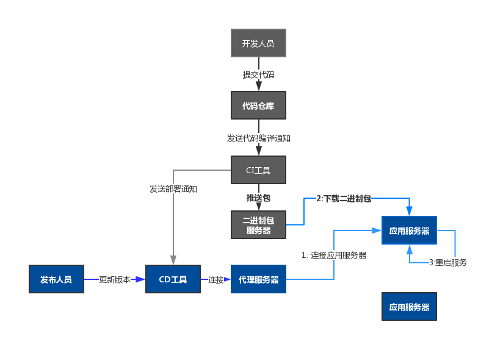

   

### 代码编译与部署

在容器流线之前，行业内都是在虚拟机上部署代码，然后启动服务。

各公司将代码打包，编译最后部署，但是整个流程缺乏规范化以及可用性保障，虽然容器及其集群管理已经日渐成熟，但是在某些情况下，某些服务可能依然还是需要运行在虚拟机中。  

因此，本章节将介绍如何标准化，版本化，规范化，可追溯化的方式将代码编译，打包，然后部署到虚拟机上。

#### 传统解决方案

容器，将代码与运行时（程序的依赖）绑定在一起，然后再给镜像添加版本。但是在虚拟机时代，大部分公司是将两者分离的，这就带来了很多问题。

各公司的解决方式各异，可以总结为（步骤之间没有顺序关系，每一行代表一种方案）：

打包：
- 开发在本地编译好后，再将包上传到服务器，
- 通过CI工具（Jenkins）打包，打包成功后，通过shell命令，将其拷贝到虚拟机上，如果有多台服务器，逐台拷贝
- 每一次编译生成的包，上传到包服务器后，覆盖上一次提交的版本
- 发布到生产环境时，再重新打包，然后拷贝到服务器

发布：
- 逐台登陆服务器，备份上一个包以及配置，然后启动当前包，如果需要回滚，再重复上述步骤
- 使用shell脚本，逐台连接，备份包及配置，拷贝包，启动服务
- 发布到生产环境时，从测试环境拷贝当前提供服务的版本

#### 传统方案的问题

传统解决方案，当服务器是小规模的时候，人工方式还能尚可，但是到了集群数量增加的时候，出错的概率与维护成本，将完全超过控制：

- 本地直接上传包到服务器，用户权限过大，用户本地依赖可能与服务器的环境不一致
- 通过shell命令将包拷贝到服务器，此操作不稳定，容易出错，服务器的数量可能会变化，而且需要准确的基础数据
- 每一次编译所生成的包，应该是相互独立的，可以共存的
- 发布到任何其它环境时，应该从包仓库种获取所需的版本
- 发布到生产环境重新打包，代码可能会不一致，重新打包的代码与在测试环境所测试的代码，之间存在时间差
- 发布时，逐台登陆服务器，任务量大，很容易出错，手工备份的方式可能因人而异
- 在部署比较复杂的服务时，shell脚本的编写与维护将变的困难
- 在云时代，使用auto-scalling后，服务器消亡与创建变的频繁，如果将数据保存在服务器上，很容易丢失数据

#### 规范化的解决方案

