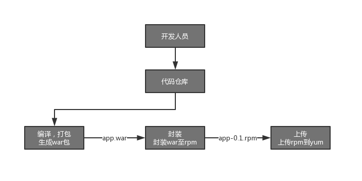

   

### 代码编译与部署

在容器流线之前，行业内都是在虚拟机上部署代码。

各公司将代码打包，编译最后部署，但是整个流程缺乏规范化以及可用性保障。  

在虚拟机时代，大部分公司是将代码与运行时分离的，这就带来了很多棘手的问题。本章节将介绍如何标准化，版本化，规范化，可追溯化的方式将代码编译，打包，然后部署到虚拟机上。

    注：Nerflix基于AWS的服务，EC2与AMI，每一次代码编译打包，都将其封装成一个新的AMI镜像。
       将代码与运行时绑定在一起。
       而且由于AMI是块存储，每生成一个新的AMI，只需要为所产生的改变付费。

#### 传统解决方案

各公司的解决方式各异，可以总结为（步骤之间没有顺序关系，每一行代表一种方案）：

打包：
- 开发在本地编译好后，再将包上传到服务器，
- 通过CI工具（Jenkins）打包，打包成功后，通过shell命令，将其拷贝到虚拟机上，如果有多台服务器，逐台拷贝
- 每一次编译生成的包，上传到包服务器后，覆盖上一次提交的版本
- 发布到生产环境时，再重新打包

发布：
- 逐台登陆服务器，备份上一个包以及配置，然后启动当前包，如果需要回滚，再重复上述步骤
- 使用shell脚本，逐台连接，备份包及配置，拷贝包，启动服务
- 发布到生产环境时，从测试环境拷贝当前提供服务的版本

#### 传统方案的问题

传统解决方案，当服务器是小规模的时候，人工方式还能尚可，但是到了集群数量增加的时候，出错的概率与维护成本，将完全超过控制：

- 本地直接上传包到服务器，用户权限过大，用户本地依赖可能与服务器的环境不一致
- 通过shell命令将包拷贝到服务器，此操作不稳定，容易出错，服务器的数量可能会变化，将需要准确的基础数据
- 每一次编译所生成的包，应该是相互独立的，可以共存的
- 在云时代，使用auto-scalling后，服务器消亡与创建变的频繁，如果将数据保存在服务器上，很容易丢失数据

#### 规范化的流程

在上图，我们可以看出打包与发布是安全独立的两个环节，相互之间既有联系又相互独立。

#### 规范化的包管理

很多语言所生成的二进制包，是没有版本管理的。比如java所生成的war包。

这就为安装，升级war包带来了困难与麻烦。我们希望能做到，每一次包，都有唯一的版本号，并且可以上传到二进制包服务器。这样，在任何时候，我可以指定所需安装的版本，而不是通过拷贝等方式去维护应用的升级。

上图，我们通过rpm包的方式（安装rpm的本质是将war安装到指定目录）：
- 为war包添加了版本号
- 在应用服务器上，通过yum命令，就可以安装自己所需的rpm包

#### 规范化的部署流程

上图，我们通过ansible，在应用服务器上完成了对应用的部署：  
- 通过yum服务器，我们可以直接使用上述步骤中所生成的rpm包
- 通过ansible playbook，完成复杂的一系列操作
- 应用启动所需的包与配置，都不需要保存在应用服务器上
- 无论是添加还是删除应用服务器，应用的部署都不受到影响

有兴趣的读者，可以参考[Devops角色](../only_devops/README.md)关于ansible role的使用案例。
