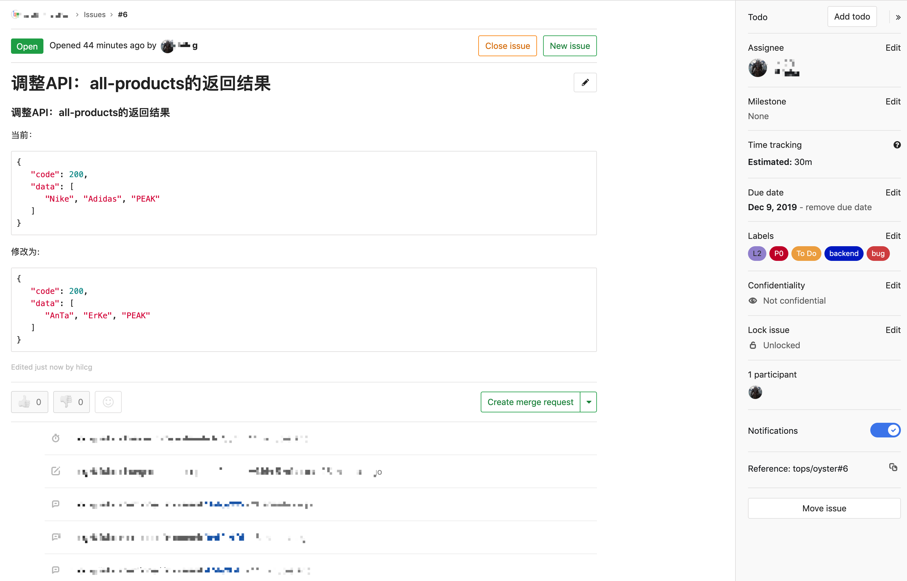

   

### 应用发布的代码行级正反向依赖

传统模式下的应用部署中，可能就只需要完成发布工作。但是，一个完整的发布，需要考虑整个链路。

经常因为一个发布，可能会在不同的人员与部门中，产生诸多问题（部分）：

- 发布是否的确完成
- 本次发布相比于上次，代码做了哪些改变
- 此次代码修改的具体说明（此次代码修改的原由）
- 当前对外提供的服务的版本是哪一个
- 知道当前提供服务的版本后，定位当前版本的代码

本章节，将通过结合[Gitlab](https://about.gitlab.com/)与[kubernetes](https://kubernetes.io/)，通过一个完整的案例，展示发布前的准备，发布后的确认以及后期检查。

注明：读者也可以使用[Jira](https://www.atlassian.com/software/jira), [Crucible](https://www.atlassian.com/software/crucible)等工具来完成任务跟踪与代码review等功能。

#### 任务创建
在传统模式下，开发人员编写代码，然后直接提交，没有一个很好的归档。一不添加注释，二不添加原由。这为后期的维护带来困难。

任务跟踪，是一种很好解决上述问题的方案。

在成熟的Devops公司中，任务的创建与分配有很严格的规定：

- **等级** - 该任务的重要程度，紧急，正常
- **难易度** - 是给哪一级别的员工去完成，初级，中级还是高级
- **due date** - 不能晚于何时完成该任务
- **完成时间** - 该任务在多长时间内完成
- **任务标签** - 任务类别，比如该任务是关于数据库的，还是关于配置的等等

这样，每当到了一个评审周期，项目助理等会从多个维度去审核该员工在此周期内任务的完成情况：

- **任务数量** - 完成任务的数量（最简单的衡量维度）
- **超期限完成情况** - 未能在规定时间内完成任务（是任务非配太多还是能力不足）
- **任务匹配度** - 完成的任务是否与其职称匹配（任务难易度超过其职称评级还是等于，甚至低于）
- **关键角色** - 是否经常完成紧急任务，在团队中起到关键角色的作用
- **工时** - 完成非配的任务所花费的时间

通过以上介绍，我们可以看出，一个按照规定，严格定义的任务，为后期的管理带来了诸多益处。

上图是一个任务案例截图，从中我们可以看到：

- 任务编号：#56
- 任务受托人
- 时间跟踪 - 预计完成时间，已用时间
- 任务标签 - TO Do，backend，bug等
- 任务标题已经任务详情

#### 代码提交