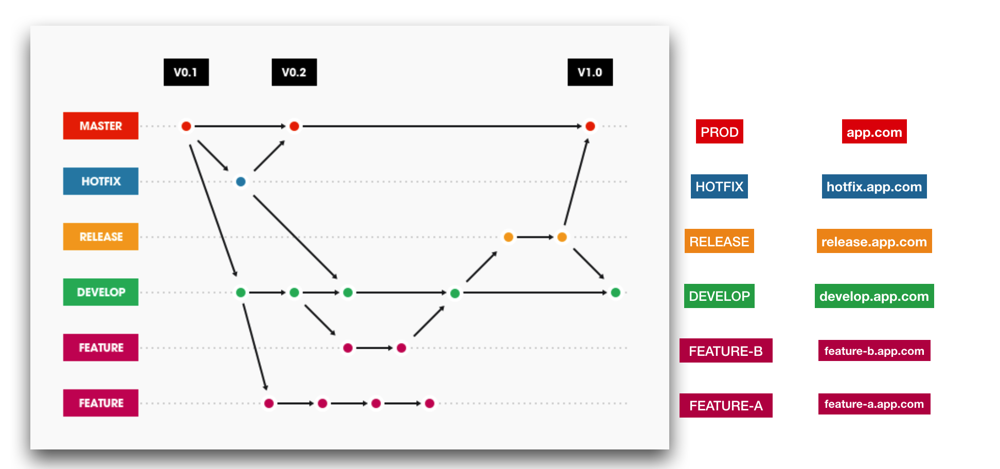

<p align="center">
   
</p>

#### Gitflow自动化实现
在前面的章节中，我们介绍了[Gitflow](../../gitflow-workflow-cn/README.md)流程。掌握了规范之后，下一步我们关心如何基于这样的标准，自动化完成后续的工作。

在本章节中，我们将遵循[Gitlab](https://about.gitlab.com/)的[.gitlab-ci.yml](https://docs.gitlab.com/ee/ci/yaml/)标准，基于Gitflow实现自动化测试，编译，打包，发布等流程。

#### 需求
在Gitflow流程中，我们讨论了不同分支的适用场景，所以我们也希望Gitlab可以基于不同的分支，按照Gitlab的规范，执行相应的操作。

因此，我们对Gitlab提出了以下几点需求：

- 能识别我们提交的分支
- 分支之间完全独立，相互不影响
- 对公司现有的一些组件，如SonarQube，Nexus等可以做到无缝衔接
- 支持灵活的添加与更新操作
- 做到一切皆代码，便于维护与管理

#### 概览


上图展示了，每一个横向都是独立的，独立的资源，独立的访问入口等。

#### 说明
在传统的虚拟机时代，由于创建与释放资源的自动化实现比较复杂，所以，很多情况下，都是事先定义好环境，流程等，如果想要改变，需要协调众多资源。

而到了容器时代，特别是以kubernetes引领的容器集群高可用解决方案，让在PaaS层实现这一切，变的不再繁琐。

所以，在此章节中，在每一个独立的分支中，我们将基于kubernetes创建该分支的所有资源。

#### 实现

.gitlab-ci.yaml的内容如下：

```yaml
variables:
  BUILD_NO: build-$CI_PIPELINE_ID
  BRANCH: $CI_COMMIT_REF_NAME
  TAG: $CI_COMMIT_TAG
  APP_NAME: '$CI_PROJECT_NAME'

before_script:
  - echo $BUILD_NO
  - echo $BRANCH
  - echo $TAG
  - echo $APP_NAME
  - echo $YAML_DIR

stages:
  - sonar_scanner
  - image_building
  - app_deploying
  - app_deploy_delete
  - deploy_prod

sonar-scanner-ci:
  allow_failure: true
  stage: sonar_scanner
  image: sonar-scanner:latest
  tags:
    - runner-A
  script:
    - sonar-scanner
  only:
    - /^develop/

image-building_non_prod:
  stage: image_building
  tags:
    - runner-B
  script:
    - compiliing
    - building docker image
  only:
    - /(^feature-[a-zA-Z1-9]{1,30}(-[a-zA-Z1-9]{1,30})*)/
    - /^develop/
    - /(^release-[0-9]{1,}[.][0-9]([.][0-9])?)/
    - /(^hotfix-[0-9]{1,}[.][0-9]([.][0-9])?)/    

k8s-deploy_feature_develop:
  stage: app_deploying
  tags:
    - runner-C
  script:
    - 替换kubernetes配置文件中的变量
    - kubectl apply -f kubernetes配置文件
  only:
    - /(^feature-[a-zA-Z1-9]{1,30}(-[a-zA-Z1-9]{1,30})*)/
    - /(^develop)/
    - /(^release-[0-9]{1,}[.][0-9]([.][0-9])?)/
    - /(^hotfix-[0-9]{1,}[.][0-9]([.][0-9])?)/

k8s-deploy_prod:
  stage: deploy_prod
  tags:
    - runner-D
  script:
    - 替换kubernetes配置文件中的变量
    - kubectl apply -f 生产环境kubernetes配置文件
  only:
    - /(v*)/
  except:
    - branches
  when: manual

```
解析：

- 通过正则表达式，过滤用户提交的分支
- 分支命名必须符合规范，否则无法触发相应的分支任务
- hotfix与release分支用于封包，供生产环境使用（生产环境不需重新打包）
- 若有特别需求，只需要修改该文件
- 文件可以加入git仓库，以代码化管理

kubernetes配置文件如下：
```yaml
apiVersion: v1
kind: List
items:

- apiVersion: extensions/v1beta1
  kind: Deployment
  metadata:
    name: APP_NAME-BRANCH
  spec:
    replicas: 1
    strategy:
      rollingUpdate:
        maxSurge: 1
        maxUnavailable: 0
      type: RollingUpdate
    minReadySeconds: 10
    template:
      metadata:
        labels:
          app: APP_NAME
      spec:
        containers:
        - name: APP_NAME
          image: APP_NAME:BRANCH-BUILD_NO
          ports:
          - containerPort: 80
          resources:
            requests:
              memory: "64M"
              cpu: "250m"
            limits:
              memory: "128M"
              cpu: "500m"
          livenessProbe:
            tcpSocket:
              port: 80
            initialDelaySeconds: 5
            periodSeconds: 5

- apiVersion: v1
  kind: Service
  metadata:
    labels:
      app: APP_NAME-BRANCH
    name: APP_NAME-BRANCH
  spec:
    ports:
    - port: 80
      protocol: TCP
      targetPort: 80
    selector:
      app: APP_NAME
    sessionAffinity: None

- apiVersion: extensions/v1beta1
  kind: Ingress
  metadata:
    name: APP_NAME-BRANCH
  spec:
    rules:
    - host: APP_NAME-DOMAIN
      http:
        paths:
        - path: /
          backend:
            serviceName: APP_NAME-BRANCH
            servicePort: 80

```

解析：

- 以参数化的方式命名资源
- 为每一次提交，创建独立的kubernetes配置文件
- 分支之间的资源相互独立不影响

#### 总结

通过以上的配置文件，可以看出，基于用户提交的代码，分析其分支，完成编译打包等，做到每一个分支，每一次提交，都产生不同的镜像，然后再将其部署到kuernetes。并且，这一切，都通过一切皆代码的标准去实现。

如此细粒度的管理，为分支与代码管理，提供了有力支撑，同时也为后期的维护都提供了极大的便利。