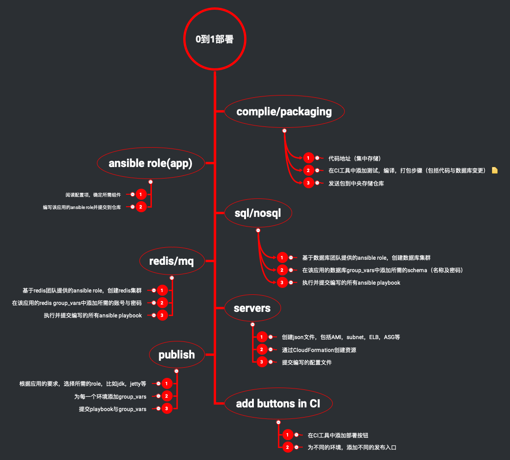
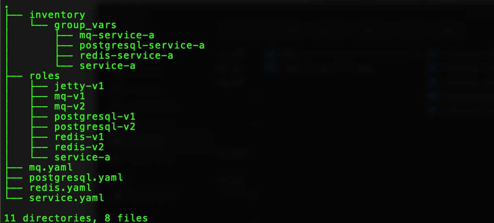

   

#### Devops角色

在探索Devops的道路上，使用CI工具，实现初步自动化，是很多公司做出的改变。

但是，可能很多公司也就停留在了这个阶段，高效率的跨组织协作、价值为先的文化氛围更无从谈起。

状况大概有以下几类:

- 自动化停留在使用CI工具实现脚本执行，编译打包等
- 开发人员，测试人员，运维人员还是需要不停的协调沟通资源，过多人员参与
- 自动化停留在代码层，对于database as code， middleware as code等还远远未能实现
- 资源还需要手工创建，申请，审核等，复用性极差，
- 未能一切皆代码（IaC）

#### 实现

本篇幅，以基于虚拟机（AWS EC2）的部署为例，使用ansible，介绍在整个流程中，只有Devops人员参与的场景。

从上图中，可以看到，在整个流程中，只有**Devops**人员参与：

- 每一个步骤，都有明确的定义
- 无需再协调资源
- 除了应用代码，数据库，中间件等，都变成代码化
- 资源的创建可以复用ansible role
- 一切皆代码

#### 总结

ansible不仅使一切变成代码，而且其document-style的风格，很适合团队中各成员的输出，将一切成果输出成代码，便于维护与阅读。

使用ansible完成上图流程图，将会得到类似于下图的目录结构图：

