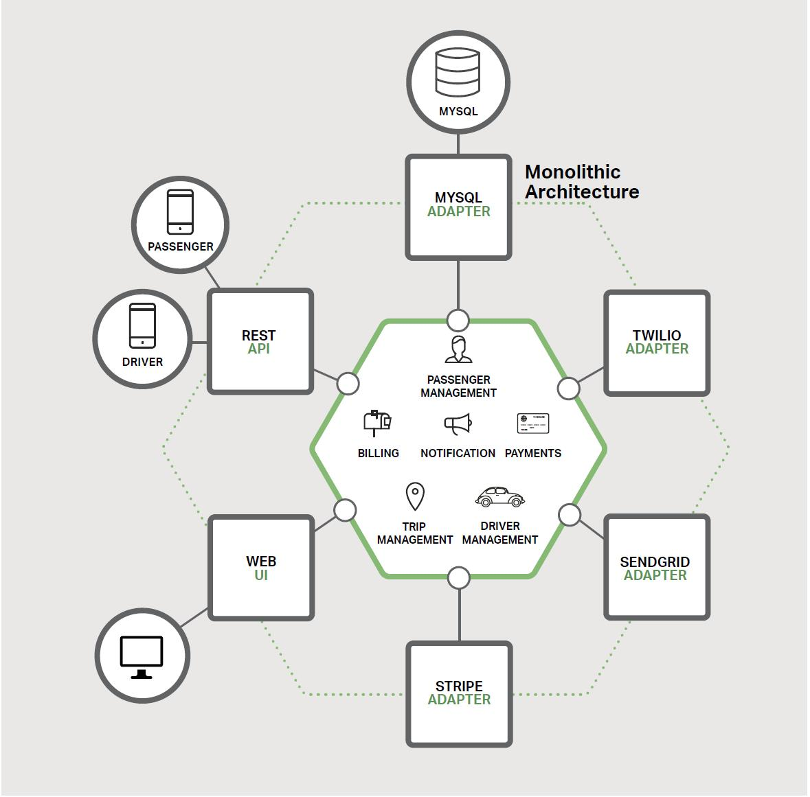

### 微服务介绍

当前，在论文，博客，社交媒体的讨论与会议上，微服务都获得了相当多的关注。它们正迅速的驶向[Gartner Hype cycle](https://www.gartner.com/en/research/methodologies/gartner-hype-cycle)中的过高期望的顶峰。与此同时，软件社区也有怀疑者对微服务不予理会，认为微服务只是换汤不换药。怀疑者断言微服务的只是对SOA体系的一个重塑罢了。但是，撇去炒作和怀疑，微服务架构模式有显著的增益，特别是能够允许敏捷开发的落地与在复杂的企业级应用的交付上。

此部分是一本拥有七章关于设计，构建与部署微服务的电子书的第一篇。你将会学到微服务的方案以及它与更传统的巨石架构模式的对比。本电子书将会阐述微服务架构中的丰富的元素。你也会学习到微服务机构模式的优缺点，无论它对你的项目有没有意义，以及如何应用它。

让我们以你为什么需要考虑使用微服务开始本章节。

#### 构建巨石应用

让我们想象一下你将要构建一个全新的打车应用以与Uber，Hailo去竞争。经过一些筹备会议与需求收集，你要么手工或者使用生成器创建新项目，项目中会包含诸如Rails, Spring Boot, Play, 或者Maven此类平台。

这个新的应用将会有一个模块化的[六角架构](https://www.infoq.com/news/2014/10/exploring-hexagonal-architecture)，如图1-1所示：

图 1-1：打车应用程序示例

应用的核心是业务逻辑，由定义服务，域对象和事件的模块来实现。围绕在核心周围的是沟通外部世界的适配器。适配器的例子由数据库访问组件，生产和消费消息的消息组件，暴漏api或者实现UI的web组件。

尽管包含一个逻辑模块化架构，此应用是作为巨石应用去打包和部署。实际的格式依赖于应用的语言与框架。例如，很多java应用作为WAR文件的形式打包，部署在Tomcat或者Jetty的应用容器中。其他的java应用是以独立可执行的Jar文件去打包。同样，Rails与Node.js应用是以目录层级的形式打包。

应用以此样式编写是非常普遍的。由于IDE和其它工具都聚焦在构建一个单个应用上，使应用的开发是变得如此简单。此类应用也易于测试。只需要简单的启动应用就可以实现端到端的测试，也可以使用诸如Selenium的测试包对UI进行测试。巨石应用也易于部署。你只需要拷贝打包好的应用到服务器中。你也可以运行多个挂载于负载均衡器的拷贝来实现伸缩。在项目的早期阶段，一起都正常运行。

#### 走向巨石地狱

很不幸，这种简单的方案有一个巨大的限制。成功的应用有一个随着时间的推移而成长的习惯，并且最终将变的巨大。在每一个迭代中，你的开发团队，实现了再多一些的用户故事，当然了，也意味着添价很多行代码。几年后，你的小而简单的应用将成长为庞大的巨石应用。一个极端的案例，我最近采访了一位开发人员，他最近在编写一个工具去分析上千个JAR文件之间依赖，而这些JAR文件使用在一个包含数百万行代码的应用中。我能肯定这是大量的开发人员经过多年的齐心协作才能创造出这样一只野兽。

一旦你的应用变成了一个庞大，复杂的巨石，你的开发组织可能生活在一个痛苦的世界中。任何敏捷开发与交付的努力都会苦苦挣扎。一个主要的问题是应用变得压倒性的复杂。它太庞大了，任何一个开发人员都无法完全理解。因此，bug的修改与新功能的正确实现变得及其困难与消耗时间。更可怕的是，这一切有恶性循环的倾向。如果代码库变的难以理解，修改将不会被准确执行。你最终将会得到一个庞大的，不可思议的大泥球。

应用的庞大体积也将会使开发慢下脚步。应用越庞大，启动时间越长。我调查过开发人员关于巨石应用的尺寸与性能，有一些声称启动时间长达12分钟之久。我还听过应用花了长达40分钟才完成启动的奇闻。如果开发人员不得不定期地重启应用服务器，那么他们一天中的大部分时间将会花在无所事事地等待上，同样他们的效率也将受难。

关于庞大，复杂的巨石应用的另一个问题，它是持续开发的一个障碍。当下，SaaS应用艺术的状态是将修改每天很多次的推送到生产环境。由于你必须重新部署整个应用以便更新应用的任何一部分，因此这一切对于复杂的巨石应用来说变得及其困难。我之前提到的启动时长也不会有什么帮助。同时，由于改变的影响通常不会被很好的理解，很有可能你不得不做一些额外的手工测试。最终，持续部署也几乎不可能被做到。

当不同的模块有资源需求的冲突时，巨石应用同样也难以伸缩。比如，一个模块可能实现了CPU密集型的图像处理逻辑，然后理想的部署在了AmazonEC2计算优化型的实例上。另一个模块可能是内存数据库，非常适合于EC2内存优化型实例。但是，由于这些模块是部署在一起的，你不得不在硬件的选择上妥协。

另一个巨石应用的问题是稳定性。由于所有的模块是运行在同一个进程中，任何模块中的一个bug，如内存溢出，都可能潜在的使整个进程崩溃。此外，由于所有运行应用的实例是完全相同的，这个bug将会影响整个应用的可用性。

最后但同样重要的，巨石应用使采纳新的框架与语言变的及其困难。比如，让我们想象下，你使用XYZ框架写了两百万行代码。用更新的ABC框架而重写整个应用的代价是巨大的（无论是时间还是费用），即使新框架被认可为更优秀。最终，采用新技术有了一个巨大的障碍。你就陷入了在项目开始之出做出的任何技术选型的泥潭中。

简而言之：你有一个成功的关键业务应用，已经成长成一个只有很少，如果有的话，庞大的巨石应用。使用过时的，效率低下的技术去编写，使招聘有天赋的开发人员变的困难。应用难以伸缩与依赖。最终，应用的敏捷开发与交付将无法实现。

所以你能对这一切做什么呢？