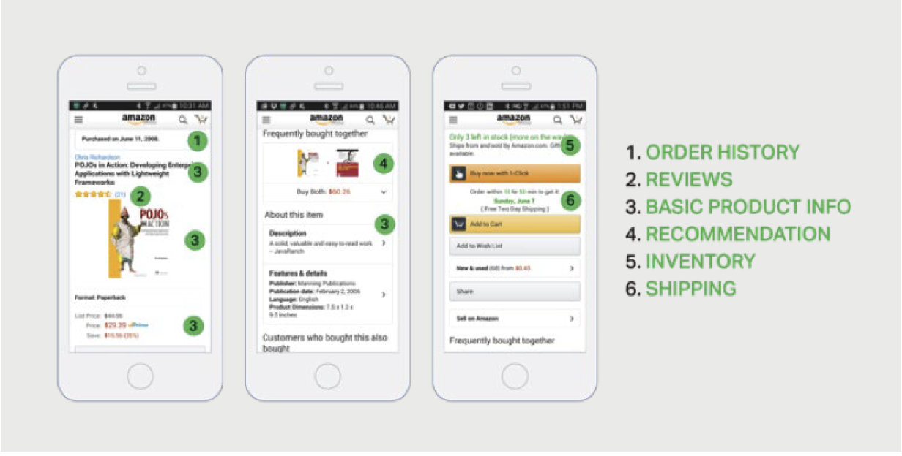
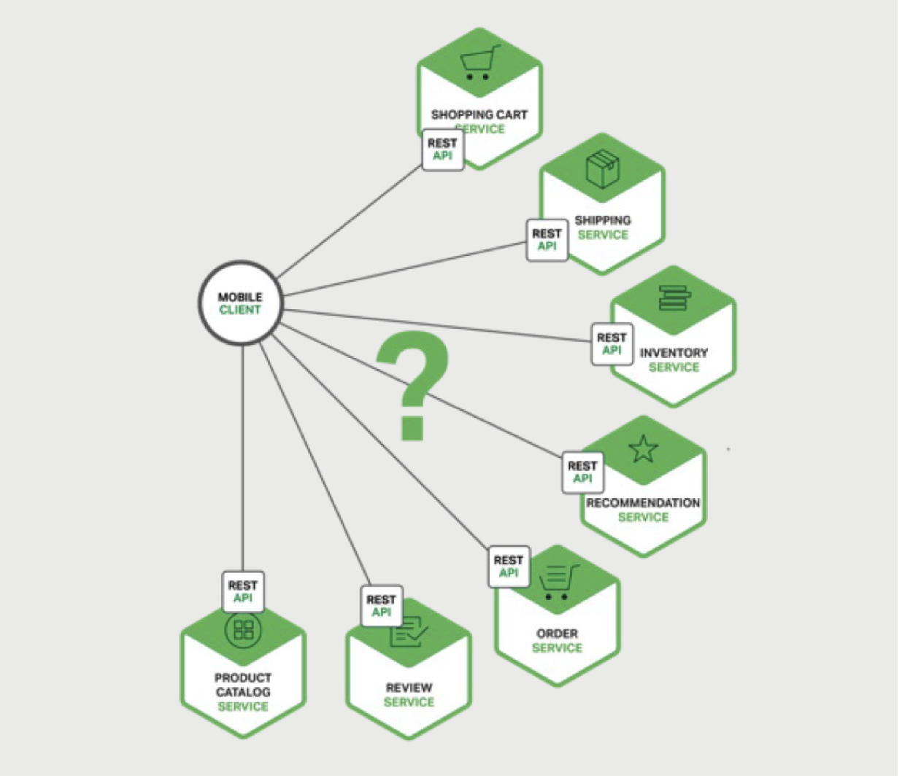
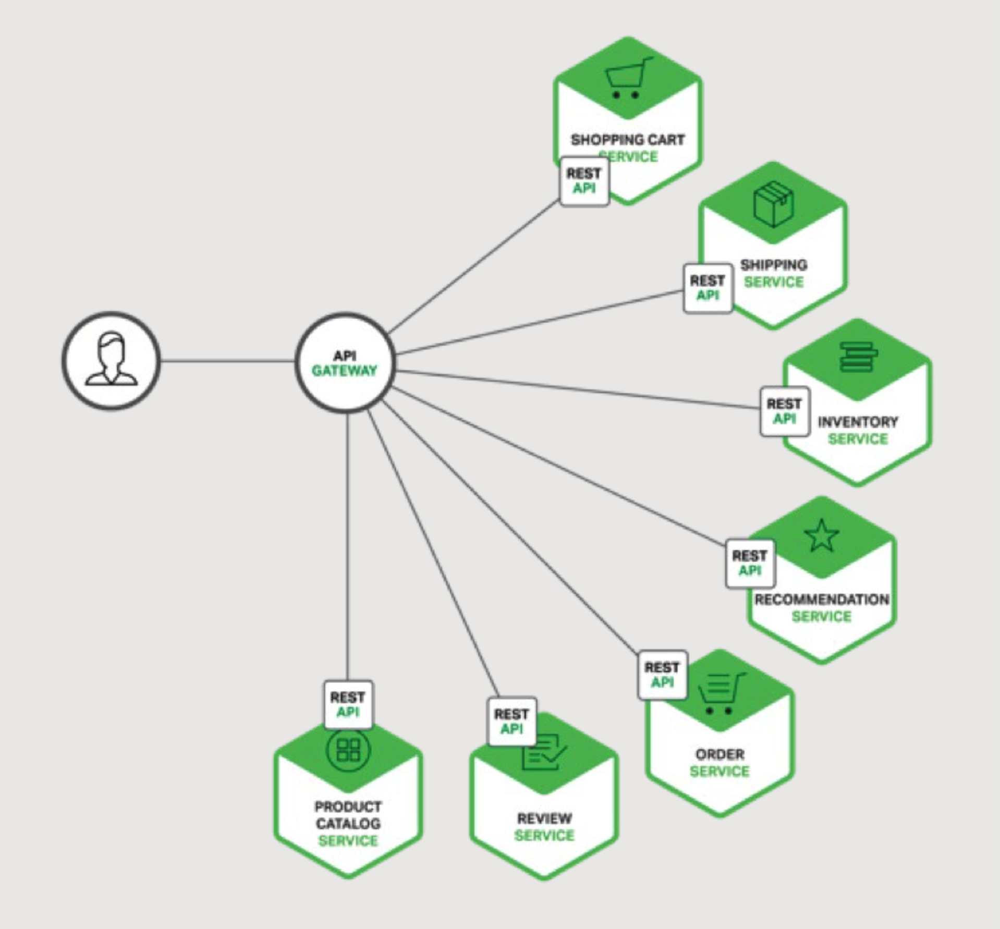

## 使用API Gateway

在这本共七个章节关于设计，构建与部署微服务的书中，第一章节介绍了微服务架构模式，讨论了使用微服务的好处和缺点以及如何使用微服务，除去复杂性，微服务是复杂应用的理想选择。这是本书的第二章节，将讨论使用API Gateway构建微服务。

当你选择将应用构建成一组微服务，你需要决定应用的客户端如何与微服务进行沟通。巨石应用只有一组端点，通常是一样的，通过使用负载均衡在它们之间分发流量。

然而，在微服务架构中，每一个微服务通常会暴露一组细粒度的端点。在本篇中，我们将评估这一切将如何影响客户端与应用之间的通信，提议使用API Gateway作为一个解决方案。

### 介绍

让我们想象下你正在为一个购物应用开发一个原生移动客户端。您可能需要实现产品详细信息页面，展示特定产品的信息。

比如，图2-1展示了在Amazon安卓移动客户端中滚动浏览商品详情而看到的页面

图2-1 购物应用示例

尽管这是个只能手机的应用，商品详情页却展示了很多信息。比如，不仅仅只有名称，概况与价格的基本产品信息，该页面还展示了：

1. 购物车中商品的总量
2. 订单历史
3. 用户浏览
4. 低库存告警
5. 运输选项
6. 各种推荐，包括与该商品一起被购买的商品，购买该商品的用户购买的其它产品，还有购买此商品的用户浏览的其它商品
7. 替代性的购买选项

当使用巨石应用架构，移动客户端通过对应用进行一个单一的REST调用以检索数据，比如：
GET api.company.com/productdetails/productId

负载均衡将此访问路由到多个完全一样应用实例中的一个。该应用然后查询多个数据库表，在将结果返回给客户端。

与此相反的是，当使用微服务架构，商品详情页中所展示的数据是被多个微服务而拥有。以下是一些潜在拥有示例特定商品页面中数据的微服务：

- 购物车服务-购物车中的商品总数
- 订单服务-订单历史
- 目录服务-商品基本信息，比如商品名，图片与价格
- 足迹服务-用户足迹
- 库存服务-低库存告警
- 运输服务-运输选项，截止日期与费用，drawn separately from the shipping provider’s API与运输服务供应商的API独立
- 推荐服务-建议的商品
  

图2-2将移动客户端的需求映射到相关的微服务

我们需要决定移动端如何访问这些服务。我们来看看选择项。

### 客户端到微服务的直接访问

理论上来讲，一个客户端可以直接请求其中任何一个微服务。每一个微服务都有一个公开的端点：
https://serviceName.api.company.name

该URL将映射到微服务的负载均衡，将请求分发到可用的实例中。为了检索特定商品的页面信息，移动客户端将访问以上列出的每一个服务。

不幸的是，使用该方法有一些挑战与限制。问题一是客户端的需求与每个微服务暴露的细粒度API之间的不匹配。示例中的客户端不得不发起七个独立的请求。在更复杂的应用中，可能要请求的更多。比如，Amazon形容了在渲染商品页面时，数百个服务是如何参与其中。虽然在局域网中，客户端可以发起如期多的请求，但在公网上这样做，可能效率太低，而且对于移动网络来说肯定是不切实际的。该方案也使客户端的代码变的复杂的多。

客户端直接调用微服务的另一个问题是有些微服务可能使用了非web友好的协议。某个服务可能使用Thrift二进制RPC，而另一个可能使用AMQP消息协议。这两种协议都不特别适合浏览器或防火墙，最好在内部调用。应用程序应该在防火墙之外使用如HTTP与WebSocket这样的协议。

这种方法的另一个缺点是它使得重构微服务变得困难。随着时间的推移，我们可能想改变系统拆分成服务的方式。比如，我们可能想合并两个服务或者将一个服务切分成两个或者多个服务。但是，如果客户端直接访问服务，想执行这样的重构会变的及其困难。

因为这些问题，客户端直接访问微服务基本不会起到效果。

### 使用API Gateway

通常，更好的方法是使用众所周知的API Gateway。API Gateway是进入系统的单一入口点的服务器。有点像基于对象设计中的Facade模式。API Gateway将内部系统架构封装到内部，然后为每一个客户端定做一个API。API Gateway也有其他的功能，比如认证，监控，负载均衡，混存，请求塑造与管理，静态响应处理。

图2-3显示了API Gateway通常如何适用与架构

图2-3 使用API Gateway的微服务

API Gateway负责请求路由，合成，协议转换。来自客户端的请求首先经过API Gateway，然后在路由到合适的微服务。API Gateway通常通过调用多个微服务并聚合结果来处理请求。它可以在Web协议（如HTTP和WebSocket）和内部使用的非web友好协议之间进行转换。

API Gateway也能为每一个客户端提供定制的API。通常为移动客户端公开粗粒度API。比如，考虑下商品详情页方案。API Gateway可以提供一个端点(/productdetails?productid=xxx)，允许移动客户端可以只通过一个请求就可以检索商品所有的详情信息。API Gateway提供调用多个服务来处理请求-商品信息，推荐，浏览记录等，然后整合结果。

API Gateway的一个绝佳的案例是Netflix API Gateway。Netflix流服务可以为多达数百个不同的终端提供服务，包括电视，机顶盒，智能手机，游戏系统，平板等等。一开始，Netflix试图为流服务提供通用型（one-size-fits-all）API。但是，他们发现由于终端设备得多样性与独特需求，这样做并不能起到很好的效果。如今，他们使用了API Gateway，通过运行终端设备特定的适配代码，为每一个终端提供定制的API。每一个适配器通常平均调用六到七个后端服务来处理每一个请求。Netflix API Gateway每天处理数十亿条得请求。

### API Gateway的优点与缺点
正如你想的那样，使用API Gateway同时拥有优点与缺点。使用API Gateway的一个主要的优点是它将应用内部的结构封装了起来。客户只需与网关通话即可，而不是不得不调用指定的服务。API Gateway为每一种客户端提供了特定的API。减少了客户端与应用之间的往返次数。同样也简化了客户端代码。
API Gateway也有一些缺点。API Gateway还是另一个必须被开发，部署与管理的高可用组件。API Gateway有成为开发瓶颈的风险。开发人员必须更新API Gateway以暴露每一个微服务的端点。
重要的是，更新API Gateway的过程尽可能轻量级。不然，开发人员将被迫排队等候以更新Gateway。尽管存在这些缺点，但是对大部分现实世界中的应用来说，使用API Gateway是有意义的。

### 实现API Gateway
现在我们已经了解了使用API Gateway的动机和权衡，让我们来看看您需要考虑的各种设计问题。

#### 性能与可扩展性
只有少数公司能以Netflix的规模运营，每天需要处理数十亿条请求。但是，对大部分应用来说，API Gateway的性能与可扩展性通常来说是很重要的。因此，在支持异步，非堵塞I/O的平台上构建API Gateway，有很多不同的技术可以被使用以实现一个可扩展的API Gateway。在JVM平台，你可以使用基于NIO的框架，比如Netty, Vertx, Spring Reactor或者JBoss Undertow中的一个。在非JVM平台一个流行的选择是Node.js，一个基于Chrome JavaScript引擎构建的平台。另一个选择是使用NGINX Plus。

NGINX Plus提供了成熟，可扩展，高性能的web服务器与反向代理，易于部署，配置与可编程。NGINX Plus可以管理认证，访问控制，负载均衡请求，缓存响应，也提供应用程序感知的健康检查与监控。

#### 使用响应式变成模型
API Gateway通过简单地将它们路由到适当的后端服务来处理一些请求，调用多个后端服务然后聚合结果来处理其他请求。有一些请求，比如商品详情请求，对于后端服务的请求是独立于其它服务的。为了最小化响应时间，API Gateway应该同时执行独立的请求。

但是，有些时候，请求之间有依赖关系。在将请求路由到后端服务之前，API Gateway可能首先需要调用验证服务来验证请求。同样，为了检索用户心愿单中的商品信息，API Gateway必须首先检索包含此信息的客户简况，然后检索每一个商品的信息。API合成的另一个有趣的例子是Netflix Video Grid。

使用传统的异步callback方式编写API合成代码会很快的将你带入到callback地狱。代码会变的紊乱，难以理解，易于出错。以声明式编写API Gateway代码的一个更好方式是使用响应式方法。响应式抽象的例子有Scala中的Future，Java8中的CompletableFuture，JavaScript中的Promise。也有Reactive的拓展（Rx或者ReactiveX），最初是由Microsoft为.NET而开发。Netflix为JVM创建了RxJava，专门用户他们的API Gateway。还有用于JavaScript的RxJS，它可以在浏览器和Node.js中运行。 使用响应式方法将使您能够编写简单而有效的API Gateway代码。

### 服务调用
基于微服务的应用是一个分布式系统，必须使用进程间通信机制。进程间通信有两种形式。一个是使用异步的，基于消息的机制。有一些实现使用消息组件，比如JMS或者AMQP。其它的，有Zeromq，无代理，服务直接通信。

进程间通信的另一个形式是同步机制，比如HTTP或者Thrift。一个系统通常会同时使用同步与异步。每一种形式甚至可能会使用多种实现。最终，API Gateway将需要支持各种各样的通信机制。

### 服务发现
API Gateway需要知道每一个它需要通信的微服务的位置（IP地址与端口）。在传统的应用中，你可能会硬写了位置，但是在现代，基于云端的微服务应用，找到所需的位置是一个非常重要的问题。

基础架构服务，比如消息组件，通常又一个静态地址，可能通过OS环境变量来指定。但是，确定应用程序服务的位置并不容易。

应用服务具有动态分配的地址。同样，服务的一组实例随着弹性伸缩与升级也会动态改变。最终，API Gateway，系统中的其它服务，需要使用系统的服务发现机制，要么是服务端端发现，要么是客户端发现。第4章将更详细地描述服务发现。目前，值得注意的是，如果系统使用客户端发现，API Gateway必须能够查询服务注册，一个所有微服务的实例与地址的数据库。

### 处理部分失败

实现API Gateway的另一个需要处理的问题是部分失败。每当一个服务调用另一个响应缓慢或不可用的服务时，所有分布式系统都会出现此问题。API Gateway应该永远不能无限期的等待一个下游服务。但是，如何处理失败需要取决于特殊的场景与哪个服务失败。比如，在商品详情页场景中，如果推荐服务无响应，API Gateway应该向客户端返回商品详情的剩余部分，因为这些对于用户来说还是有用的。这些推荐信息，要么为空，要么被替代，比如，一个固定的前十商品列表。但是，如果商品信息服务无响应，API Gateway应该将错误返回给客户端。

如果可以的话，API Gateway也能返回缓存数据。比如。由于商品价格经常改动，如果价格服务不可用，API Gateway应该能返回缓存数据。数据可以由API网关本身缓存，也可以存储在外部缓存中，比如Redis，Memcached。通过要么返回默认数据，要么缓存数据，API Gateway保证了系统的失败在最小程度上影响用户体验。

Netflix Hystrix是一个非常有用的库，用于编写调用远程服务的代码。超过指定的阀值，Hystrix会超时通话，实现了断路器模式，阻止客户端不必要地等待无响应的服务。如果服务的错误率超过了阀值，Hystrix使断路器跳闸，所有请求将在指定的时间段内立即失效。如果请求失败，Hystrix允许你定义一个fallback函数，比如从缓存中读取数据，或者返回一个默认值。如果你正在只用JVM，你一定要考虑使用Hystrix。而且，如果您在非JVM环境中运行，应该使用等效的库。

## 总结
对于大部分的基于微服务的应用，实现API Gateway是有意义的，它扮演了系统的单个入口的角色。API Gateway负责请求路由，合成与协议转换。为应用的每一个客户端提供了自定义的API。API Gateway也可以通过返回缓存或者默认数据以掩饰后端服务的失败。在下一章中，我们将研究服务之间的通信。
