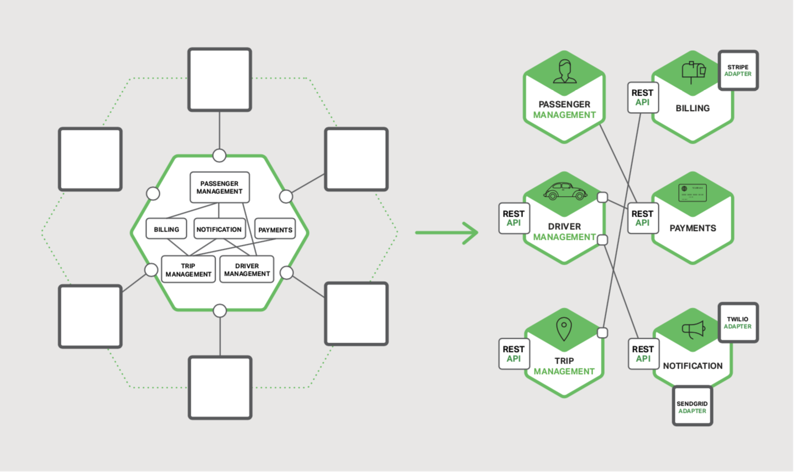
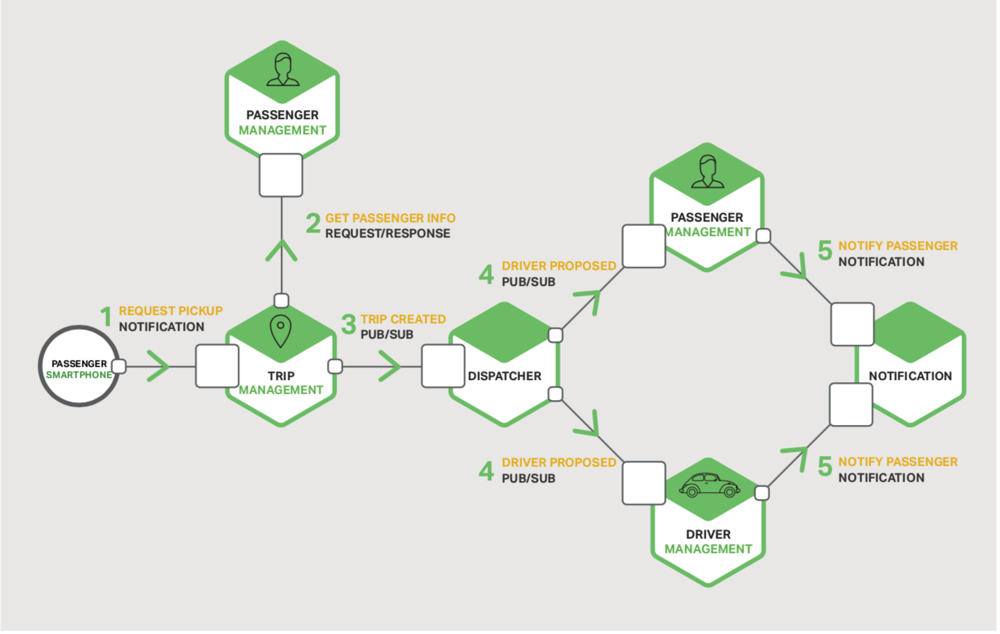

## 进程间通信

这是本电子书中关于使用微服务架构构建应用程序的第三章。第一章介绍了微服务架构模式，与巨石架构模式做了比较并讨论了微服务的优缺点。第2章描述了应用程序的客户端如何通过称为API Gateway的中间组件与微服务进行通信。在本章节中，我们一起探讨系统中的服务如何通信。第4章探讨与服务发现密切相关的问题。

### 介绍
巨石应用中，组件通过语言级的方法或者函数调用来触发另一个组件。相比之下，基于微服务的应用是运行在多台机器上的分布式系统。每一个服务实例通常是一个进程。

因此，如图3-1所示。服务必须使用进程间通信（IPC）机制进行交互

稍后我们将会查看特定的IPC技术，首先让我们一起探索多样的设计问题。

图3-1 使用进程间通信进行交互的微服务

### 交互风格
当为服务选择IPC机制时，首先要考虑服务之间是如何交互的。有各种客户端<->服务的交互风格。可以被归类到两个纬度。第一个纬度，交互是否是一对一，还是一对多。
- 一对一：每一个客户端的请求只被一个服务实例处理
- 一对多：每一个请求被多个服务实例处理

第二个纬度，交互是同步的还是异步的
- 同步：客户期望服务的及时响应，甚至可能在等待时阻塞
- 异步：客户端在等待响应时不阻塞，并且响应（如果有的话），并不一定需要立刻返回

下表展示了各种交互风格

|                     |            一对一            |  一对多             | 
| --------------------------| ---------------------------- |  ---------------------------- | 
| 同步    |  请求/响应|  - |
| 异步   |  通知 / 请求/异步响应| 推送/订阅 推送/异步响应 |
表3-1 进程间通信风格

有以下类型的一对一交互，包括同步（请求/响应）和异步（通知和请求/异步响应）：
- 请求/响应 - 客户端请求访问服务，然后等待响应。客户希望响应及时到达。在基于线程的应用中，发起请求的线程在等待中甚至可能会阻塞。
- 通知（亦称：单向请求）- 客户端向服务发送请求，但是不期待任何答复
- 请求/异步响应 - 客户端向服务发送请求，服务异步答复。客户端在等待期间不会阻塞，并且假设响应可能不会在一段时间内到达。
  
有以下类型的一对多交互，两者都是异步的：
- 推送/订阅 - 客户端发送一条通知消息，会被零个以上的目标服务消费
- 推送/异步响应 - 客户端推送一条请求消息，然后等待一定时间以获得目标服务的响应

每项服务通常组合使用这些交互方式。对一些服务来说，单一的IPC机制是足够的。而对于另一些服务可能需要组合使用IPC机制。

图3-2 显示了当用户请求打车时，打车应用中的服务可能如何交互的方式

图3-2 为服务交互使用多个IPC机制

服务使用了通知，请求/响应和发布/订阅的组合。比如，乘客的智能手机发送一个通知到行程管理服务以请求搭乘。行程管理服务通过使用请求/响应调用乘客管理服务来验证乘客的帐户是否有效。行程管理服务然后创建行程，使用推送/订阅机制通知其它服务，包括可以定位有空驾驶员的调度器。

现在我们已经了解了交互样式，让我们来看看如何定义API。

### 定义APIs
服务的API是服务与其客户端之间的约定。无论你选择哪一种IPC机制，使用某种接口定义语言（IDL）精确定义服务的API非常重要。使用API优先方法定义服务甚至有很好的论据。您可以通过编写接口定义并与客户端开发人员一起查看来开始开发服务。只有在对API定义进行迭代后才能实现该服务。预先进行此设计可增加构建满足客户需求的服务的机会。

在本篇的后续你会看到，API定义的性质取决于你使用的IPC机制。如果你使用消息传送，API包括消息通道与消息类型。如果你使用HTTP，API包括URL，请求与响应的格式。稍后我们将深入介绍一些IDL。

### 演进的APIs
服务的API总是随着时间而改变的。在巨石应用中，通常直接修改API然后更新所有的调用者。在微服务应用中，这变的困难的多，即使你的API的所有消费者都是相同应用程序中的其他服务。您通常无法强制所有客户端与服务保持同步升级，此外，您可能会逐步部署新版本的服务，以便同时运行旧版本和新版本的服务。制定处理这些问题的方案非常重要。

处理API更改的方式取决于更改的大小。某些更改是次要的，并且与以前的版本向后兼容。比如，你可能为请求或者响应添加属性。设计客户端和服务是有意义的，以便他们遵守健壮性原则。使用旧版本API的客户端应该能继续使用新版本的服务。服务为休斯的请求参数提供了默认值，客户端可以忽略额外的响应属性。使用IPC机制和消息传递格式非常重要，这使您可以轻松地演进你的API。

但是，有些时候，你必须对API做出主要的，不兼容的修改。由于你不能强制客户端立刻升级，必须为旧版本的API提供一段时间的服务。如果你使用基于HTTP的机制，比如REST，一个方法是集成版本号到URL中。每一个服务实例可能同时处理多个版本。或者，你可以部署多个实例，每一个处理特定的版本。

### 处理部分失败
正如在章节二关于API Gateway中所提到的那样，在分布式系统中，部分失败是永远存在的。由于客户端与服务是独立的进程，某个服务可能不能及时响应客户端的请求。由于故障或者维护，服务有可能不可用。或者，服务可能会超负荷运行，及其缓慢的响应请求。

比如，试想下，章节二中商品详情案例。让我们构想下，推荐服务无响应。一个客户端的天真实现可能会无限期地阻塞响应