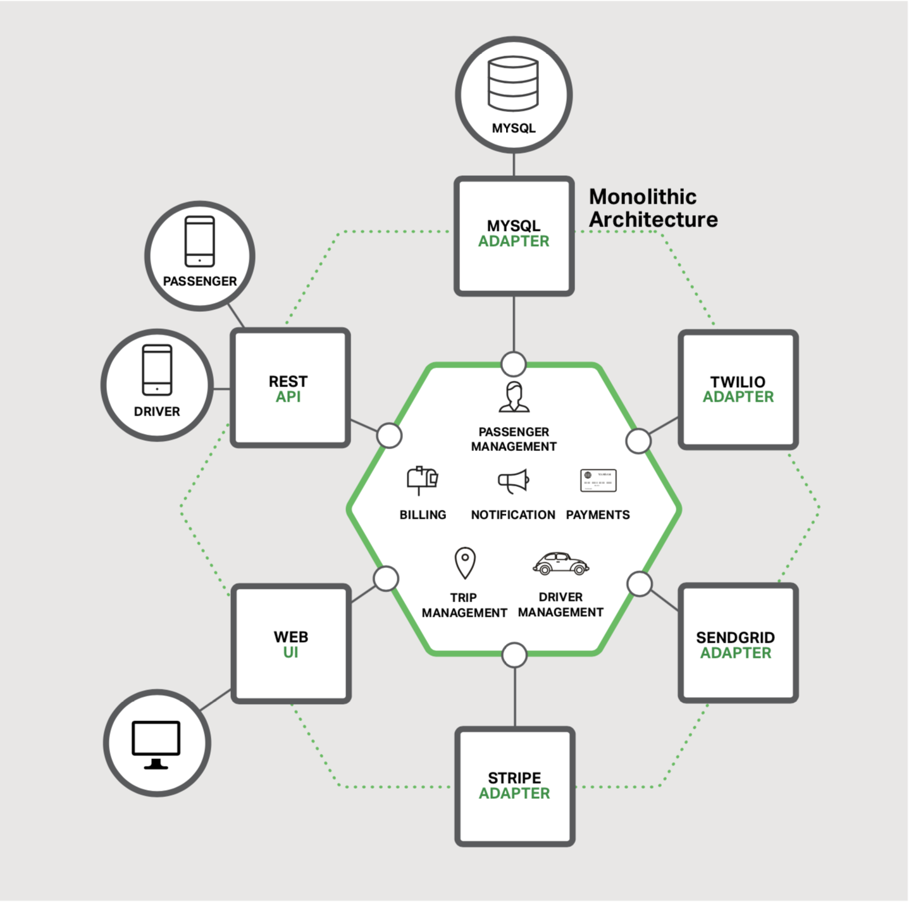
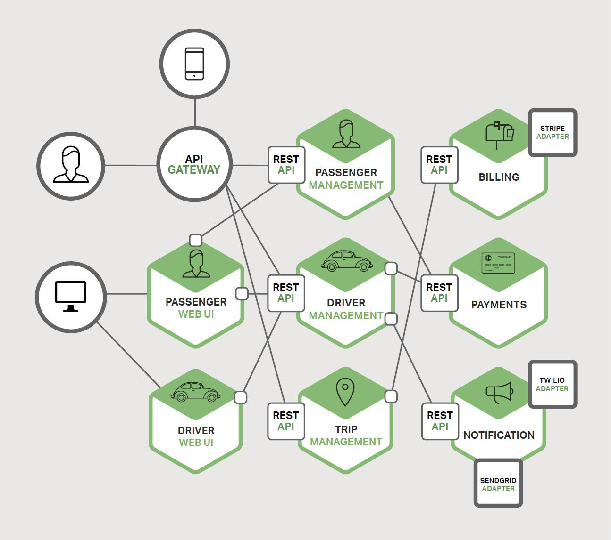
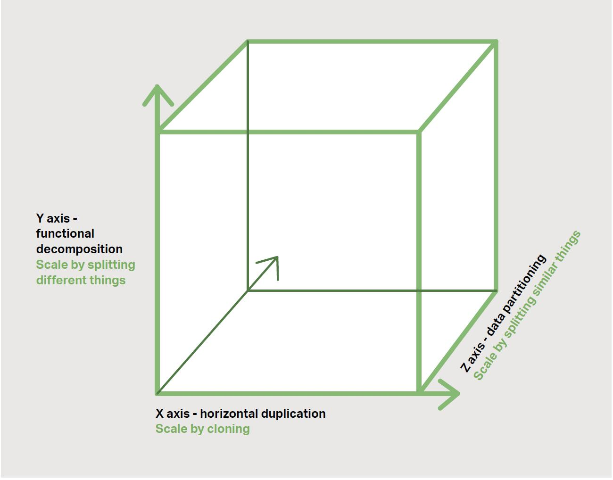
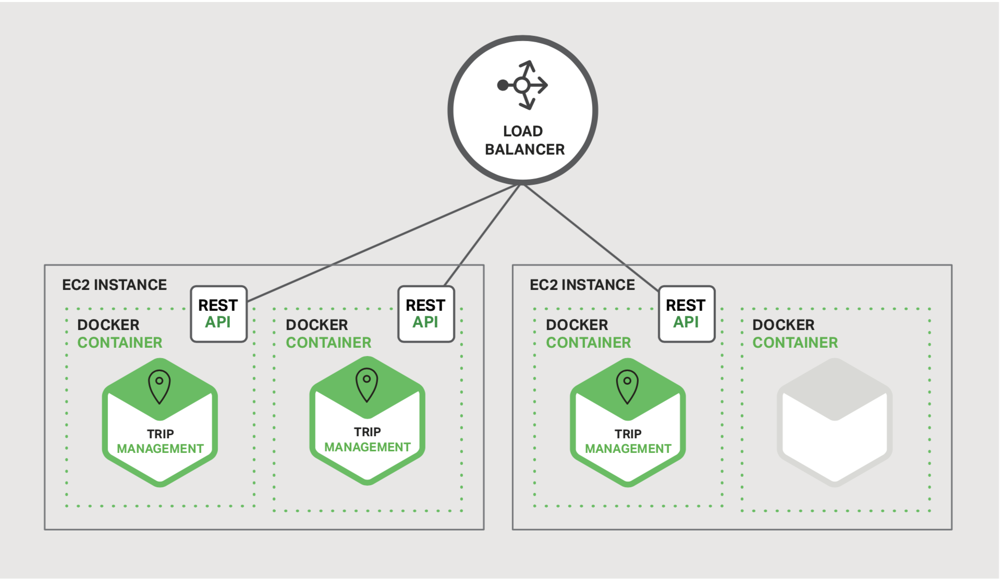
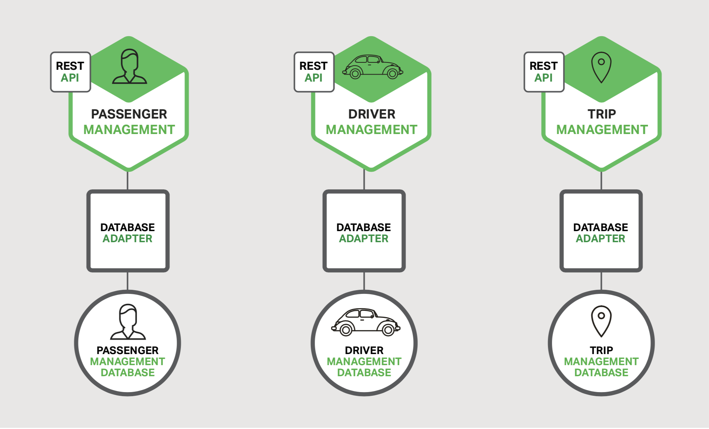

### 微服务介绍

当前，在论文，博客，社交媒体的讨论与会议上，微服务都获得了相当多的关注。它们正迅速的驶向[Gartner Hype cycle](https://www.gartner.com/en/research/methodologies/gartner-hype-cycle)中的过高期望的顶峰。与此同时，软件社区也有怀疑者对微服务不予理会，认为微服务只是换汤不换药。怀疑者断言微服务的只是对SOA体系的一个重塑罢了。但是，撇去炒作和怀疑，[微服务架构模式](http://microservices.io/patterns/microservices.html)有显著的增益，特别是能够允许敏捷开发的落地与在复杂的企业级应用的交付上。

此章节是本电子书的第一章。你将会学到微服务的方案以及它与更传统的[巨石架构模式](https://microservices.io/patterns/monolithic.html)的对比。本电子书将会阐述微服务架构中的丰富的元素。你也会学习到微服务机构模式的优缺点，它是否对你的项目有意义，以及如何应用它。

让我们以你为什么需要考虑使用微服务开始本章节。

#### 构建巨石应用

让我们想象一下你将要构建一个全新的打车应用以与Uber，Hailo去竞争。经过一些筹备会议与需求收集，可以手动创建新项目，也可以使用带有Rails、Spring Boot、Play或Maven等平台的生成器创建新项目。

这个新的应用将会有一个模块化的[六角架构](https://www.infoq.com/news/2014/10/exploring-hexagonal-architecture)，如图1-1所示：

图 1-1：打车应用程序示例

应用的核心是业务逻辑，由定义服务，域对象和事件的模块来实现。围绕在核心周围的是沟通外部世界的适配器。适配器的例子由数据库访问组件，生产和消费消息的消息组件，暴漏api或者实现UI的web组件构成。

尽管包含模块化逻辑架构，此应用还是作为巨石应用去打包和部署。实际的格式依赖于应用的语言与框架。例如，很多java应用作为WAR文件的形式打包，部署在Tomcat或者Jetty的应用容器中。其他的java应用是以独立可执行的Jar文件去打包。同样，Rails与Node.js应用是以目录层级的形式打包。

应用以此样式编写是非常普遍的。由于IDE和其它工具都聚焦在构建一个单个应用上，使应用的开发是变得如此简单。此类应用也易于测试。只需要简单的启动应用就可以实现端到端的测试，也可以使用诸如Selenium的测试包对UI进行测试。巨石应用也易于部署。只需要拷贝打包好的应用到服务器中，也可以运行多个挂载于负载均衡器的拷贝来实现伸缩。在项目的早期阶段，一起都正常运行。

#### 走向巨石地狱

很不幸，这种简单的方案有一个巨大的限制。成功的应用有一个随着时间的推移而成长的习惯，并且最终将变的巨大。在每一个迭代中，开发团队，获得了更多用户，当然了，也意味着添价很多行代码。几年后，小而简单的应用将成长为庞大的巨石应用。一个极端的案例，我最近采访了一位开发人员，他最近在编写一个工具去分析上千个JAR文件之间依赖，而这些JAR文件使用在一个包含数百万行代码的应用中。我能肯定这是大量的开发人员经过多年的齐心协作才能创造出这样一只野兽。

一旦应用变成了一个庞大，复杂的巨石，开发组织可能生活在一个痛苦的世界中。任何敏捷开发与交付的努力都会苦苦挣扎。一个主要的问题是应用变得压倒性的复杂。它太庞大了，任何一个开发人员都无法完全理解。因此，bug的修改与新功能的正确实现变得及其困难与消耗时间。更可怕的是，这一切有恶性循环的倾向。如果代码库变的难以理解，修改将不会被准确执行。最终将会得到一个庞大的，不可思议的大泥球。

应用的庞大体积也将会使开发慢下脚步。应用越庞大，启动时间越长。我调查过开发人员关于巨石应用的尺寸与性能，有一些声称启动时间长达12分钟之久。我还听过应用花了长达40分钟才完成启动的奇闻。如果开发人员不得不定期地重启应用服务器，那么他们一天中的大部分时间将会花在无所事事地等待上，同样他们的效率也将受难。

关于庞大，复杂的巨石应用的另一个问题，它是持续开发的一个障碍。当下，SaaS应用艺术的状态是将修改每天很多次的推送到生产环境。由于你必须重新部署整个应用以便更新应用的任何一部分，因此这一切对于复杂的巨石应用来说变得及其困难。我之前提到的启动时长也不会有什么帮助。同时，由于改变的影响通常不会被很好的理解，很有可能你不得不做一些额外的手工测试。最终，持续部署也几乎不可能被做到。

当不同的模块有资源需求的冲突时，巨石应用同样也难以伸缩。比如，一个模块可能实现了CPU密集型的图像处理逻辑，理想情况下是部署在Amazon EC2 Compute Optimized（AmazonEC2计算优化型）实例中。另一个模块可能是内存数据库，非常适合于EC2 Memory-optimized（AmazonEC2内存优化型）实例中。但是，由于这些模块是部署在一起的，你不得不在硬件的选择上妥协。

另一个巨石应用的问题是稳定性。由于所有的模块是运行在同一个进程中，任何模块中的一个bug，如内存溢出，都可能潜在的使整个进程崩溃。此外，由于所有运行应用的实例是完全相同的，这个bug将会影响整个应用的可用性。

最后但同样重要的，巨石应用使采纳新的框架与语言变的及其困难。比如，让我们想象下，你使用XYZ框架写了两百万行代码。用更新的ABC框架而重写整个应用的代价是巨大的（无论是时间还是费用），即使新框架被认可为更优秀。最终，采用新技术有了一个巨大的障碍。你就陷入了在项目开始之出做出的任何技术选型的泥潭中。

简而言之：你有一个成功的关键业务应用，已经成长成一个只有很少开发人员，如果有的话，能理解的庞大巨石应用。使用过时的，效率低下的技术去编写，使招聘有天赋的开发人员变的困难。应用难以伸缩与依赖。最终，应用的敏捷开发与交付将无法实现。

所以你能对这一切做什么呢？

#### 微服务-解决复杂性

很多组织，比如亚马逊（Amazon），易贝（eBay），[奈飞（Netflix）](https://www.nginx.com/blog/microservices-at-netflix-architectural-best-practices/)，已经通过接纳被大家熟知的[微服务架构规范](http://microservices.io/patterns/microservices.html)解决了这些问题。将应用程序分解为一组更小的、相互连接的服务，而不是去构建一个单一且庞大的巨石应用。

一个服务，通常实现了一组独特的特性或者功能，比如订单管理，用户管理等。每个微服务都是一个迷你应用程序，它有自己的六边形架构，包括业务逻辑和各种适配器。一些微服务会暴露一个API, 供其它的微服务或者应用的客户端来调用。其它的微服务可能实现了web用户界面。运行时，每一个实例通常是一个云虚拟机或者一个Docker容器。

例如，图1-2 将之前描述的应用做了一个可能合适的系统分解

图1-2 将巨石应用分解成微服务

现在，应用的每一个功能区域都由它自己的微服务来实现。此外，web应用被切割成了一组更简单的web应用，比如在我们的打车例子中，一个用于乘客，一个用于司机。为特定的用户，设备或者特定的用户案例进行部署将变的更加容易。

每一个后端服务，暴露一个REST API，大部分服务消费其它服务提供的API。比如，司机管理使用通知服务器将潜在的订单通知给空闲的司机。UI服务调用其它的服务去渲染web页面。服务也可能使用异步的，基于消息的沟通。服务之间的通信将会在以后的章节中阐述更多细节。

一些REST API也同样暴露给共乘客与司机使用的移动应用。但是这些应用不直接与后端服务交互。相反，服务间的通信是由一个被认为是API网关的媒介去协调。API网关负责的任务包括负载均衡，缓存，访问控制，API计量与监控，而这一切任务可以通过[NGINX](http://www.nginx.com/solutions/api-gateway/)高效的实现。
[第二章](chapter2.md)节将详细讨论API Gateway

图1-3 伸缩立方，适用于开发与交付

微服务架构模式对应于[伸缩立方](https://microservices.io/articles/scalecube.html)的Y轴，伸缩立方，3D伸缩模型，来至于一本完美的书，[伸缩艺术](http://theartofscalability.com/)。其它的两个伸缩轴，X伸缩轴，包含运行多个完全一致的应用拷贝，且挂载于负载均衡器之上；Z伸缩轴（或者数据分区），当请求的一个属性（比如，一行的主键或者用户的id）用于将请求路由到指定的服务器。

应用通常同时使用三种形式的伸缩。Y伸缩轴将应用分解成如图1-2所示的微服务。

运行时，为保证吞吐量与可用性，在负载均衡器下游，X伸缩轴会运行每一个服务的多份实例。一些应用也使用Z伸缩轴将服务分区。
图1-4 显示了如何以运行在Amazon EC2上Docker部署Trip Management（行程管理服务）服务

图1-4 使用Docker部署行程管理服务

在运行时，行程管理服务包括多个服务实例。每一个服务实例是一个Docker容器。为了保证高可用，这些容器会运行在多个跨云的虚拟机中。在服务实例的上游是负载均衡器，将请求分发到这些实例上，比如[NGINX](http://www.nginx.com/solutions/load-balancing/)。负债均衡器可能也处理其它的关注点，比如[缓存](http://www.nginx.com/resources/admin-guide/content-caching/)，[访问控制](https://docs.nginx.com/nginx/admin-guide/security-controls/controlling-access-proxied-http/)，[API计量](https://www.nginx.com/solutions/api-gateway/)与[监控](http://www.nginx.com/products/live-activity-monitoring/)。

微服务架构模式很明显的影响了应用与数据库之间的关系。每一个服务有自己独立的数据库schema，而不是与其它的服务公用一个数据库schema。一方面，改方案与企业级数据模型的想法不一致，同样，它经常会导致部分数据的冗余。但是，如果你想受益于微服务，为每一个服务配置独立的数据库模式是必须的，因为它保证了低耦合。图1-5展示了示例应用的数据库架构

图1-5 打车应用的数据库架构

每个服务都有自己的数据库。此外，服务可以使用最适合其需求的数据库类型，即所谓的多语言持久性体系结构。例如，Driver Management（司机管理），发现靠近潜在乘客的司机，必须使用支持高效地理查询的数据库。

从表面上看，微服务与SOA架构类似。两个方案的架构都包括了一组服务。然而，一种对微服务架构模式的思考，它是没有商业化，没有web服务规范(WS-*)与企业消息总线(ESB)感知包袱的SOA。以微服务为基础的应用更偏爱简单，更轻量的的协议，诸如REST，而不是WS-。它们也强烈的避免使用ESBs，而是通过微服务自己的方式去实现类似ESB的功能。微服务架构模式也拒绝SOA的其它部分，比如用于数据访问的规范模式的概念。

#### 微服务的优点

微服务架构模式有很多重要的好处。首先，它解决了复杂性的问题，将那些有可能成为庞大的巨石应用分解成一组服务。当功能总量无法改变，应用被分解为可被管理的块或者服务。每个服务都有一个明确定义的边界，其形式为RPC驱动或者消息驱动的API。微服务架构模式强制实现一定程度的模块化，而在基于巨石代码库的实践中，这一切极其难以实现。所以，独立服务的开发速度会快很多，也更易于理解与维护。

第二点，这样的架构允许每一个服务可以被专注于此服务的团队独立部署。只要服务符合API规定，开发人员可以自由选择任何有效的技术。当然，大部分组织会为了避免混乱而限制了技术选项。但是，这样的自主意味着开发人员不再逼不得已的使用那些在项目开始之初就存在的废弃的技术。当写一个新服务的时候，开发人员可以选择使用当前的技术。此外，由于服务相对来说比较小，使用当前的技术去重写陈旧的服务也是可行的。

第三点，微服务架构模式允许每一个服务可以被独立部署。开发人员永远不需要协调其服务本地更改的部署。一旦完成测试，这些改变就可以马上部署。比如，UI团队可以执行A|B测试，然后对UI的修改快速迭代。微服务架构模式使持续部署变成了可能。

最终，微服务架构模式使每一个服务可以独立伸缩。你可以在满足服务容量与可用性约束的情况下，独立配置每一个服务的实例。此外，你可以使用最符合服务资源要求的硬件。比如，你可以在EC2计算优化实例上部署CPU密集型图像处理服务，在EC2内存优化型实例上部署内存服务器。

#### 微服务的缺点
几乎三十年前，在Fred Brooks的书，人月神话([The Mythical Man-Month](https://en.wikipedia.org/wiki/The_Mythical_Man-Month))中写到，不存在银子弹。就像其他技术一样，微服务架构模式也有缺点。一个缺点正如它的名字，微服务一词过分强调服务规模。实际上，有开发人员提倡构建极其细粒度的10-100 LOC服务。虽然小型服务更可取，但重要的是要记住小型服务是达到目的的手段，而不是主要目标。微服务的目标是能高效地分解应用，促进应用的敏捷开发与部署。

微服务的另一个缺点，由于微服务应用是一个分布式系统，复杂性将随着提升。开发人员需要选择并实现基于消息传递或RPC的进程间通信机制。此外，由于请求目标的不稳定性与迟缓，开发人员也必须编写代码处理部分失效。虽然这一切都不是火箭科学，微服务比基于语言级模块调用的巨石应用复杂的多。

微服务的另一个挑战是分区数据库架构。更新多个业务实体的业务事务是很常见的。因为只有一个数据库，这种事务对巨石应用来说是微不足道的。但是，在无服务模式下的应用，你需要更新多个被不同服务维护的数据库。使用分布式事务通常来说不是一个好的选择，不仅仅是由于CAP理论。因为这些不被当今的很多高度可伸缩的NoSQL数据库和消息中间件所支持。最终不得不使用最终一致性的方案，这对开发人员来说更具挑战性。

对微服务应用的测试也会更加复杂。比如，使用现代框架，诸如Spring Boot，编写一个启动巨石Web应用的测试类并测试其REST API是微不足道的。相反，一个服务相似的测试类需要启动此服务以及它所依赖的任何服务，或者至少要为依赖的服务配置stubs。再次申明，这不是火箭科学，但重要的是不要低估此项工作的复杂性。

微服务架构的另一个主要挑战是横跨多个服务实现修改。比如，让我们假设你正在实现一个需求，需要更改服务A，B和C，A依赖B，而B依赖C。在巨石应用中，你可以简单的修改相应的模块，整合修改，一次性的部署他们。相反，在微服务架构模式中，你需要细心的规划与迭代每一个服务。比如，你需要先更新服务C，然后是B，最后是A。幸运的是，很多修改通常只影响一个服务；需要协调的多服务的修改是及比较少见的。

微服务应用的部署也是复杂的多。巨石应用只需要部署在传统负载均衡器下游一组完全相同的服务器上。每一个应用实例都配置成基础架构服务的地址（主机跟端口），比如数据库，消息代理组件。相反，微服务应用通常拥有大量的服务。比如，Hailo有160个不同的服务，据Adrian Cockcroft所说，Netfilx有超过600个以上。

每一个服务有多个运行实例。这就意味着有更多的部件需要被配置，部署，伸缩与监控。此外，你同样需要时间服务发现机制，使服务能够发现与之通信所需的任何其他服务的位置（主机和端口）。传统费事的基于工单与人为的手工操作在规模上是无法处理这种级别的复杂度。所以，成功部署微服务应用需要开发人员对发布方法的完全掌握与更高级别的自动化。

一个实现自动化的方式是使用诸如Cloud Foundry此类现成的PaaS。PaaS为开发人员提供了更简单部署与管理微服务的方法。它让开发人员不再关注采购与配置IT资源。同时，配置PaaS的系统和网络专业人员可以确保遵守最佳实践和公司策略。

自动部署微服务的另一种方法是开发基本上属于你自己的PaaS。一个代表性的出发点是使用一个集群解决方案，比如Kubernetes，连同容器方案，比如Docker。在本电子书的后面章节，我们将看到基于软件的应用程序交付方案，比如NGINX，如何在微服务层级，简单的处理缓存，访问控制，API计量与监控，将有助于你解决这个问题。

## 总结
构建复杂的应用程序本身就很困难。巨石架构模式只适用于简单，轻量级的应用。如果将它用于复杂的应用程序，将陷入痛苦的世界。尽管有缺点和实施挑战，微服务架构模式是复杂，不断发展的应用程序的更好选择。

在后面的章节中，我将深入探讨微服务架构模式的各个方面的细节，也将讨论诸如服务发现，服务部署选项，将巨石应用重构成服务的策略等话题。
