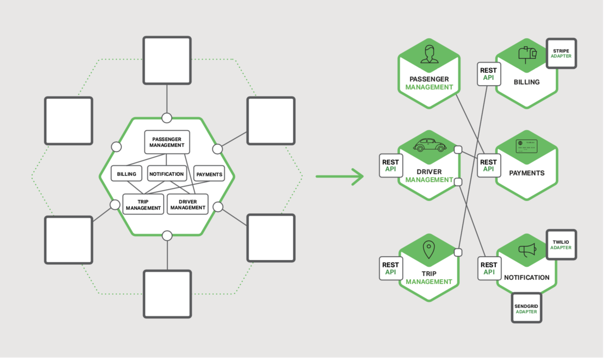
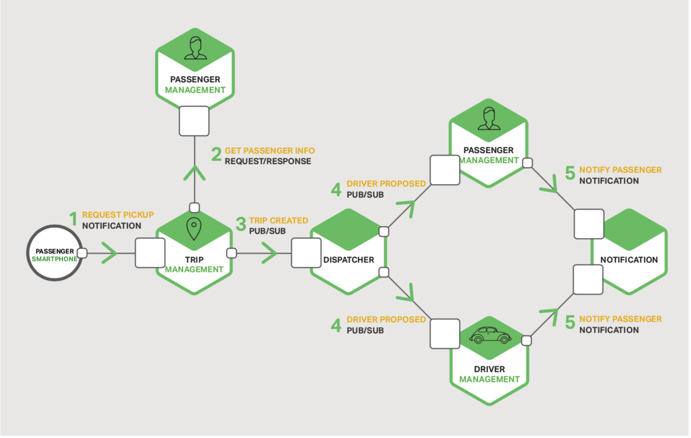
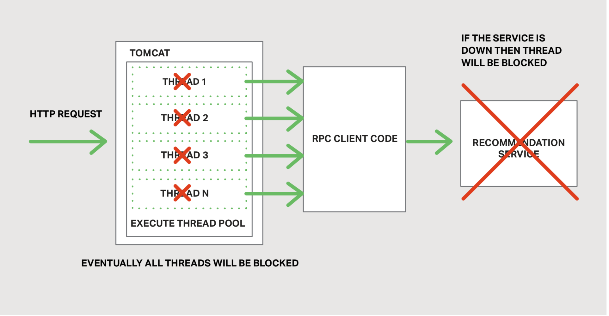
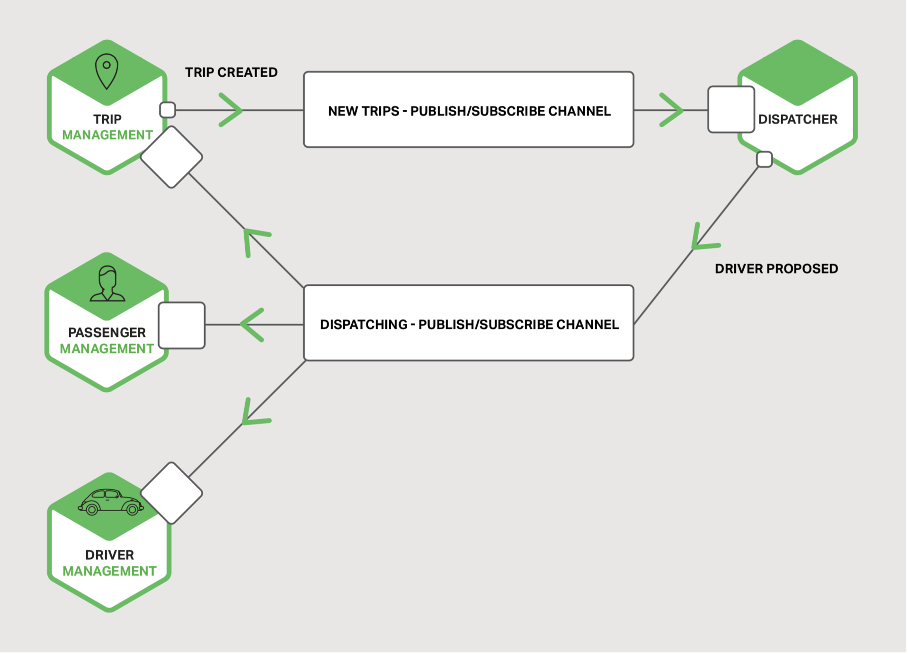
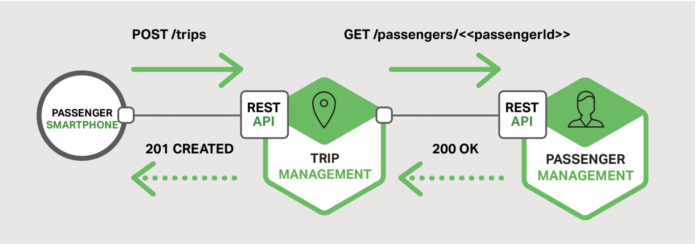

## 进程间通信

本章节本电子书的第三章。第一章介绍了微服务架构模式，与巨石架构模式做了比较并讨论了微服务的优缺点。第二章描述了应用的客户端如何通过被称为API网关的中间组件与微服务进行通信。在本章节中，我们一起探讨系统中的服务如何通信。第4章探讨与服务发现密切相关的问题。

### 介绍
巨石应用中，组件通过语言级的方法或者函数调用来触发另一个组件。相比之下，基于微服务的应用是运行在多台机器上的分布式系统。每一个服务实例通常是一个进程。

因此，如图3-1所示。服务必须使用进程间通信（IPC）机制进行交互。

稍后我们将会查看特定的IPC技术，首先让我们一起探索多样的设计问题。

图3-1 使用进程间通信进行交互的微服务

### 交互风格
当为服务选择IPC机制时，首先要考虑服务之间是如何交互的。有各种客户端<->服务的交互风格。可以被归类到两个纬度。第一个纬度，交互是否是一对一，还是一对多。
- 一对一：每一个客户端的请求只被一个服务实例处理
- 一对多：每一个请求被多个服务实例处理

第二个纬度，交互是同步的还是异步的
- 同步：客户期望服务的及时响应，甚至可能在等待时阻塞
- 异步：客户端在等待响应时不阻塞，并且响应（如果有的话），并不一定需要立刻返回

下表展示了各种交互风格

|                     |            一对一            |  一对多             | 
| --------------------------| ---------------------------- |  ---------------------------- | 
| 同步    |  请求/响应|  - |
| 异步   |  通知 / 请求/异步响应| 推送/订阅 推送/异步响应 |
表3-1 进程间通信风格

有以下类型的一对一交互，包括同步（请求/响应）和异步（通知和请求/异步响应）：
- 请求/响应 - 客户端请求访问服务，然后等待响应。客户希望响应及时到达。在基于线程的应用中，发起请求的线程在等待中甚至可能会阻塞。
- 通知（亦称：单向请求）- 客户端向服务发送请求，但是不期待任何答复
- 请求/异步响应 - 客户端向服务发送请求，服务异步答复。客户端在等待期间不会阻塞，并且假设响应可能不会在一段时间内到达。
  
有以下类型的一对多交互，两者都是异步的：
- 推送/订阅 - 客户端发送一条通知消息，会被零个以上的目标服务消费
- 推送/异步响应 - 客户端推送一条请求消息，然后等待一定时间以获得目标服务的响应

每项服务通常组合使用这些交互方式。对一些服务来说，单一的IPC机制是足够的。而对于另一些服务可能需要组合使用IPC机制。

图3-2 显示了当用户请求打车时，打车应用中的服务可能如何交互的方式

图3-2 为服务交互使用多个IPC机制

服务使用了通知，请求/响应和发布/订阅的组合。比如，乘客的智能手机发送一个通知到行程管理（Trip Management）服务以请求搭乘。行程管理服务通过使用请求/响应调用乘客管理（Passenger Management）服务来验证乘客的帐户是否有效。行程管理服务然后创建行程，使用推送/订阅机制通知其它服务，包括可以定位可载客司机的调度器。

现在我们已经了解了交互样式，让我们来看看如何定义API。

### 定义APIs
服务的API是服务与其客户端之间的约定。无论你选择哪一种IPC机制，使用某种接口定义语言（IDL）精确定义服务的API非常重要。使用[API优先方案](https://www.programmableweb.com/news/how-to-design-great-apis-api-first-design-and-raml/how-to/2015/07/10)定义服务甚至有很好的论据。可以通过编写接口定义并与客户端开发人员一起查看来开始开发服务。只有在对API定义进行迭代后才能实现该服务。预先进行此设计可增加构建满足客户需求的服务的机会。

在本篇的后续你会看到，API定义的性质取决于你使用的IPC机制。如果你使用消息传送，API包括消息通道与消息类型。如果你使用HTTP，API包括URL，请求与响应的格式。稍后我们将深入介绍一些IDL。

### 演进的APIs
服务的API总是随着时间而改变的。在巨石应用中，通常直接修改API然后更新所有的调用者。在微服务应用中，这变的困难的多，即使你的API的所有消费者都是相同应用程序中的其他服务。通常无法强制所有客户端与服务保持同步升级，此外，可能会[逐步部署新版本的服务](https://medium.com/netflix-techblog/deploying-the-netflix-api-79b6176cc3f0)，以便同时运行旧版本和新版本的服务。制定处理这些问题的方案非常重要。

处理API更改的方式取决于更改的大小。某些更改是次要的，并且与以前的版本向后兼容。比如，你可能为请求或者响应添加属性。设计客户端和服务是有意义的，以便他们遵守[健壮性原则](https://en.wikipedia.org/wiki/Robustness_principle)。使用旧版本API的客户端应该能继续使用新版本的服务。服务为丢失的请求参数提供了默认值，客户端可以忽略额外的响应属性。使用IPC机制和消息传递格式非常重要，这使你可以轻松地演进你的API。

但是，有些时候，你必须对API做出主要的，不兼容的修改。由于你不能强制客户端立刻升级，必须为旧版本的API提供一段时间的服务。如果你使用基于HTTP的机制，比如REST，一个方法是集成版本号到URL中。每一个服务实例可能同时处理多个版本。或者，你可以部署多个实例，每一个处理特定的版本。

### 处理部分失败
正如在章节二关于API Gateway中所提到的那样，在分布式系统中，部分失败是永远存在的。由于客户端与服务是独立的进程，某个服务可能不能及时响应客户端的请求。由于故障或者维护，服务有可能不可用。或者，服务可能会超负荷运行，及其缓慢的响应请求。

比如，试想下，章节二中商品详情案例。让我们构想下，推荐服务无响应。一个客户端的天真实现可能会无限期地阻塞响应。这样不仅会导致糟糕的用户体验，而且在许多应用中，会消耗宝贵的资源，比如线程。最终运行时将耗尽线程并变得无响应。如图3-3所示。

图3-3 线程由于服务无响应而阻塞

为了阻止该问题，必须设计服务来处理部分失败。[Netflix](https://medium.com/netflix-techblog/fault-tolerance-in-a-high-volume-distributed-system-91ab4faae74a)描述是一种可供参考的优秀方案。处理部分失败的方案包括：
- 网络超时 - 等待响应时，永远不能无限期的阻塞而且总是使用超时。使用超时可以保证资源永远不会无限期的被占用。
- 限制未完成请求数 - 强加客户端对特定服务未完成请求数的上限。如果达到限制，发起额外请求是无意义的，而且这些尝试需要立刻终止。
- 断路器模式 - 跟踪成功与失败的请求。如果错误率超过定义的阀值，触发断路器，以便以后的尝试立刻失效。如果大量的请求失败，则表明此服务不可用，发送请求是无意义的。超时时间后，客户端应该重新尝试，如果成功，则关闭断路器。
- 提供回调 - 当请求失败时，执行回调。比如，返回缓存数据或者默认值，比如一组空的推荐。
  
[Netflix Hystrix](https://github.com/Netflix/Hystrix)是一个开源库，可以实现这些和其他模式。如果是正在使用JVM，你应该毫不考虑的使用Hystrix。而且，如果在非JVM环境中运行，则应使用相应的同等库。

### IPC技术
有很多不同的IPC技术可供选择。服务可以使用基于同步请求/响应的通信机制，比如基于HTTP的REST或者Thrift。同样，也可以使用异步，基于效益的通信机制，比如AMQP，或者STOMP。

也存在各种不同的消息格式。服务可以使用人类刻度的，基于文本的格式，比如JSON，或者XML。同样，也可以使用二进制格式（更高效），比如Avro，或者协议缓冲。稍后我们将着于同步IPC机制，但是首先让我们讨论异步IPC机制。

### 异步，基于消息的通信
当使用消息传送，线程通过异步交换消息进行沟通。客户端通过发送消息向服务发送请求。如果期待服务应答，服务会发送独立消息返回给客户端。由于通信是异步的，客户端不会阻塞等待应答。相反，客户端是以应答不会被立刻收到的假设去编写。

消息包括头（元数据，比如发送人）和消息体。消息通过通道进行交换。任何数量的生产者都可以发送消息到通道。同样，任何数量的消费者可以从通道中接收消息。有两种通道，点对点和发布-订阅。
- 点对点通道向正在读取通道的其中一个消费者传递消息。服务使用点对点通道来实现之前描述的一对一交互样式
- 发布-订阅通道为所有连接的消费者推送每一条消息。服务使用发布-订阅通道来实现上述的一对多交互样式

图3-4 显示了打车应用程序如何使用发布-订阅频道

图3-4 打车应用中使用推送/订阅通道

行程管理服务通知其他服务，比如调度器，通过将行程创建信息写入到推送-订阅通道以处理新行程。调度器寻找空闲的司机，通过将被提议的司机信息写入到推送-订阅通道以通知其它服务。

有很多消息系统可供选择。应该选择一个支持各种编程语言的系统。

有一些消息系统支持标准的协议，比如AMQP，STOMP。其他的消息系统具有所有权但有文档说明的协议。

有很多开源的消息系统可供选择，包括RabbitMQ, Apache Kafka, Apache ActiveMQ, 和NSQ。在更高层级，他们都支持某种形式的消息和渠道。他们都力求可靠，高性能与可扩展。但是，每一个代理消息传递模型的细节都存在显著差异。
使用消息推送有很多优势：
- 客户端与服务解耦 - 客户端只需简单的将消息发送到适当的通道即可发起请求。客户端对服务实例完全无察觉。不需要使用发现机制来确定服务实例的位置。
- 消息缓冲 - 使用同步请求/相应协议，比如HTTP，客户和服务都必须在交换期间可用。相比之下，消息代理将写入通道的消息排队，直到消费者可以处理它们。这将意味着，比如，在线商店仍然可以接受来自客户的订单，尽管订单完成系统变的缓慢或者无响应。订单消息只需要排队。
- 灵活的客户端-服务交互 - 消息传递支持前面描述的所有交互样式。
- 直接的进程间通信 - 基于RPC的机制尝试将对远程服务的调用看起来就像在调用本地服务。但是，因为物理定律和部分失败的可能性，实际上它们是大相径庭。消息传递使得这些差异非常明确，因此开发人员不会陷入虚假的安全感。

但是，消息推送也存在缺点：
- 额外的操作复杂性 - 消息系统是另一个也要被安装，配置与运维的系统组件。消息代理必须具有高可用性，否则会影响系统可靠性。
- 实现基于请求/响应交互的复杂性 - 请求/响应式交互需要一些工作来实现。每一个请求消息必须包含答复通道标识符以及相关标识符。该服务将包含相关ID的响应消息写入答复通道。客户端使用相关ID对响应与请求进行匹配。使用直接支持请求/响应的IPC机制通常更容易。

现在我们已经看过了使用基于消息推送的IPC，让我们剖析基于请求/响应的IPC。

### 同步，请求/响应IPC
当使用同步的，基于请求/响应的IPC机制，客户端想服务发送请求。服务处理请求并发回响应。

在很多客户端中，在等待响应时，发起请求的线程会一直阻塞。其他客户端可能使用可能由[Futures](https://docs.scala-lang.org/overviews/core/futures.html)或[Rx Observables](http://reactivex.io/documentation/observable.html)封装的异步，事件驱动的客户端代码。但是，并不类似于消息推送，客户端假设响应会及时到达。

有许多协议可供选择。两种流行的协议是REST和Thrift。我们先来看看REST。

#### REST
今天，以RESTful风格开发API是一种时尚。REST是一种（几乎总是）使用HTTP的IPC机制。

REST中的一个关键概念是资源，它通常表示业务对象（如客户或产品）或此类业务对象的集合。REST使用HTTP动词以操作资源，在使用URL时被引用。比如，GET请求返回资源的表示形式，该形式可能是XML文档或JSON对象的形式。POST请求创建新资源，PUT请求更新资源。

引用Roy Fielding的话，REST之父：

“REST provides a set of architectural constraints that, when applied as a whole, emphasizes scalability of component interactions, generality of interfaces, independent deployment of components, and intermediary components to reduce interaction latency, enforce security, and encapsulate legacy systems.”
—Roy Fielding, Architectural Styles and the Design of Network-based Software Architectures

图3-5显示了打车应用程序可能使用REST的方法之一：

图3-5 使用RESTful交互的打车应用

乘客的智能手机通过向行程管理(Trip Management)服务 **/trips** 资源发送POST请求以请求搭乘，服务通过向乘客管理( Passenger Management)服务发送有关乘客信息的GET请求来处理请求。在确认旅客有权创建行程后，行程管理(Trip Management)服务创建行程然后返回201响应到智能手机。

很多开发人员申明它们基于HTTP的APIs是RESTful。但是，如Fielding在此[博客](http://roy.gbiv.com/untangled/2008/rest-apis-must-be-hypertext-driven)中所阐述的那样，它们并不全是这样。

Leonard Richardson（并非亲属）定义了一个非常有用的REST成熟度模型，它包含以下级别：
- 级别0 - 级别0 API的客户端通过向其唯一的URL端点发出HTTP POST请求来调用该服务。每个请求都指定要执行的操作，操作的目标（例如，业务对象）以及任何参数。
- 级别1 - 级别1 API支持资源的概念。要对资源执行操作，客户端会发出POST请求，指定要执行的操作和任何参数。
- 级别2 - 级别2 API使用HTTP动词来执行动作：GET：检索；POST：创建；PUT：更新。如果有，请求查询参数和正文，指定操作的参数。这使服务能够利用Web基础结构，例如缓存GET请求。
- 级别3 - 级别3 API的设计基于可怕的命名规则，HATEOAS(Hypertext As The Engine Of Application State（超文本作为应用程序状态的引擎）)。基本思想是GET请求返回的资源陈述中包含对该资源所允许执行操作的链接。例如，客户端可以使用订单陈述中返回的链接来取消订单，该链接是为了响应检索订单的GET请求而返回的。
  HATEOAS其中一个[好处](https://www.infoq.com/news/2009/04/hateoas-restful-api-advantages)是客户端代码中不再需要硬写URL。另一个好处是因为资源陈述中包含了所允许的操作，客户端不必猜测可以对当前状态的资源执行哪些操作。

使用基于HTTP的协议有众多好处：
- HTTP简单而熟悉
- 可以使用Postman等扩展程序在浏览器中测试HTTP API，或者使用curl从命令行测试HTTP API（假设使用JSON或其他一些文本格式）
- 直接支持请求/响应样式通信
- 当然，HTTP是防火墙友好的
- 不需要中间代理，简化了系统架构
  
使用HTTP也有一些缺点：
- HTTP仅直接支持请求/响应交互方式。可以使用HTTP进行通知，但服务器必须始终发送HTTP响应。
- 因为客户端与服务直接通信（没有中间组件可以缓冲消息），在交换期间两者都必须在运行。
- 客户端必须知道每个服务实例的位置（即URL），如章节二中所描述的那样，在现代应用中，这是一个非常重要的问题。客户端必须使用服务发现机制定位服务实例。
  
开发人员社区最近重新发现了RESTful API接口定义语言的价值。有一些选择，包括[RAML](https://raml.org/)，[Swagger](https://swagger.io/)。有些IDLs，比如Swagger，允许你定义请求与响应消息的格式。其他的，比如，RAML，要求使用单独的规范，比如[JSON Schema](https://json-schema.org/)。和描述APIs一样，IDL通常有工具可以从接口定义生成客户端stubs和服务器骨架。

#### Thrift
[Apache Thrift](https://thrift.apache.org/) 是REST一个有趣的替代物，它是一个用于编写跨语言RPC客户端和服务器的框架。Thrift为定义APIs提供了C风格的IDL。你可以使用Thrift编译器生成客户端喝服务器端的骨架。编译器为各种语言生成代码，包括C++, Java, Python, PHP, Ruby, Erlang, 和Node.js。
一个Thrift接口包含了一个或者多个服务。服务定义类似于Java接口。它是一组强类型方法的集合。
Thrift方法要么返回一个值（也可能void），要么它们被定义成单向，没有值。返回值的方法实现请求/响应风格的交互；客户端等待响应而且肯能会抛出异常。单向方法对应于通知风格的交互；服务器不发送响应。

Thrift支持多样的消息格式：JSON, 二进制, and 紧凑二进制。二进制比JSON更高效，因为二进制解码更快。而且，顾名思义，紧凑二进制是空间高效的格式。当然，JSON，是人类和浏览器友好的。Thrift还提供了包括 raw TCP和HTTP在内的传输协议选择。raw TCP有可能比HTTP更高效，但是，HTTP对防火墙、浏览器和人类都是友好的。

### 消息格式
现在我们已经看过了HTTP和Thrift，现在让我们剖析消息格式的问题。如果你正在使用消息推送系统或者REST，你现在到了消息格式的选择。其它的IPC机制，比如Thrift，可能只支持一小部分的格式类型，或者甚至只有一种。在任一情况下，使用跨语言的消息格式很重要。尽管今天你可能只用单一的语言编写你的微服务，而在未来，你有可能会使用其它的语言。

主要有两种类别的消息格式：文本与二进制。基于文本格式的有JSON和XML。使用这种格式的好处不仅仅是人类可读的，而且他们也是自我描述的。在JSON中，对象的属性由 名称-值 键值对的集合表示。同样，在XML里，属性由命名元素和值表示。这样可以允许消息的消费者可以挑选他感兴趣的值而忽略剩余的。最终，对消息格式的微小更改可以很容易地向后兼容。

XML文档的结构由[XML schema](https://www.w3.org/XML/Schema)指定。随着时间的推移，开发者社区意识到JSON也需要一个类似的机制。一个选择是使用[JSON schema](https://json-schema.org/)，要么是独立的，要么作为IDL的一部分，比如Swagger。

使用基于文本的消息格式的一个缺点是消息倾向于冗余，特别是XML。因为消息是自我描述的，每一个消息包含了值之外，还包括了属性的名称。另一个缺点是解析文本的开销，因此，你可能需要考虑使用二进制格式。

有许多种二进制格式可供选择。如果你是用Thrift RPC，你可以使用二进制Thrift。如果你需要选择消息格式，流行的选择有[Protocol Buffers](https://developers.google.com/protocol-buffers/docs/overview)和[Apache Avro](https://avro.apache.org/)。这两种格式都提供了一种用于定义消息结构的类型IDL。但是，一个区别是Protocol Buffers使用被标记的字段，而Avro消费者需要知道schema以解释消息。最终，使用Protocol Buffers比使用Avro更容易实现API的演化。这篇博文是Thrift，Protocol Buffers和Avro的绝佳对比。

## 总结
微服务的通信必须使用进程间通信机制。在设计服务的通信方式时，你必须考虑各种问题：服务如何交互，如何为每一个服务指定API，如何演进APIs，和如何处理部分失败。有两种类型的IPC机制可供微服务使用：异步消息推送和同步请求/响应。为了通信，一个服务必须能发现另一个服务。在章节4中，我们将探讨微服务架构中的服务发现问题。
