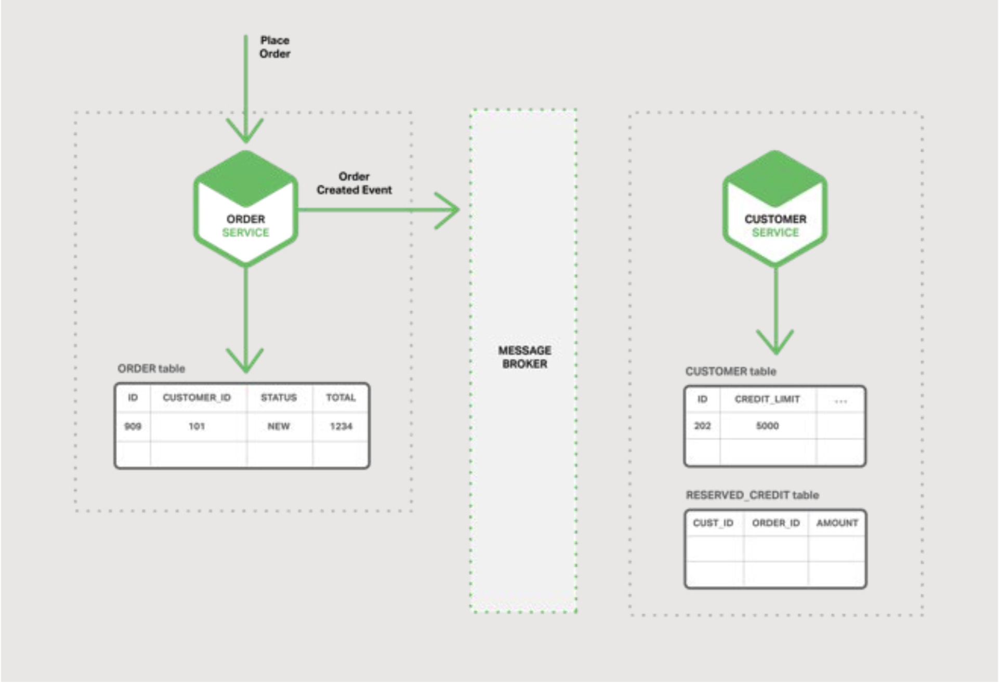
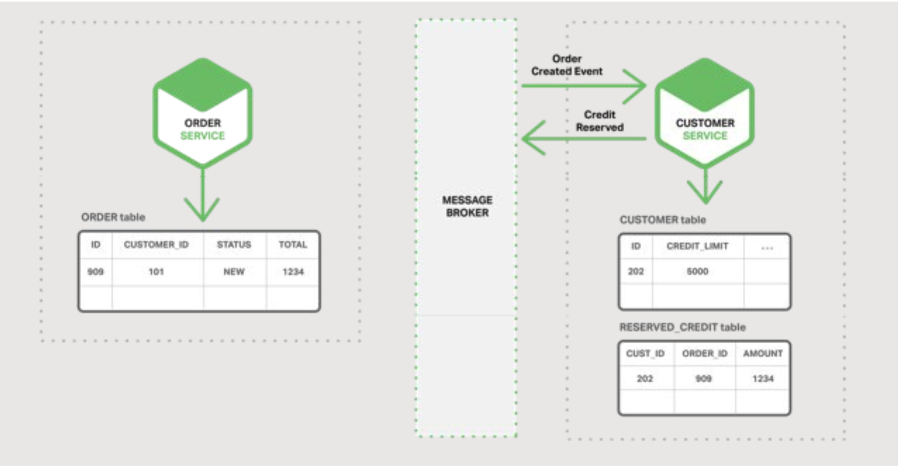

## 微服务的事件驱动数据管理

本章节是电子书的第五章。章节一介绍了微服务架构模式，讨论了使用微服务的优缺点。章节二和章节三，阐述了微服务之间通信不同的层面。在本章节中，我们探讨与服务发现密切相关的问题。章节四探索了与服务发现紧密相关的问题。在本章节，我们改变话题，探讨微服务架构中出现的分布式数据管理问题。

### 微服务与分布式数据管理的问题
巨石应用通常有一个单一的关系型数据库。使用关系型数据库的一个主要好处是能使用[ACID事物](https://en.wikipedia.org/wiki/ACID_(computer_science))，提供了一些重要的保障：
- 原子性 - 以原子化方式进行修改
- 一致性 - 数据库的状态永远是一致的
- 隔离性 - 即使事务是并发执行的，它们看起来也是串行执行的
- 持久性 - 事物一旦提交，将无法撤销
  
因此，你的应用可以简单地开始事务，更改（插入，更新和删除）多行数据，并提交事务。

使用关系型数据库的另一个主要好处是它提供了SQL，一种丰富的，声明性的，标准化的查询语言。你可以轻松编写一个查询，从多个表中合并数据。然后，RDBMS查询计划程序确定执行查询的最佳方式。你不必担心底层细节，比如如何访问数据库。而且，因为应用的所有数据都是在一个数据库中，所以很容易查询。

不幸的是，当我们转向微服务架构时，数据访问变得更加复杂。这是因为每个微服务拥有的数据对于该微服务是[私有的](https://microservices.io/patterns/data/database-per-service.html)，并且只能通过其API访问。封装数据可确保微服务低耦合，并且相互间可以独立演进。如果多个服务访问相同的数据，则schema修改需要对所有服务进行耗时，协调的更新。

情况更糟的是，不同的微服务通常使用不同种类的数据库。现代应用存储和处理各种数据，关系型数据库并不总是最佳选择。对于某些用例，特定的NoSQL数据库可能具有更实用的数据模型，并提供更好的性能和可伸缩性。例如，存储和查询文本的服务使用文本搜索引擎（如Elasticsearch）会更合理。同样，存储社交图数据的服务应该使用图形数据库，例如Neo4j，最终，基于微服务的应用通常使用SQL和NoSQL数据库的混合，所谓的混合持久化方案。

用于数据存储的分区的，混合持久化架构具有许多优点，包括服务低耦合，更好的性能与伸缩性。但是，它也带来了分布式数据管理挑战。

第一个挑战是如何实现保持多个服务之间一致性的业务事务。要知道为什么这是一个问题，让我们看一个B2B在线商店的例子。客户服务维护客户信息，包括他们的信用额度。订单服务管理订单，并且必须验证新订单是否违反客户的信用额度。在该应用的巨石版本中，订单服务可以简单的执行一个ACID事务来检查可用额度，然后创建订单。

与此相反，在微服务架构中，ORDER和CUSTOMER表对其各自的服务是私有的，如图5-1所示：

图 5-1 每个微服务拥有自己的数据

订单服务无法直接访问CUSTOMER表。它只能使用客户服务提供的API。订单服务可以潜在的使用[分布式事务](https://en.wikipedia.org/wiki/Two-phase_commit_protocol)，也称为两阶段提交(two-phase commit, 2PC)。但是，在现代应用中，2PC通常不是可行的选择。[CAP理论](https://en.wikipedia.org/wiki/CAP_theorem)需要你在可用性与ACID风格的一致性两者间做出选择，而且可用性通常是更优的选择。此外，很多现代技术，比如大部分NoSQL数据库，不支持2PC。维护服务和数据库之间的数据一致性至关重要，因此我们需要另一种解决方案。

第二个挑战是如何实现从多个服务检索数据的查询。例如，让我们假设应用需要显示客户及其最近的订单。如果订单服务提供用于检索客户订单的API，那么你可以使用应用端的join来检索此数据。应用从客户服务中检索客户，并从订单服务中检索客户的订单。但是，假设订单服务仅支持按主键查找订单（也许它使用的NoSQL数据库只支持基于主键的检索）。在这种情况下，没有明显的方法来检索所需的数据。

### 事件驱动架构
对于许多应用来说，解决方案是使用[事件驱动架构](https://martinfowler.com/eaaDev/EventNarrative.html)。在该架构中，当一些值得注意的事情发生时，微服务就会推送一个事件，比如当他更新了一个业务实体（entity）。其他微服务订阅这些事件。当微服务接收事件时，它可以更新自己的业务实体，这可能导致更多事件被推送。

你可以使用事件来实现跨多个服务的业务事务。事物包含一系列步骤。每个步骤由更新业务实体的微服务和发布触发下一步的事件组成。下图显示了在创建订单时如何使用事件驱动方法检查可用信用。

微服务通过消息中间件交换事件：
- 订单服务创建状态为NEW的订单并发布订单创建事件
  
  图 5-2 订单服务推送事件
- 客户服务消费订单创建事件，保留该订单的信用，并发布信用保留事件
  
  图 5-3 客户服务答复
- 订单服务消费信用保留事件并将订单状态更改为OPEN
  
  图 5-4 订单服务响应答复

一个更复杂的场景可能包含额外的步骤，比如在客户信用被检查的同时，预留库存。

假设（a）每个服务以原子方式更新数据库并发布事件 - 稍后再详述 - 以及（b）消息中间件保证事件至少传递一次，然后，你可以实现跨多个服务的业务事务。值得注意的是，这些不是ACID事务。它们提供了更弱的保证，例如[最终一致性](https://en.wikipedia.org/wiki/Eventual_consistency)。此事务模型称为[BASE模型](https://queue.acm.org/detail.cfm?id=1394128)。

您还可以使用事件来维护由多个微服务拥有的预join数据的物化视图。服务为相关事件维护视图订阅者并更新视图。图5-5描述了Customer Order View Updater Service基于Customer Service和Order Service所推送的事件更新Customer Order View。

图 5-5 客户订单视图由两个服务访问。

当Customer Order View Updater Service接收到Customer或者Order事件，将修改Customer Order View数据库。你可以使用文件数据库，比如MongoDB，实现Customer Order View，并为每一个用户存储一个文件。Customer Order View Query Service通过查询Customer Order View的数据存储来处理客户和最近订单的请求。

事件驱动架构用多个优点和缺点，支持跨多个服务的事务实现，并提供最终的一致性。另一个好处是它同样允许应用能够维护物化视图。

一个缺点是编程模型比使用ACID事务时更复杂。通常，你必须实现补偿事务以从应用级故障中恢复；比如，如果信用额度检查失败，必须关闭订单。同样，应用必须处理不一致的数据。这是因为由正在进行中的事务所引起的修改是可见的。如果应用从尚未更新的物化视图中读取，则也会看到不一致的数据。另一个缺点是订阅者必须检测并忽略重复事件。

### 实现原子性
在事件驱动的体系结构中，还存在数据库更新的原子化和事件推送的问题。比如，Order Service 必须向ORDER表插入一行数据和推送Order Created事件。这两个操作必须是原子的。如果服务在更新数据库之后但在发布事件之前崩溃，则系统会变得不一致。确保原子性的标准方法是使用分布式事务，包括数据库和Message代理组件。但是，由于上述原因，例如CAP定理，这正是我们不想做的。

### 使用本地事务发布事件
实现原子性的一种方法是应用使用仅涉及本地事务的多步骤流程来推送事件。诀窍是在存储业务实体状态的数据库中创建一个EVENT表，充当消息队列。应用开始（本地）数据库事务，更新业务实体的状态，向EVENT表中插入一个事件，然后提交事物。一个独立的应用线程或者进程查询EVENT表，将事件推送到消息中间件，然后使用本地事物将事件标志为已推送，
设计如图5-6所示

图5-6 使用本地事物实现原子性

Order Service向ORDER表中插入一条新数据，同样也向EVENT中插入一条Order Created事件。Event Publisher线程或者进程在EVENT表中查询未推送的事件，然后推送事件，更新EVENT表，将该事件标志为以推送。

该方案有多个优缺点。一个好处是它保证在不依赖2PC的情况下为每次更新推送事件。同样，应用推送业务级事件，这消除了推断它们的需要。这种方法的一个缺点是它可能容易出错，因为开发人员必须记住推送事件。这种方法的局限性在于，由于其有限的事务和查询功能，在使用某些NoSQL数据库时实现起来很困难。

通过让应用使用本地事务来更新状态和推送事件，这种方法消除了对2PC的需求。现在让我们看一下通过让应用简单地更新状态来实现原子性的方法。

### 挖掘数据库事务日志
在不依赖2PC的情况下实现原子性的另一种方法是由挖掘数据库事务或者提交日志的线程或者进程来推送事件。应用更新数据库，因此修改将记录在数据库的事务日志中。Transaction Log Miner线程或进程读取事务日志并将事件推送到消息中间件。
设计如图5-6所示

图5-7 消息中间件可以仲裁数据事务

该方案的一个案例是开源项目：[LinkedIn Databus](https://github.com/linkedin/databus)。Databus挖掘Oracle事务日志并对相应的修改推送事件。LinkedIn使用Databus使各种派生数据在存储与记录系统之间保持一致。

另一个案例是[AWS DynamoDB中的流机制](http://docs.aws.amazon.com/amazondynamodb/latest/developerguide/Streams.html)，一个托管的NoSQL数据库。DynamoDB流包含在过去24小时内对DynamoDB表中的元素进行的按时间排序的修改（创建，更新和删除操作）序列。应用可以从流中读取这些更改，例如，将它们作为事件来推送。

事务日志挖掘具有各种优点和缺点。一个好处是它保证在不使用2PC的情况下为每次更新推送事件。事务日志挖掘还可以通过将事件推送从应用的业务逻辑中抽离出来以简化应用。一个主要缺点是事务日志的格式是每个数据库特有的，甚至在不同的数据库版本之间也会修改。此外，从事务日志中记录的低级别更新逆向工程高级别业务事件也很困难。

事务日志挖掘通过让应用做一件事来消除对2PC的需求：更新数据库。现在让我们看一个消除更新并仅仅依赖于事件的不同方案。

### 使用事件源
[事件源](https://github.com/cer/event-sourcing-examples/wiki/WhyEventSourcing)通过使用完全不同的，以事件为中心的方式来持久化业务实体，从而在没有2PC的情况下实现原子性。应用存储一系列状态改变事件，而不是存储实体的当前状态。应用通过重现事件来重建实体的当前状态。业务实体的状态无论是在何时发生变化，都会在事件列表中追加一个新事件。由于保存事件是单一操作，因此它天然具有原子性。

要了解事件源的工作原理，将Order实体作为示例。在传统方案中，每个订单映射到ORDER表中的一行，并映射到例如ORDER_LINE_ITEM表中。

但是，当使用事件源时，Order Service以其状态修改事件的形式存储Order：创建，通过，发货，取消。每个事件都包含足够的数据来重建订单的状态。

图 5-8 事件可以具有完整的恢复数据

事件在Event Store中持久化，是事件的数据库。存储有用于添加和检索实体事件的API。Event Store的作用与我们之前描述的架构中的Message Broker相似。提供API，供服务订阅事件。Event Store向所有订阅者传送所有事件。Event Store是事件驱动的微服务架构的支柱。

事件驱动有几个好处。它解决了事件驱动架构中的关键问题。状态无论何时发生改变，它都能可靠的推送事件。因此，它解决了微服务架构中的数据一致性问题。此外，因为它持久化事件而不是域对象，在很大程度上避免了[对象-关系阻抗不匹配](https://en.wikipedia.org/wiki/Object-relational_impedance_mismatch)问题。事件源还提供了对业务实体所做更改的100％可靠审计日志，并且可以实现在任何时间点确定实体状态的时态查询。事件源的另一个主要好处是你的业务逻辑由交换事件的松散耦合的业务实体组成。这样从巨石应用迁移到微服务架构会容易的多。

事件源也有一些缺点。这是一种不同的，不熟悉的编程风格，因此有一个学习曲线。事件存储仅直接支持按主键查找业务实体。你必须使用[命令查询职责分离](https://github.com/cer/event-sourcing-examples/wiki)（CQRS）来实现查询。因此，应用必须处理最终一致的数据。

## 总结
在微服务架构中，每个微服务都有自己的私有数据存储。不同的微服务可能使用不同的SQL和NoSQL数据库。虽然此数据库架构具有显着优势，但它产生了一些分布式数据管理挑战。第一个挑战是如何在跨多个服务的情况下实现保持一致性的业务事务。第二个挑战是如何从多个服务中实现数据检索。

对于许多应用，解决方案是使用事件驱动架构。实现事件驱动架构的一个挑战是如何以原子更新状态以及如何推送事件。有几种方法可以完成实现，包括将数据库用作消息队列，事务日志挖掘和事件源。
