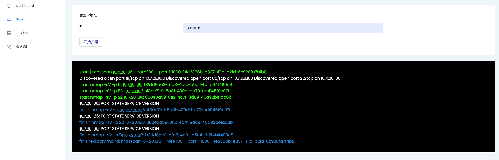
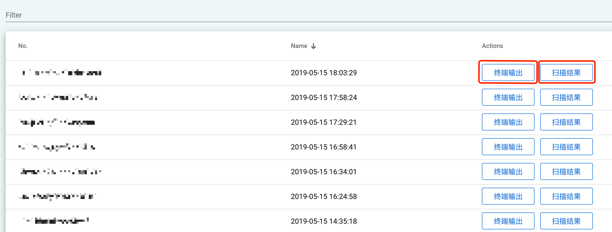
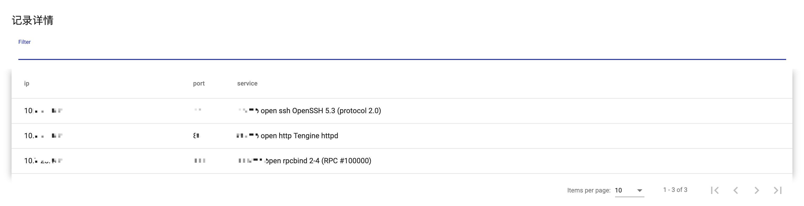
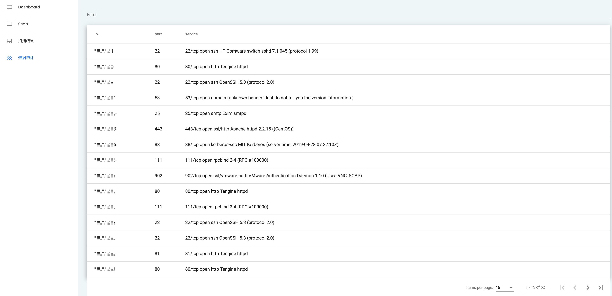

<p align="center">
   
</p>

随着时间的推移，公司服务器的规模逐渐成规模化后，有一个比较严肃的安全问题：**所有服务器的端口开放情况及其协议**。

由于各种原因，服务器的端口开放的管理会变的比较复杂。处于安全与管理等方面的考虑，需要对其进行科学化的管理：

1. 归档服务器的端口及其协议，用于统计与维护
2. 发生新的安全漏洞时，可以根据协议，定位到具体的服务器
3. 加强对服务器的管理，只允许开放规定的端口

在本篇幅中，我们将从需求确认，方案选择，具体实现环节来阐述具体实现。

希望能给读者提供一定的参考。

## 章节1：需求确认

##### 一：传统场景

在传统场景中，我们主要是用命令工具，然后通过console的输出查看具体结果。虽然快速，但是有许多问题：

1. 本次console端的所有输出只能执行人可见，其它人员无法查看
2. 在不同的时间执行同样的命令，结果可能存在差异，这时候只能依赖主观记忆去比较
3. 需要登录到服务器，然后才能执行命令

##### 二：需求

结合平台的具体使用场景，我们提出了以下需求：

1. 规范用户输入 - 用户指定合法的IP
2. 扫描发起后，通过websocket，我们可以实时看到后台命令的执行情况，
3. 每一次的扫描，都要保存命令的执行情况，同时也要格式化保存扫描的结果
4. 统计所有的扫描结果并提供数据查询入口
5. 有较高的性能，能扩展到可以一次性扫描几千个地址

## 章节2：解决方案探讨

#### websocket

websocket的实现方案有很多种，这个主要看自己的个人选择，只要能在功能和协议上达到目标即可。

在本方案中，我们选择了[tornado](https://www.tornadoweb.org/)，成熟的python web框架： 

1. tornado由于使用的是单线程非堵塞的方式处理请求，因此性能显著高于传统模式下的框架；
2. 最新版本的tornado，v6，使用了python3中的很多关键字，降低学习成本；
3. 组件成熟，可以解决大部分的使用场景

#### 主机端口扫描

[masscan](https://github.com/robertdavidgraham/masscan)，p端口扫描工具。

命令简单，性能高，命令示例：
```shell
masscan 192.168.1.200 -p80 --rate 200
```

#### 端口服务识别

[nmap](https://nmap.org/)，端口服务识别工具。

命令简单，协议丰富，命令示例：

```shell
nmap -sV -p 80 192.168.1.200
```

## 章节3：具体实现

#### 扫描服务的代码逻辑

在tornado的代码中，我们集成了masscan，nmap命令，并通过websocket协议将命令结果实时输出给客户端。

代码的具体设计逻辑请看下图：


#### 扫描入口

用户输入ip地址，点击开始扫描按钮后，将看到后台的实时输出



#### 历史结果查询入口



点击终端输出按钮，可以查看本次console的历史输出:


点击扫描结果按钮，可以查看本次扫描结果的格式化统计:


#### 数据统计查询入口
每一次的扫描结果，都会累加到该表格中，可以查询到所有所描结果的格式化统计:

