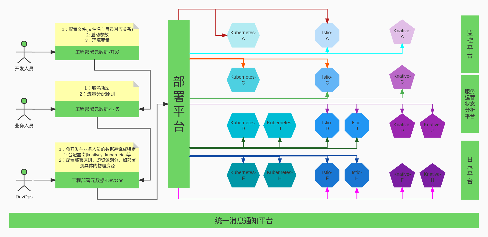
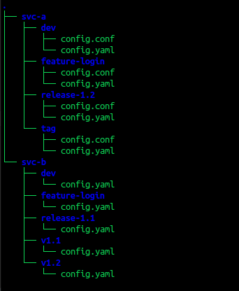
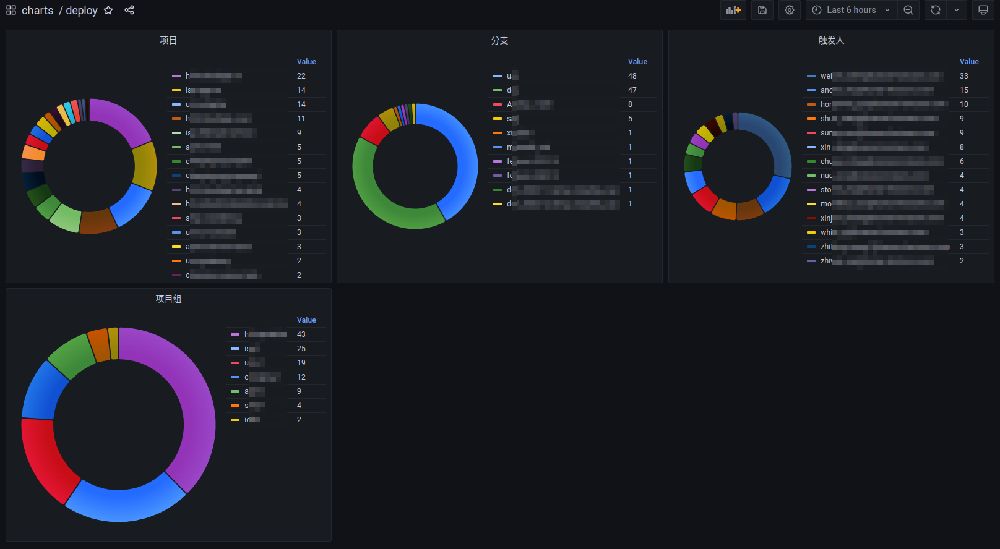
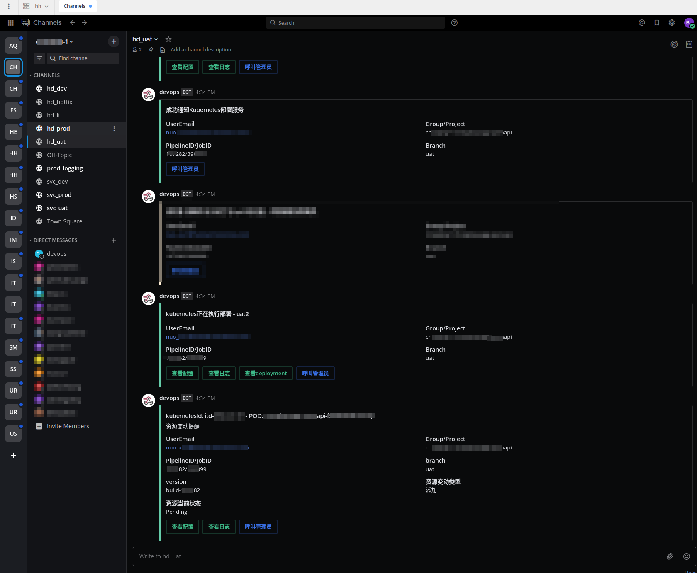
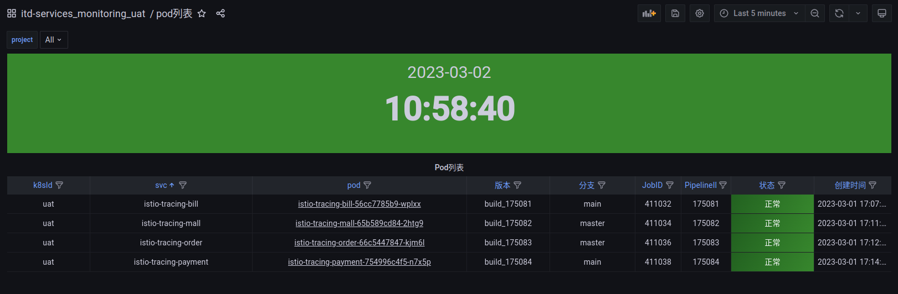

## 发布平台

在介绍前，我们先看一段话，

```
    Here is my source code.
    Run it on the cloud for me.
    I do not care how.
```

这段话阐述了一个优秀的发布平台应该让开发人员，业务人员无需过多关注平台本身。

---

### 开发团队：

1. 简单易学，最好能做到与本地开发一致，无需学习
2. 部署方案灵活 - 能灵活支持各种分支管理方案
3. 减少对服务部署架构的关注 - 无需关注部署至何种平台，应无需关注架构级调整
4. 可追溯性强 - 每一次部署所产生的元数据能将各数据进行关联，便于查询与定位问题
5. 数据反馈与查询入口 - 对每次部署所产生的变更能提供各种数据反馈与查询入口，如配置是否生效，新版本服务的日志等

### 项目管理/业务团队：

1. 提供各维度数据 - 如哪些项目，哪些分支，哪些人员在触发部署任务,查看项目进度的宏观数据

### DevOps团队：

1. 提供申请入口 - 用户自助完成部署申请
2. 适配器 - 将开发人员提供的交付物，如镜像，rpm包等经过修改成功部署至相应的平台，如kubernetes，knative，虚拟机, apig等

---

## 部署平台

### 现状

目前很多公司的开发平台，都是直接对接服务运行平台，如下图：
<p align="center">
   
</p>

该发布平台架构简单，也是我们的第一版发布系统，基于ansible，灵活快速， 但是会有以下几种问题：

1. 只注重代码部署，服务运行所依赖的其他元数据，如域名，流量等需要单独配置
2. 部署平台与服务运行载体耦合性强，如后续需要支持knative等，需要重新构造
3. 使用ansible有一定的学习成本，配置文件中包含除应用外的其他配置

### 下一代

当项目越来越多，扩展性要求更高的情况下，我们设计了下一代发布平台  
注明： [部署工程的数据结构](structure.md)

<p align="center">
   
</p>

<p align="center">
   
</p>

以项目A做例，该项目不同分支部署到不同的物理资源，在规划部署平台的入口标准时，一定要统一规划好分支管理，可以参考[Gitflow 工作流](../../gitflow-workflow-cn/README.md)

| 分支                          | 资源                                                          |
|-----------------------------|---------------------------------------------------------------|
| **^dev$**                   | kubernetes-dev,  istio-dev                                    |
| **^feature(-[a-z0-9]+)+$**      | kubernetes-feature,  istio-feature                            |
| **^release-([0-9]+)(.[0-9]+)*$** | kubernetes-release,  istio-release                            |
| **^lt-([0-9]+)(.[0-9]+)*$**     | kubernetes-lt,  istio-lt                                      |
| **tag**                        | kubernetes-prod1,  istio-prod1, kubernetes-prod2,  istio-prod2 |

部署平台具有以下特点：

1. 元数据分角色 - 一个服务完成端到端部署，需要多角色的参与，这里根据角色的不同输入不同的数据
2. 各项目独立控制 - 一个项目，根据分支管理，在部署时部署到不同的物理资源
3. 解耦开发与业务人员对架构与物理资源的关注
4. 易升级与迁移 - 当物理资源需要升级时，只需将特定物理资源纳管进部署平台
5. 易控制性 - 部署平台作为中央管理，可以精确控制项目与物理资源，以及提供多维度的业务指标数据
6. 配置清晰 - 一分支一目录，目录中包含所有指定的配置文件

#### 独立的配置工程 - 使用gitlab project工程存放配置文件,可以参考[config目录](config/README.md)

<p align="center">
   
</p>

灵活支持滚动发布，灰度发布等任意发布模式下的配置文件管理

---

## 宏观概览
    各维度查看工程的部署状态
<p align="center">
   
</p>

---

## 统一消息通知平台
    任何联动消息都通过IM工具发送给相应的人员
<p align="center">
   
</p>

---

## 部署结果反馈
    在监控中关联本次部署的元数据，如分支，pipelineID，jobID,以及用户自定义的属性等

<p align="center">
   
</p>
