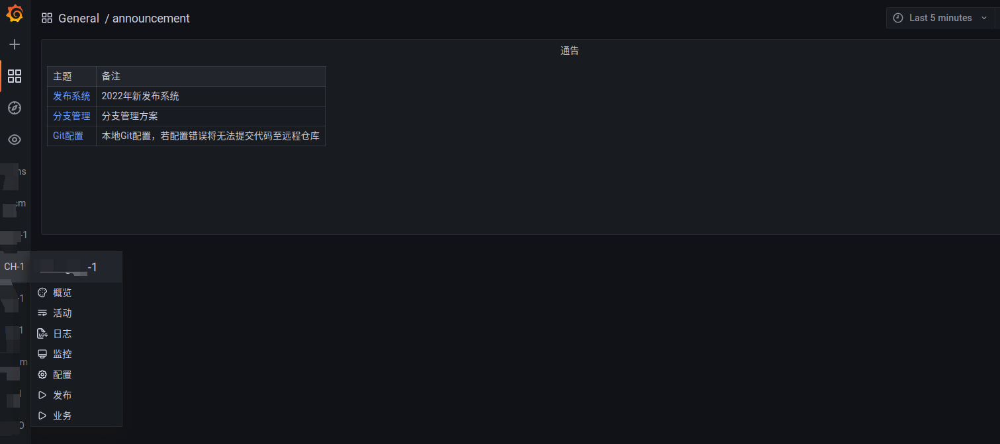
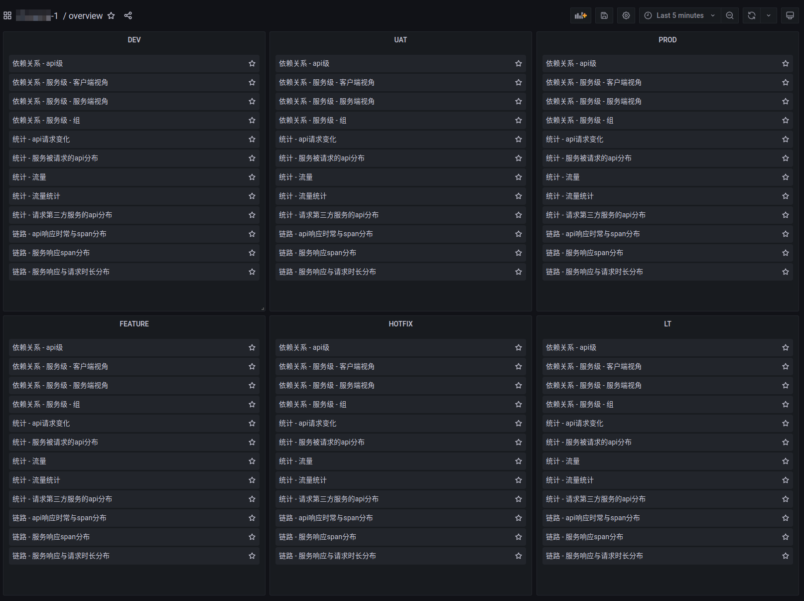
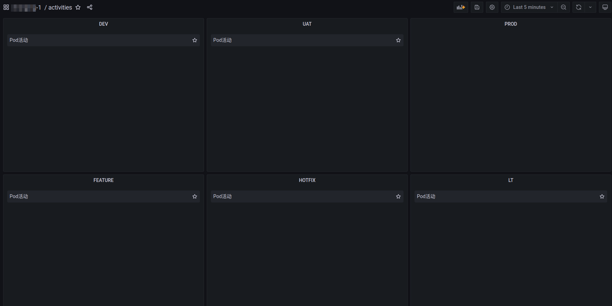
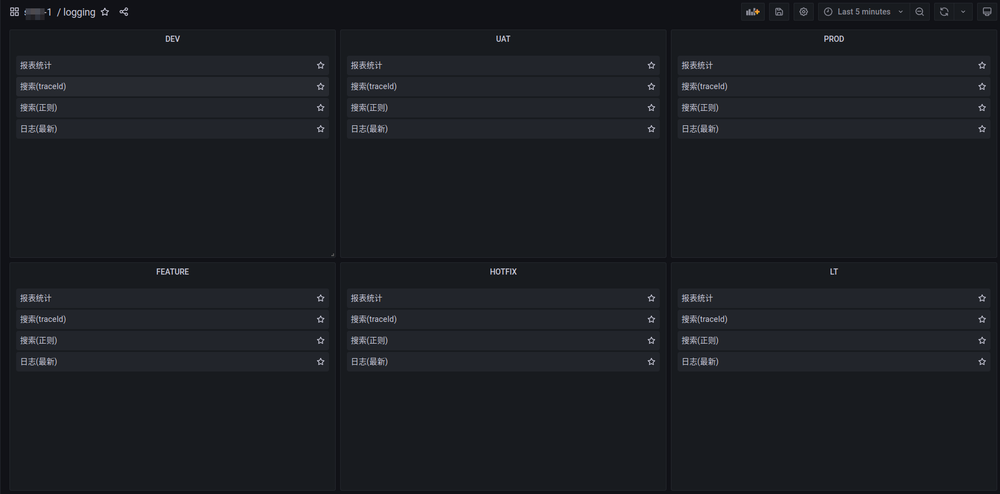
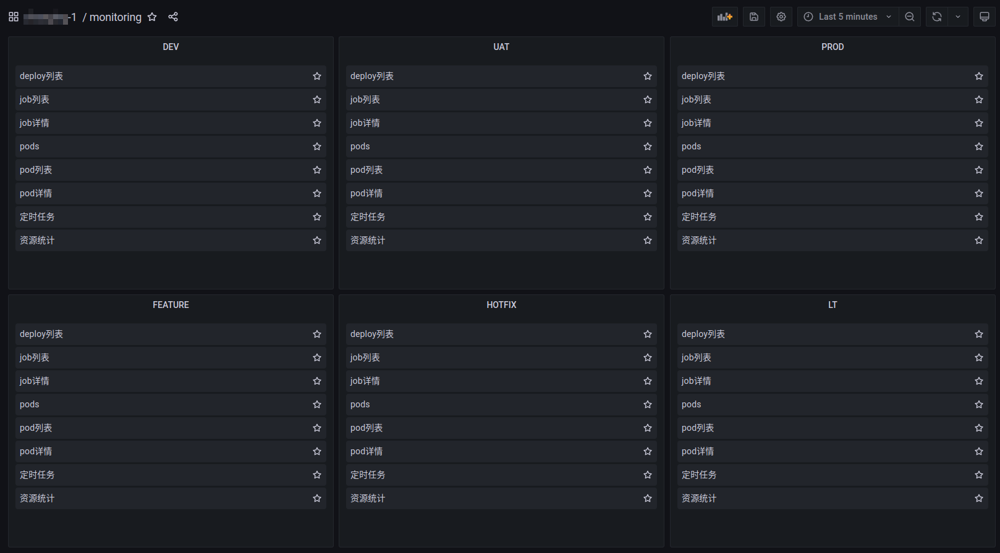
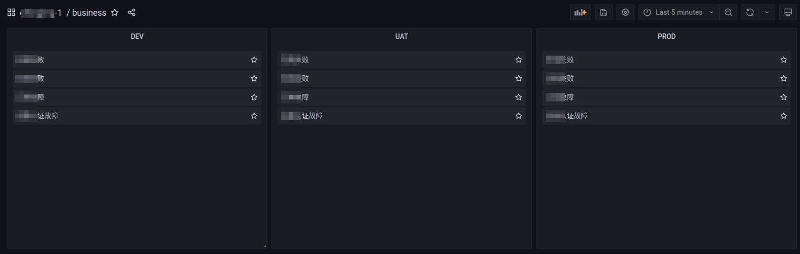

## 功能概览

   

### 功能介绍

1. 概览 - 从宏观与微观上查看服务运行的状态, 具体功能可以查看[服务运营状态分析平台](../tracing_platform/README.md)

   

2. 活动 - 根据服务与版本获取pod的进出记录, 具体功能可以查看[服务运营状态分析平台-开发团队](../tracing_platform/developer/README.md)

   

3. 日志 - 根据不同场景搜索日志

   

4. 监控 - 多维度多角度展示资源的状态

   

5. 配置 - 查看应用配置
6. 发布 - 工程阶段部署的统计，各个工程的元数据，如配置文件对应关系，启动命令，环境变量，域名等等
7. 业务 - 业务监控，通过云原生的监控方案，自定义监控指标与报警等

   

