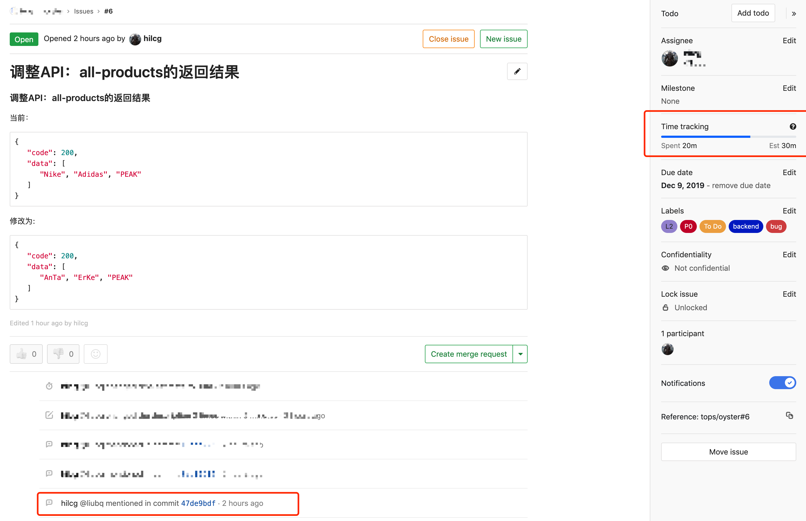
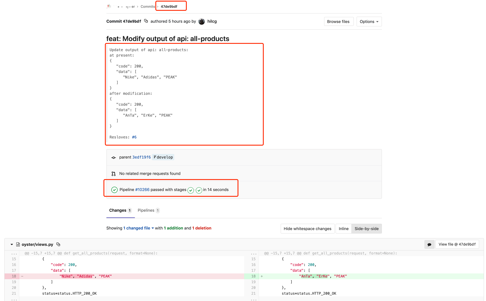

<p align="center">
   
</p>

### 应用发布的代码行级正反向依赖

传统模式下的应用部署中，可能就只需要完成发布工作。但是，一个完整的发布，需要考虑整个链路。

经常因为一个发布，可能会在不同的人员与部门中，产生诸多问题（部分）：

- 发布是否的确完成
- 本次发布相比于上次，代码做了哪些改变
- 此次代码修改的具体说明（此次代码修改的原由）
- 当前对外提供的服务的版本是哪一个
- 知道当前提供服务的版本后，定位当前版本的代码
- 服务发生修改后，准确定位代码的具体修改与修改原由

本章节，将通过结合[Gitlab](https://about.gitlab.com/)，通过一个完整的案例，展示发布前的准备，发布后的确认以及后期检查。

### 章节概览
- 任务创建
- 代码提交
- 版本确认
- 反向检查

注明：读者也可以使用[Jira](https://www.atlassian.com/software/jira), [Crucible](https://www.atlassian.com/software/crucible)等工具来完成任务跟踪与代码review等功能。

#### 任务创建
在传统模式下，开发人员编写代码，然后直接提交，没有一个很好的归档。一不添加注释，二不添加原由。这为后期的维护带来困难。

任务跟踪，是一种很好解决上述问题的方案。

在成熟的Devops公司中，任务的创建与分配有很严格的规定，当上级分配任务至下属时，需要考虑众多因素：

- **等级** - 该任务的重要程度，紧急，正常
- **难易度** - 是给哪一级别的员工去完成，初级，中级还是高级
- **due date** - 不能晚于何时完成该任务
- **完成时间** - 该任务在多长时间内完成
- **任务标签** - 任务类别，比如该任务是关于数据库的，还是关于配置的等等

这样，每当到了一个评审周期，项目助理等会从多个维度去审核该员工在此周期内任务的完成情况：

- **任务数量** - 完成任务的数量（最简单的衡量维度）
- **超期限完成情况** - 未能在规定时间内完成任务（是任务非配太多还是能力不足）
- **任务匹配度** - 完成的任务是否与其职称匹配（任务难易度超过其职称评级还是等于，甚至低于）
- **关键角色** - 是否经常完成紧急任务，在团队中起到关键角色的作用
- **工时** - 完成分配的任务所花费的时间

通过以上介绍，我们可以看出，一个按照规定，严格定义的任务，为后期的管理带来了诸多益处。


上图是一个任务案例截图，从中我们可以看到：

- 任务编号：#6
- 任务受托人
- 时间跟踪 - 预计完成时间（30分钟）
- 任务标签 - TO Do，backend，bug，P0，L2
- 任务标题以及任务详情（此处只是为了演示，实际工作中可以根据模版，生成标准的标题与详情）

#### 代码提交

传统的代码提交，注释几乎没有标准。
在这里，给大家推荐由[Udacity](https://udacity.github.io/git-styleguide/)推荐的注释标准。

**编写好了注释后，该如何将此次代码修改关联到特定的任务呢？**

```shell
feat: Modify output of api: all-products

Update output of api: all-products:
at present:
{
   "code": 200,
   "data": [
      "Nike", "Adidas", "PEAK"
   ]
}
desired:
{
   "code": 200,
   "data": [
      "AnTa", "ErKe", "PEAK"
   ]
}

Resloves: #6
```
1: 在提交的comment中，我们添加上述的注释，以及添加了此任务已花费的时间**20m**。  
Gitlab将关联此提交到编码为#6的任务。


2: 点击提交的commit链接，可以跳转到此次提交的详情页。

通过上图我们可以看出此次代码提交的详情，用户提交的注释，代码对比，以及触发的流水线等等。

#### 版本确认
在上一个章节中，我们提交了代码，虽然触发了相应的流水线job，但是我们仍希望可以通过最简单的方式来确认当前服务是否已经部署完成。

得益于Gitlab中，每一个pipeline都会有一个唯一的ID标识符，如下图。

可以看到我们最近一次的提交所引起的流水线job的ID为 **#10266**。  
在这里，我们可以向每一个打包的镜像或者二进制包中添加一个环境变量或者文件，然后通过添加一个API来读取此变量：

以Dockerfile为例：
```shell
FROM docker.io/python:3.6.4-slim

MAINTAINER liubq "liubq919@163.com"

USER root

ENV APP_VERSION "BUILD_NO"
```

在上述的Dockerfile中，我们添加了环境变量，**APP_VERSION**，其具体的值，**BUILD_NO**，是每一次流水线的唯一的ID标识符。

然后在服务的API中，添加一个获取当前版本的API，比如 **app.com/version**（在具体环境中，基于安全考虑，为每一个服务，添加相应的无规则字符串，比如**app.com/gg0836984kgmvkjgit/version**），当用户请求时，可以返回以下具体响应：

```json
{
    "code": 200,
    "data": {
        "version": "build-10266"
    }
}
```
当然，具体的version值，可以根据公司的规定与实际情况，添加分支号，服务详情，负责人等等。

通过version API的请求，我们可以看出，当前的版本是build ID为10266，基础此ID，我们可以确认，我们提交的代码，最近的一次#10266的流水线job，已经完成了服务的部署。

**至此，当开发人员提交完代码，触发流水线后，可以通过调用获取version的API来确认，服务是否已经上线，减少了部门与人员之间的沟通成本。**

#### 反向检查
反向检查适用与多种场景：

##### 通过服务版本确认代码情况
在很多情况下，我们需要知道当前正在服务的API的版本，然后在git仓库中定位具体的代码版本，比如tag，分支等。

在此要求下，我们可以：
1. 通过请求version API，确认当前版本以及build ID
2. 通过build ID，确定分支或者tag

##### 多人合作的功能冲突
在日常工作中，如果有多人合作的项目，很容易发生功能冲突。

当某位开发人员编写的功能，可能由于某些原因，被其它人员有意或者无意的修改了，无论是远程协同还是同地办公，都为沟通带来了成本。在传统模式中，我们先确认代码提交人，然后根据情况选择下一步：

- 同地：若人员在职，当面沟通，讨论方案
- 人员离职或者请假，无法当面沟通，沟通几乎停滞
- 异地协同：发送邮件或者通过IM，来回沟通，沟通缓慢

此状况下，我们也可以通过反向检查的方式：
1. 通过请求version API，确认当前版本以及build ID
2. 通过build ID，追踪此次提交的是由及代码修改的详细记录，同时确认此提交绑定的任务号
3. 通过任务号，查看任务详情，

通过上述步骤，可以确认详细检查整个流程中的每一个步骤。在了解了这些内容后，再确定是否需要与代码提交人进行详细沟通。

### 总结
在本章节中，我们以一个大家熟悉的代码提交案例，详细介绍了每一个环节的步骤，做到归档，入库，追踪等。  
做好正向过程中的每一个环节，也为后期的反向检查奠定了基础，同样为后期的统计，归档，员工审核，人员沟通等，都提供了帮助。  