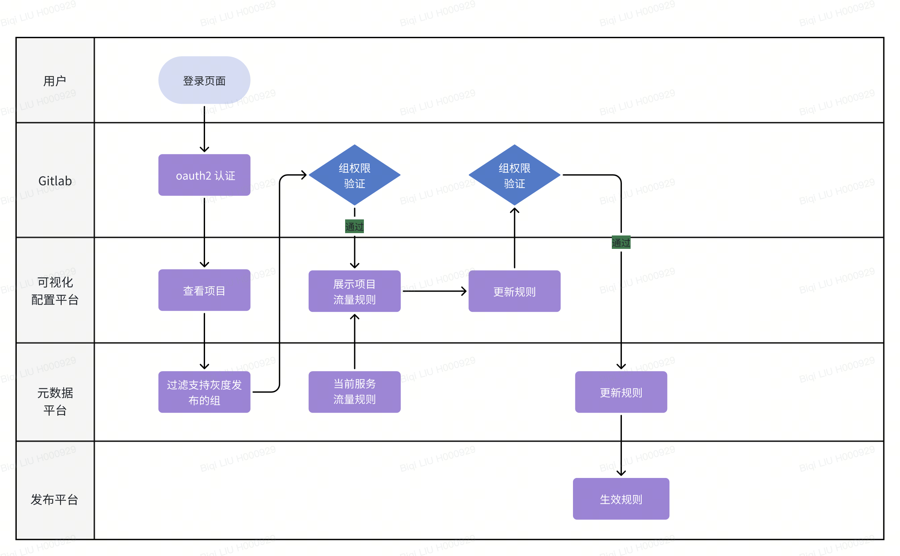
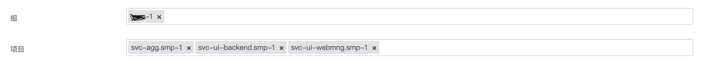

## 灰度发布服务

### 一、产品概述

#### （一）我们为什么要灰度发布服务？

在过去的几年中，营销部门的服务上线方式都是单版本滚动发布，也就是说线上只能同时存在一个版本，该种部署方式实现方式简单，成本低，但有很大的概率会影响服务的可用性。
为了降低对客户的影响与保证服务上线质量，业内提出了灰度发布，灰度发布可以做到多维度管控上线节奏，自定义入口策略，特别适合营销某些服务的使用场景。
在与业务，开发人员的沟通中，我们搜集了以下几个重点需求：

1. 基于当前社区的主流云原生方案
   - 开发人员无需修改代码，降低服务接入成本
   - 灰度发布能力与特定语言，特定框架无关，降低准入标准
2. 完整的全链路数据记录
   - 原生记录服务完整的链路数据，便于调试与定位问题
   - 支持精确定位到特定服务特定版本的服务进出数据
3. 可视化配置管理平台
   - 供业务与开发人员使用，减少页面过于专业和复杂的配置流程
   - 与 Gitlab group 组联动权限配置

#### （二）这款产品的核心价值是什么？
在云原生时代，通过使用开源的容器集群管理平台(kubernetes)以及服务网格框架(istio)可以将灰度发布能力赋能给服务，降低服务接入成本，加快服务接入。  
同样，为了用户更好的使用灰度服务，我们提供了
   - 数据平台，可以细粒度查看具体服务具体版本的服务进出情况
   - 可视化配置管理平台，可视化调整个版本灰度入口规则

1. 原生提供灰度发布能力
   - 该部署能力下沉到基建，开发人员无需关注所使用的语言与框架
   - 使用业内成熟的架构与平台(kubernetes+istio)，并且由华为云提供 paas 服务
2. 数据平台
   - 对于服务的每一个版本的任何一次请求，数据平台都可以完整记录，便于业务人员查看与调试
   - 该数据平台提供原生数据能力，开发人员同样无需修改代码以及与应用层开发语言，开发架构无关
3. 可视化配置管理平台
   - 供业务与开发人员使用，直观查看当前特定服务(组)的流量规则配置情况
   - 可视化动态更新流量规则，能力平台化，降低对特定人员的依赖

#### （三）我们是如何做这款产品的？

   

### 二、功能介绍
#### 1. 根据用户权限展示相应的组与项目  
   组的过滤规则为：
   - 该组下有支持灰度发布的项目
   - 当前用户为该组的owner
   - 该项目支持灰度发布

   

#### 2. 可视化显示当前项目的流量配置规则
1. 组件说明：
   - Gatway  - 网关
   - canary-* 流量规则 - 单击可以查看详情
   
2. 规则说明：
   - Gateway 所指向的版本为默认版本 - 从下图中可以看出，svc-ui-backend这个服务的默认版本为v1.5；
   - canary-* 所指向的版本代表了进入这个版本的流量规则(点击以查看详情)，如 规则canary-2cd081指向了svc-ui-backend的v1.6，规则canary-4bffb1ee指向了svc-ui-backend的v1.7；
   - svc-ui-backend的流量细则为：符合canary-2cd081规则的进入到v1.6；符合canary-4bffb1ee规则的进入到v1.7；都不符合的，进入到默认版本v1.5

#### 3. 配置服务访问入口规则
   规则配置说明
1. 灰度入口的访问方式是通过设定请求头，携带特定的请求头的访问才可以进入到灰度版本
2. 请求头的匹配规则为三种，前缀匹配，完全匹配，正则匹配
   
3. 一个流量规则可以添加多个请求头，多个请求头之间的匹配要求是与的关系，如图3.2，用户为svc-ui-backend的v1.6版本的规则配置了两个请求头，如果用户想进入该版本，请求头需要同时包含hd-service与hd-version两个请求头。
   
4. 可以为一个版本添加多个入口规则
   下图中，可以为svc-ui-backend的v1.7版本添加一个规则，canary-037a2143，这样v1.7版本就有两个入口规则，若要访问v1.7版本，只需要满足其中一个规则即可
   同一个服务的流量规则如下
   1. 不允许存在内容相同的规则，无论这些规则指向了同一个版本还是不同的版本，即规则1不允许与规则2相同；
   2. 不允许规则中存在子集，无论这些规则指向了同一个版本还是不同的版本，即规则1是规则2的子集；
   

5. 基于特定服务特定版本的访问规则
   为了降低开发人员的开发成本，可以对来自于特定服务的特定版本直接进行灰度，开发人员无需修改代码即可实现。
   下图中，对来自于服务svc-ui-webmng的v1.9版本的请求，可以直接访问svc-ui-backend的v1.6版本，同样，来自于svc-ui-backend的v1.7请求可以直接访问svc-agg的v1.5版本。
   

6. 批量修改多个服务的流量规则
   下图中，我们修改了
   1. smp-ui-activity-webmng， v1.6版本可以直接访问smp-ui-activity-backend的v1.4，而不是以前的v1.3
   2. smp-ui-activity-backend
   1. 删除了规则canary-z6e4，即符合该规则的请求将无法访问该服务的v1.4版本；
   2. 删除了v1.3与服务smp-agg-activity v1.2的链接，即v1.3服务将无法访问smp-agg-activity的v1.2
   3. 新建链接 从v1.4至smp-agg-activity的v1.3，即v1.4可以直接访问smp-agg-activity的v1.3版本
