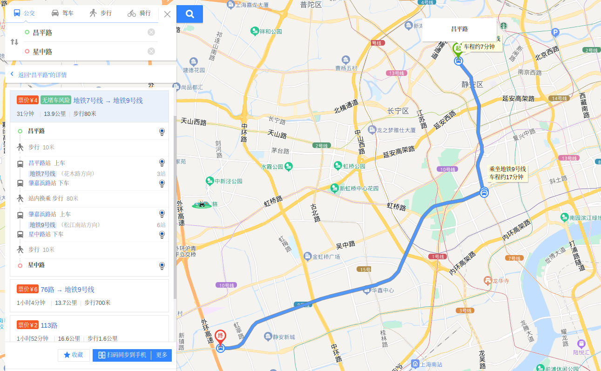
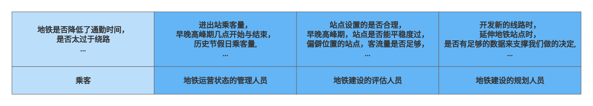

## 基于istio链路跟踪的拓展思考

### 摘要
微服务架构，相比于单体服务，可以做到灵活部署，资源与功能的独立，健壮性好等各种优势，目前已经成为了互联网时代的主流。  
在各公司的实践中，微服务架构下的服务数量将是以前的几十倍，服务部署阶段，若使用了kubernetes等容器调度平台，其容器数量可能是以前单体服务时代虚拟机数量的几百倍。  
因此，这种情况下，诊断与分析平台中的问题变的异常繁琐与艰难。  
在上述场景下，链路跟踪，应运而生，为每一次请求关联唯一的编号，traceId，以还原这一笔请求的所有参与方以及具体的元数据。但是当我们从架构以及业务视角去观察微服务架构的时候，发现单次链路跟踪好像不能带来什么帮助，无法提供数据化的指导, 然而两者之间却存在一定的因果关系。  
因此本篇论文将通过基于istio的链路跟踪，拓展思考到云原生时代的数字基座。  

### 说明
本篇论文所实现的方案基于以下平台

    基于华为云CCE与ASM产品

1. kubernetes 1.21
2. istio 1.13

### 拓展思考
现实生活中，我们经常乘坐地铁，从进站，换乘再到出站，一次乘坐就好比一次链路跟踪，地铁站记录了你经过的每一个站点以及每一个时刻。  

乘客愿意乘坐地铁，因为地铁的确降低了我们的通勤时间，四通八达的站点还能做到常年午休，价格低廉亲民，班次准时准点。

如果此刻，你的角色不是乘客，而是**负责地铁运营状态的管理人员**，你可能想知道，上海市地铁过去的每一时刻地铁所有站点的进出站人员数量，早晚高峰期在几点开始又在几点结束，重要节假日乘客量是多少等等，为优化地铁排班提供数据化引导，甚至可以将这些数据贡献给相关部门，哪里可以开商场，哪里需要拓宽道路等等。  

再让我们切换下角色，此刻你是**地铁建设的评估人员**，地铁站点设置的是否合理，早晚高峰期，站点是否能平稳度过，不出现过于拥堵的情况，偏僻位置的站点，客流量是否足够等等，这一切的数据反馈出在地铁前期规划时各方的判断与规划是否合理。  

最后一个角色，**地铁建设的规划人员**，当我们要开发新的线路时，延伸地铁站点时，是否有足够的数据来支撑我们做的每一个决定，地铁是一个民生工程，成果的好坏将直接影响城市的发展进度。  

每一个角色看似孤立，实际上却有着因果关系。管理人员所依赖的宏观数据，正是由若干个乘客的数据所组成，若干个乘客的数据形成了宏观数据。

### 云原生数字基座

云原生时代，数据量爆发式增长，但大家对各自的服务的数字化要求却有很多共同点。平台正在发生什么，未来可能要发生什么，过去的投入是否达到了预期。
上个时代，我们要跨越好几个团队，花费大量资源才能大概知道上述的几个问题，而且这一能力很难下沉到基建，各个团队不同的数据格式，不同的标准。

下面列出我们团队关注的几点，从宏观到微观

1. 时间段内有哪些服务被访问 - 如每个服务的每个版本每天被访问了多少次数，加大或者调优对某些服务的投入
2. 服务有哪些api被请求 - 如服务每天被请求了一百万次，精确到api级要定位到被访问的api分布，提高对用户的响应质量与加大特定功能的投入
3. 服务请求了哪些第三方服务 - 如服务调用了哪些第三方服务以及这些服务的响应时长分布，如过去一天调用了服务A一万次，其中百分之八十的响应区间是在200-500ms内，
4. 服务间访问依赖关系 - 如服务间访问关系拓扑图，找出其中的隐患
5. 服务进出事件的完整记录 - 如每个服务的每个版本在其生命周期内的完整的进出事件都能完整记录，当服务出现异常时，能还原那一刻的具体事件
6. 记录服务进出的元数据 - 如请求头/体，响应头/体，完整复现参与方以及具体的数据

上述是我们列出的几个主要关注点，在云原生时代，实现这一切几乎不需要任何代码修改，不依赖任何特定框架，不依赖任何特定语言，成为数字基建，赋能给每一个团队。

基于我们拥有的数据以及上述功能，下面我们列出了几点探索

1. 基于历史的用户访问，是否可以分析出未来的趋势
2. 基于服务关系图，是否可以分析出架构设计的优劣性，对架构设计提出评估
3. 基于服务进出的元数据实现业务场景 - [CloudEvents](https://cloudevents.io/)给了我们很好的借鉴，通过统一平台的数据格式，是否可以通过分析这些元数据实现业务价值
4. 基于服务进出的元数据实现机器学习 - 大部分场景下的机器学习是从数据库中抽取数据，链路过长，跨部门协作等，是否可以直接通过分析元数据实现部分场景的机器学习

