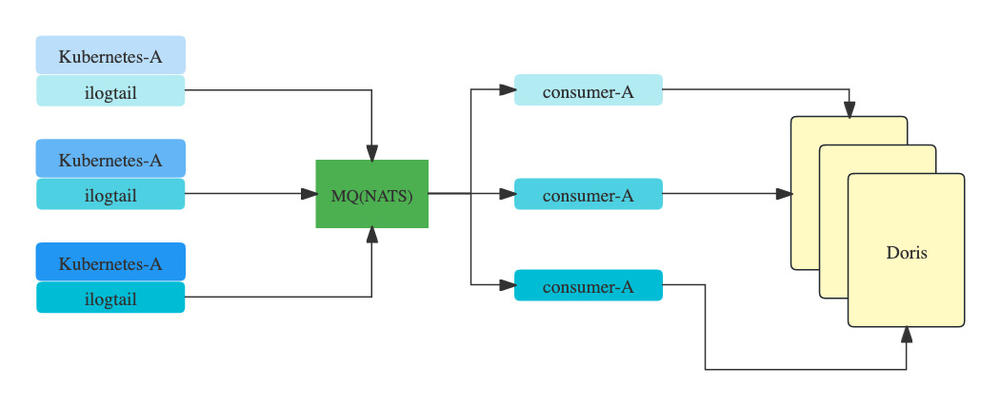
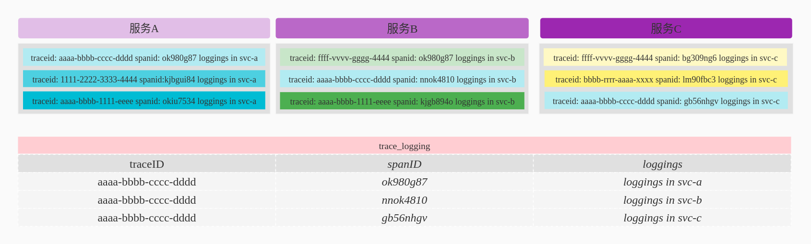
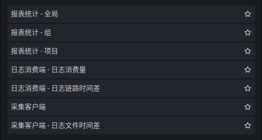
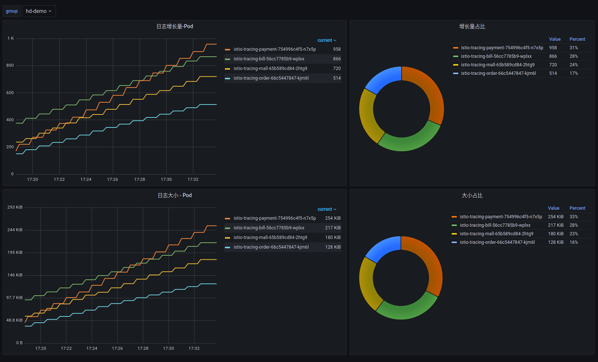
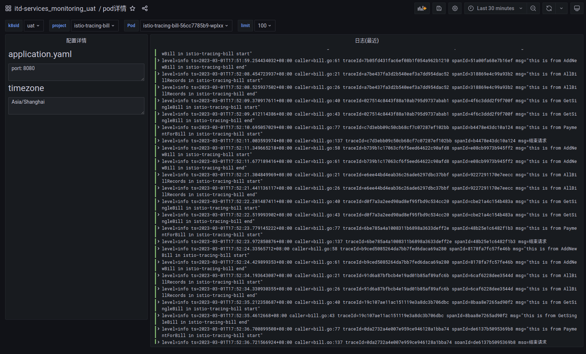

## 微服务下的日志

### 摘要

服务架构，从传统的单体服务已经进化到今天的微服务，以及下一代的无服务器架构。  
但是在日志的查询中，大部分的公司还是继承了单体服务的查询思路，使用elasticsearch作为日志引擎，es在使用上往往有以下几个问题，

1. 微服务架构下，一个请求往往需要经过几个服务，如果要复原此次请求下所有服务在处理此次请求所产生的日志，需要逐个定位具体服务，然后在根据关键字去搜索，繁琐且效率低
2. elasticsearch是基于内容搜索，资源消耗量大

在服务架构上我们从单体转向了微服务与无服务器等模式，但是日志却没能相应的做出改变。日志还是纵向根据服务名为索引，横向上无法串联。
### 思考
微服务架构下，可以为每一次请求生成唯一的编号，traceid，可以帮助我们立刻复现那一刻完成此次请求的所有参与方，在知道了这一次具体的参与方，我们更想知道我的服务在处理此次请求时所产生的具体日志。  
如果每一条日志里包含了traceid与spanid，我们在存储日志的时候，同时根据traceid与spanid为索引的方式存储日志，这样我们从traceid维度去定位日志的时候，是不是就可以很方便。

### 方案调研

#### [loki](https://grafana.com/oss/loki/)
    loki是grafana公司开源的日志平台

与elasticsearch相比，loki是基于标签的日志平台，可以对日志打标签，支持多种存储方式，因此在资源消耗上有了很大的节省，  
但是其在架构方面还是有很多问题
1. [架构复杂](https://grafana.com/docs/loki/latest/fundamentals/architecture/components/)，组件过于复杂，其在架构端考虑了底层设施的不可用性，所以在架构中融入了太多的组件，维护成本大
2. 日志量巨大时，需要综合调优众多组件，此操作将带来风险性，一定程度上也加大了平台的开销
3. 处理海量标签时，特别是为每一条日志添加微服务架构下为每一次服务请求所产生的traceid作为标签，[loki是不建议添加此种无共性的标签](https://grafana.com/docs/loki/latest/fundamentals/labels/)，若加上该标签，将极大的添加日志的分片数量，降低性能

#### 半自研方案

##### 日志采集客户端
基于[ilogtail](https://github.com/alibaba/ilogtail)，经过我们的测试，ilogtail在性能上远超过其他agent组件；

##### 日志架构

   

   

##### 持久化端的数据库设设计

在经过大量的后端存储方案调研后，我们选择了Doris作为日志后端存储方案，Doris有以下几个特点：
1. 架构简单易维护，可以支持海量水平扩展；
2. 支持远程对象存储，如S3等；
3. 高效的压缩比，日志经过压缩后，明显低于elasticsearch；
4. 倒排索引，支持高效的基于内容的搜索，在海量数据中可以做到快速搜索；
5. 列式存储以及前缀索引都极大的极高了数据定位的速度；

### 日志平台功能概览

- 报表

   

#### pod报表统计
    pod日志变化量

   

#### 采集客户端
    日志产生的时间，全链路日志端到端监控，日志被采集的时间，日志被消费的时间以及他们之间的时间差

   

- 查询
#### 获取pod详情
    配置与日志

   

#### 根据tarceid获取日志

    

在[基于istio链路跟踪的拓展思考](../extended-trace-based-on-istio/README.md)中，我们可以根据traceid获取链路跟踪详情，包括请求头请求体。由于日志持久化时，我们根据traceid与相应属性做了物化视图，因此可以做到根据traceid与spanid立刻定位到具体日志。    

    

    

上面的两张图，点击日志链接后，展示了istio-tracing-mall与istio-tracing-payment在处理这一笔请求时所产生的具体日志。

### 总结

我们实现了横向上串联日志的能力，让用户可以从另一个视角上去立刻定位日志。  
在资源使用上，与传统的elasticsearch相比，可以做到其资源使用量的1/6,在功能上，提供了elasticsearch不具备的横向能力。  
