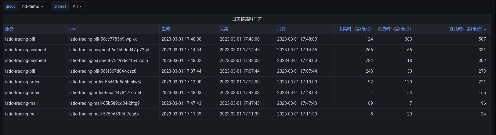

## 微服务下的日志

### 摘要

服务架构，从传统的单体服务已经进化到今天的微服务，以及下一代的无服务器架构。  
但是在日志的查询中，大部分的公司还是继承了单体服务的查询思路，使用elasticsearch作为日志引擎，es在使用上往往有以下几个问题，

1. 根据关键字搜索问题，在互联网下，每天服务的请求是巨量的，根据关键字搜索到的内容往往包含了太多的无关内容
2. 微服务架构下，一个请求往往需要经过几个服务，如果要复原此次请求下所有服务在处理此次请求所产生的日志，需要逐个定位具体服务，然后在根据关键字去搜索，繁琐且效率低
3. elasticsearch是基于内容搜索，资源消耗量大

在服务架构上我们从单体转向了微服务与无服务器等模式，但是日志却没能相应的做出改变。日志还是纵向根据服务名为索引，横向上无法串联。
### 思考
微服务架构下，可以为每一次请求生成唯一的编号，traceid，可以帮助我们立刻复现那一刻完成此次请求的所有参与方，在知道了这一次具体的参与方，我们更想知道我的服务在处理此次请求时所产生的具体日志。  
如果每一条日志里包含了traceid与spanid，我们在存储日志的时候，同时根据traceid与spanid为索引的方式存储日志，这样我们从traceid维度去定位日志的时候，是不是就可以很方便。

### 方案调研

#### [loki](https://grafana.com/oss/loki/)
    loki是grafana公司开源的日志平台

与elasticsearch相比，loki是基于标签的日志平台，可以对日志打标签，支持多种存储方式，因此在资源消耗上有了很大的节省，  
但是其在架构方面还是有很多问题
1. [架构复杂](https://grafana.com/docs/loki/latest/fundamentals/architecture/components/)，组件过于复杂，其在架构端考虑了底层设施的不可用性，所以在架构中融入了太多的组件，维护成本大
2. 日志量巨大时，需要综合调优众多组件，此操作将带来风险性，一定程度上也加大了平台的开销
3. 处理海量标签时，特别是为每一条日志添加微服务架构下为每一次服务请求所产生的traceid作为标签，[loki是不建议添加此种无共性的标签](https://grafana.com/docs/loki/latest/fundamentals/labels/)，若加上该标签，将极大的添加日志的分片数量，降低性能

#### 半自研方案

##### 日志采集客户端
基于[promtail](https://grafana.com/docs/loki/latest/clients/promtail/)方案，简化其架构，优化数据结构

##### 日志架构

   

##### 持久化端的数据库设设计

   

1. 存入到Cassandra的日志，将数据存放至**loggings**表，两个物化视图，**search_logging**与**trace_logging**将根据base表，logging自动更新其中的内容
2. **search_logging**适用于搜索特定服务特定版本下在某一时间区间内的日志
3. **trace_logging**适用于根据traceid与spanid精确定位到与traceid以及spanid关联的日志

   

### 日志平台功能概览

- 报表

   

#### pod报表统计
    pod日志变化量

   

#### 采集客户端
    日志产生的时间，全链路日志端到端监控，日志被采集的时间，日志被消费的时间以及他们之间的时间差

   

- 查询
#### 获取pod详情
    配置与日志

   

#### 根据tarceid获取日志

    

在[基于istio链路跟踪的拓展思考](../extended-trace-based-on-istio/README.md)中，我们可以根据traceid获取链路跟踪详情，包括请求头请求体。由于日志持久化时，我们根据traceid与相应属性做了物化视图，因此可以做到根据traceid与spanid立刻定位到具体日志。    

    

    

上面的两张图，点击日志链接后，展示了istio-tracing-mall与istio-tracing-payment在处理这一笔请求时所产生的具体日志。
