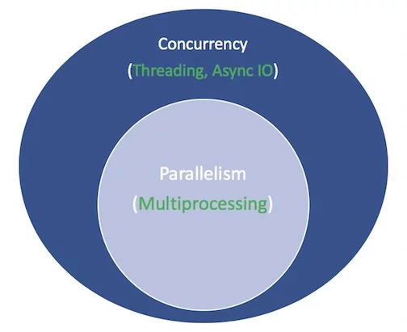

<p align="center">
   
</p>

## Python中的Async IO: 完整介绍
by Brad Solomon 

### 目录
- 设置开发环境
- Async IO的一万英尺鸟瞰
- 对多线程Python程序的影响
- 为什么GIL还没有被移除
- 为什么在python3中没有删除它
- 如何处理Python GIL


Async IO 是一种并发编程设计，在Python中得到了专门的支持，从Python 3.4到3.7，得到了快速的发展，甚至[可能到更高的版本](https://twitter.com/1st1/status/1041855365745455104)。

你可能会觉得恐惧，“并发，并行，线程，多处理”。已经很多需要掌握了。异步IO适合哪里？“

本教程旨在帮助你回答这个问题，给你更牢固地掌握Python async IO方法。

下面你将学习到：

- 异步IO(async IO): 一种与语言无关的范例(模型)，它具有跨许多编程语言的实现
- async/await: 用于定义coroutines的两个Python关键字
- asyncio: Python包，提供基础与API用于运行与管理coroutines

coroutines（专用生成器函数）是Python中异步IO的核心，稍后我们将深入研究它们。

**注意：在本篇文章中，我使用术语async IO来表示与语言无关的异步IO设计，而asyncio指的是Python包。**

在开始之前，需要确保已经设置本指南所使用的asyncio和其它库。

### 设置开发环境

你需要Python 3.7或更高版本来完整地阅读本文，以及aiohttp和aiofiles包。

```shell
$ python3.7 -m venv ./py37async
$ source ./py37async/bin/activate  # Windows: .\py37async\Scripts\activate.bat
$ pip install --upgrade pip aiohttp aiofiles  # Optional: aiodns
```
有关安装Python 3.7和设置虚拟环境的帮助，参考 [Python 3 Installation & Setup Guide](https://realpython.com/installing-python/) 或者 [Virtual Environments Primer](https://realpython.com/python-virtual-environments-a-primer/)。

好了，我们开始吧。

### Async IO的一万英尺鸟瞰

Async IO相对于它久经考验的表亲(多处理和线程)来说，不太为人所知。本节将更全面地介绍异步IO是什么，以及它如何适应周围的环境。

#### 异步IO适合哪些场景？

并发(Concurrency)和并行（Parallelism)是扩展的主题，不容易涉及。虽然本文关注的是async IO及其在Python中的实现，但是花点时间将async IO与它的对应对象进行比较是值得的，以便了解async IO如何适应更大的、有时令人眼花缭乱的难题。

并行（Parallelism）包括同时执行多个操作。多处理（Multiprocessing）是一种实现并行的方法，它需要将任务分散到计算机的中央处理单元(cpu或核心)上。多处理非常适合计算密集型(CPU-bound)的任务: 紧密绑定for循环和数学计算通常属于这一类。

并发(Concurrency)是一个比并行（Parallelism)稍微宽泛的术语。它表明多个任务能够以重叠的方式运行。(有句话说并发并不意味着并行。)

线程（Threading）是一个并发执行模型，多个[线程](https://en.wikipedia.org/wiki/Thread_(computing))轮流执行任务。一个进程可以包含多个线程。由于其[GIL](../GIL/README.md), Python与线程有着复杂的关系，但这超出了本文的范围。

了解线程的重要之处是，它更适合于I/O密集型(IO-bound)的任务。计算密集型(CPU-bound)任务的特点是计算机的核心从开始到结束都在不停地工作，而I/O密集型(IO-bound)任务则是由大量等待IO(input/output)完成。

概括一下上面的内容，并发包括多处理(适用于计算密集型任务)和线程(适用I/O密集型任务)。多处理是并行的一种形式，并行是并发的一种特定类型(子集)。Python标准库通过它的多处理（multiprocessing）、线程（threading）和concurrent.futures包为这两者提供了长期的支持。

现在是时候引进一个新成员了。在过去的几年里，CPython中更全面地内置了一个单独的设计:异步IO，通过标准库的**asyncio**包和新的**async**与**await**语言关键字启用。需要明确的是，async IO不是新发明的概念，它已经存在或正在构建到其他语言和运行时环境中，例如[Go](https://gobyexample.com/goroutines)，[C#](https://docs.microsoft.com/en-us/dotnet/csharp/async)或[Scala](https://docs.scala-lang.org/sips/async.html)。


Python文档将**asyncio**包称为用于编写并发代码的库。 但是，async IO不是线程(threading)，也不是多处理(multiprocessing)。它不是建立在这两者之上的。

实际上，async IO是一种单线程，单进程设计：它使用**协作式多任务处理**(cooperative multitasking)，在本指南结束时你将充分理解这个术语。

换句话说，尽管在单个进程中使用单个线程，但async IO给人一种并发感。协程（async IO的核心功能）可以同时调度，但它们本身并不是并发的。

重申一下，异步IO是一种并发编程风格，但它不是并行的。与多处理(multiprocessing)相比, 它与线程紧密结合，但是它与这两种方法都非常不同，并且是并发性技巧包中的一个独立成员。

还剩下一项。异步是什么意思?这不是一个严格的定义，但是为了我们的目的，我可以想到两个性质:

- 异步例程(routine)能够在等待其最终结果时“暂停”，并允许其他例程同时运行.
- 通过上述机制，异步代码促进了并发执行。换句话说，异步代码提供了并发的外观和感觉。

这里有一个图表可以把它们组合起来。白色术语表示概念，绿色术语表示概念的实现或影响方式:



我将停止比较并行编程模型。本教程重点介绍子组件: async IO，如何使用它，以及围绕它创建的API。有关线程，多处理（multiprocessing）与async IO的全面探索，请暂停并查看Jim Anderson的[使用并发加速Python程序](../speed_up_your_python_program_with_concurrency/README.md)。Jim比我有趣得多，而且参加的会议也比我多。

### Async IO解释

Async IO最初可能看起来违反直觉和矛盾。如何使用一个线程和一个CPU内核来简化并发代码?我从来都不擅长编造例子，所以我想借用 Miguel Grinberg在2017年PyCon演讲中的一个例子，这个例子很好地解释了一切：

国际象棋大师朱迪特·波尔加(Judit Polgar)举办了一场国际象棋表演赛，她在其中与多位业余棋手对弈。她有两种方式进行表演赛:同步和异步。

设想:

- 24个对手
- Judit在5秒内走完一步棋
- 对手每走一步都需要55秒
- 游戏平均30对棋（共60步）

同步版本：Judit一次只玩一场表演赛，从不同时玩两场，直到表演赛结束。每场比赛需要（55 + 5）* 30 == 1800秒，或30分钟。整个表演赛需要24 * 30 == 720分钟，或12小时。

异步版本：朱迪特从一张桌子走到另一张桌子，每张桌子走一步。她离开桌子，让对手在等待期间完成下一步棋。在所有24场比赛中，一步棋需要Judit 24 * 5 == 120秒，即2分钟。整个表演赛现在减少到120 * 30 == 3600秒，或仅1小时。[视频](https://youtu.be/iG6fr81xHKA?t=4m29s)

只有一个Judit Polgar，她只有两只手，一次只做一步棋。但是，异步比赛将表演赛时间从12小时减少到1小时。

因此，协作式多任务处理（cooperative multitasking）是一种奇特的方式，可以说程序的事件循环（稍后会详细介绍）与多个任务进行通信，让每个任务在最佳时间轮流运行。

异步IO需要很长的等待时间，否则函数将被阻塞，并允许其他函数在停机期间运行。（高效阻塞的函数禁止其他函数从它开始运行到返回为止的时间内运行。）

### Async IO并不容易

我听说过，“尽可能使用async IO; 必要时使用线程。”事实是，构建健壮的多线程代码可能很困难，而且容易出错。Async IO避免了在使用线程设计时可能遇到的一些潜在的制约。

但这并不是说Python中的async IO很简单。警告:当稍微深入到表面之下时，异步编程也会很困难!Python的异步模型是围绕回调、事件、传输、协议和期物等概念构建的，哪怕只有术语本身就令人生畏。它的API一直在不断地变化，这使掌握它并不容易。

幸运的是，asyncio已经成熟到它的大部分特性不再是临时的，而它的文档已经得到了巨大的修改，并且关于这个主题的一些高质量的资源也开始出现。

### asyncio包和async/await

现在你已经了解了async IO作为设计的一些背景知识，让我们来探索Python的实现。Python的**asyncio**包（在Python 3.4中引入）及其两个关键字**async**和**await**用于不同的目的，但它们可以一起帮助你声明，构建，执行和管理异步代码。

#### async/await语法和原生协程

提醒: 小心你在互联网上读到的内容。从Python 3.4到Python 3.7中，Python的 async IO API迅速地发生了演变。一些旧的模式不再被使用，一些最初不被允许的现在通过新的引入将被允许。据我所知，本教程也将很快加入过时的行列。

异步IO的核心是协程。协程是Python生成器函数的一个专门版本。让我们从基线定义开始，然后在此处进行构建：coroutine是一个可以在返回到达之前暂停其执行的函数，并且它可以间接地将控制权传递给另一个协程使其运行一段时间。

稍后，你将更深入地研究如何将传统生成器重新用于协程。目前，了解协程如何工作的最简单方法是开始制作一些协程。

让我们采用沉浸式方法并编写一些异步IO代码。这个简短的程序是async IO的Hello World，但在说明其核心功能方面还有很长的路要走：

```python
#!/usr/bin/env python3
# countasync.py

import asyncio

async def count():
    print("One")
    await asyncio.sleep(1)
    print("Two")

async def main():
    await asyncio.gather(count(), count(), count())

if __name__ == "__main__":
    import time
    s = time.perf_counter()
    asyncio.run(main())
    elapsed = time.perf_counter() - s
    print(f"{__file__} executed in {elapsed:0.2f} seconds.")
```

当执行此文件时，请注意与仅使用def和time.sleep()定义函数时看起来不同的内容：

```shell
$ python3 countasync.py
One
One
One
Two
Two
Two
countasync.py executed in 1.01 seconds.
```

此输出的顺序是async IO的核心。与count()的每个调用通信是单个事件循环或协调器。当每个任务到达等待asyncio.sleep(1)时，该函数会向事件循环大喊并将控制权交还给它，说：“我将要睡1秒钟。 在此期间，继续做其他有意义的工作。”

将此与同步版本进行对比：

```Python
#!/usr/bin/env python3
# countsync.py

import time

def count():
    print("One")
    time.sleep(1)
    print("Two")

def main():
    for _ in range(3):
        count()

if __name__ == "__main__":
    s = time.perf_counter()
    main()
    elapsed = time.perf_counter() - s
    print(f"{__file__} executed in {elapsed:0.2f} seconds.")
```

执行时，在顺序和执行时间上有细微但关键的变化:

```shell
$ python3 countsync.py
One
Two
One
Two
One
Two
countsync.py executed in 3.01 seconds.
```

虽然使用time.sleep()和asyncio.sleep()看起来很普通，但是它们可以替代任何涉及等待时间的时间密集型进程。
