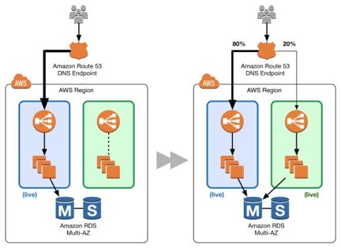
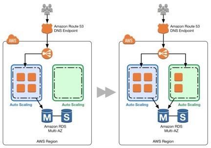
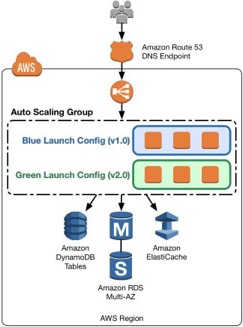
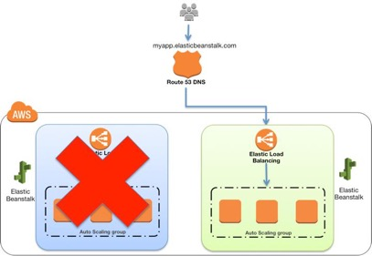
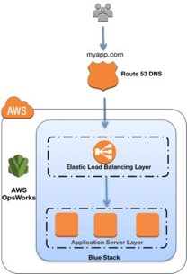

## 方案

以下方案是如何在AWS上实现蓝/绿的示例。虽然我们强调每种方案中的特定服务，但你可能还有其他服务或工具来实现相同的模式。根据现有架构，应用的性质以及组织中软件部署的目标，选择合适的模式。尽可能多地进行尝试，为环境获得更多的经验，并了解不同的部署风险因素如何与特定工作负载相互作用。

### 使用Amazon Route 53更新DNS路由
通过记录更新进行DNS路由是蓝/绿部署的常用方法。DNS是将流量从蓝色环境切换到绿色环境的机制，如果需要回滚，则反之亦然。此方法适用于各种环境配置，只要你可以将endpoint作为DNS名称或IP地址表示到环境中。

在AWS中，此方法适用于以下环境：
- 单实例，具有公共或弹性IP地址
- Elastic Load Balancing负载均衡器或第三方负载均衡器下游的实例组
- Auto Scaling组中的实例，以Elastic Load Balancing负载均衡器作为前端
- 在Elastic Load Balancing负载均衡器下游的Amazon EC2容器服务（Amazon ECS）群集上运行的服务
- Elastic Beanstalk环境Web层
- 暴露IP或DNS端点的其他配置  

图2 经典DNS模式  
图2显示了Amazon Route 53如何管理DNS托管域。通过更新别名记录，可以将流量从蓝色环境路由到绿色环境。

可以一次性转移所有流量，也可以进行加权分配。使用Amazon Route 53，可以定义进入绿色环境的流量百分比以并逐渐更新权重，直到绿色环境承载完整的生产流量。加权分布通过将一小部分生产流量引入新环境以提供金丝雀分析的能力。可以测试新代码并监控错误，如果遇到任何问题，则限制冲击半径。如果使用了Elastic Load Balancing，还允许绿色环境向外扩展以支持完整的生产负载，比如，Elastic Load Balancing会自动调整其请求处理容量，以满足入站应用程序流量；伸缩过程不是瞬间的，因此我们建议你测试，观察并了解你的流量模式。负载均衡器也可以通过请求支持以预先加热（配置为最佳容量）。  

图3 经典的DNS权重分配  

如果在部署期间出现问题，可以通过更新DNS记录来实现回滚，以将流量转回到蓝色环境。虽然DNS路由很容易实现蓝/绿，但问题是可以多快完成回滚。DNS TTL确定客户端缓存查询结果的时间。但是，对于更陈旧的和潜在行为不规范的客户端，某些会话仍可能与之前的环境相关联。尽管回滚可能具有挑战性，但这种模式的确有利于按照自己的进度进行颗粒度转换，以便对伸缩活动进行更实质的测试。为帮助管理成本，请考虑使用Auto Scaling为EC2实例根据实际需求扩展资源。这适用于使用Amazon Route 53加权分配的逐步转换。要进行完全转换，请务必调整Auto Scaling策略以按预期进行扩展，并记住新的Elastic Load Balancing endpoint可能也需要时间进行扩展。

### 在弹性负载均衡器下游交换Auto Scaling组
如果DNS复杂性过高，请考虑将负载均衡用于蓝/绿环境的流量管理。此方法使用Auto Scaling管理蓝/绿环境的EC2资源，根据实际需求进行扩展或收缩。你还可以通过更新特定组的最大所需实例的数量来控制Auto Scaling组大小。

Auto Scaling还与Elastic Load Balancing集成，因此如果任何新实例通过负载均衡器管理的健康检查，则会自动添加到负载均衡池。Elastic Load Balancing使用简单的ping或更复杂的连接尝试或请求来测试已注册的EC2实例的运行状况。健康检查以可配置的时间间隔进行，并具有定义的阈值来确定实例是健康的还是不健康。例如，可以使用Elastic Load Balancing运行状况检查策略，每隔20秒ping一次80端口，并在通过10次成功ping的阈值后，将实例报告为InService。如果足够多的ping请求超时，则报告该实例为OutofService。与Auto Scaling配合使用，如果Auto Scaling策略发出指示，则可以替换OutofService实例。相反，对于收缩活动，负载均衡器会从池中删除EC2实例，并在终止之前消耗完当前连接。

图4 交换Auto Scaling组模式

图4显示了环境边界缩小到了Auto Scaling组。蓝色组承载生产负载，同时使用新代码部署的绿色组处于准备状态。在部署时，只需将绿色组附加到现有负载均衡器上，将流量引入新环境。对于HTTP / HTTPS侦听器，负载均衡器倾向于绿色Auto Scaling组，因为它使用最少未完成的请求路由算法，如[Elastic Load Balancing开发人员指南](https://docs.aws.amazon.com/elasticloadbalancing/latest/userguide/how-elastic-load-balancing-works.html)中所述。你可以通过调整绿色组的容量来控制引入的流量。

图5 蓝色Auto Scaling组节点处于待机和停用状态  

在扩展绿色Auto Scaling组时，可以通过终止蓝色Auto Scaling组实例或将其置于待机状态使蓝色Auto Scaling组实例停止服务，如在[Auto Scaling开发人员指南](https://docs.aws.amazon.com/autoscaling/ec2/userguide/as-enter-exit-standby.html)中讨论的那样。待机是一个不错的选择，因为如果需要回滚到蓝色环境，只需将蓝色服务器实例重新投入使用即可。只要绿色组的增加没有任何问题，可以通过将组大小调整为零来退役蓝色组。

此模式的流量管理功能不像经典DNS那样精细，但仍然可以通过Auto Scaling组的配置来控制。例如，可以使用更精细的扩展策略来拥有更多的小型实例，这也有助于控制扩展成本。由于没有了DNS的复杂性，因此流量转移本身更为便利。此外，使用已预热的负载均衡器，你可以确信将具备支持生产负载的容量。

### 更新Auto Scaling组启动配置

Auto Scaling组具有自己的启动配置。启动配置包含Amazon Machine Image（AMI）ID，实例类型，密钥对，一个或多个安全组以及块设备映射等信息。一次只能将一个启动配置与自动伸缩组关联，并且在创建后无法对其进行修改。要更改与Auto Scaling组关联的启动配置，请将现有启动配置替换为新配置。在启用新的启动配置后，启用的任何新实例都将使用新的启动配置参数，但现有实例不受影响。当Auto Scaling从组中删除实例（收缩）时，默认的终止策略是删除具有最早启动配置的实例。但是，你应该记住，如果可用性区域一开始就不平衡，那么Auto Scaling可能会删除具有新启动配置的实例以平衡区域。在这种情况下，应该有适当的流程来弥补这种影响。

要实现此方案，首先要使用Auto Scaling组和Elastic Load Balancing负载均衡器。当前的启动配置使用蓝色环境。

图6 更新启动配置模式  
要在绿色环境中部署新版本的应用，请使用新的启动配置更新Auto Scaling组，然后将Auto Scaling组扩展到其原始大小的两倍。  

图7 扩展绿色启动配置

然后，将Auto Scaling组缩小回原始大小。默认情况下，首先删除具有旧启动配置的实例。还可以利用组的待机状态临时从Auto Scaling组中删除实例，如[Auto Scaling开发人员指南](http://docs.aws.amazon.com/AutoScaling/latest/DeveloperGuide/AutoScalingEnteringAndExitingStandby.html)中所述。如果需要，使实例处于待机状态有助于快速回滚。只要对新部署的应用版本有信心，就可以永久删除处于待机状态的实例。

图8 收缩蓝色启动配置  
要执行回滚，使用旧的启动配置更新Auto Scaling组。然后，反过来执行上述步骤。或者，如果实例处于待机状态，将它们置回服务。

### 交换Elastic Beanstalk应用环境

Elastic Beanstalk可以快速轻松地部署和管理应用，而无需担心运行这些应用的基础架构。要使用Elastic Beanstalk部署应用，请以应用包的形式上传应用版本（例如，java .war文件或.zip文件），然后提供有关应用的一些信息。根据应用信息，Elastic Beanstalk在蓝色环境中部署应用，并提供访问环境的URL（通常用于Web服务器环境）。

Elastic Beanstalk提供了几种可配置使用的部署策略，范围从对现有实例执行就地更新的策略，到使用一组新实例的不可变部署。由于Elastic Beanstalk在更新应用版本时执行就地更新，因此应用可能会在短时间内无法供用户使用。

但是，可以通过将新版本部署到单独的环境中来避免不可用。复制现有环境的配置，并使用新版本的应用启动绿色环境。新绿色环境将拥有自己的URL，当要上线绿色环境以服务生产流量时，可以使用Elastic Beanstalk的交换环境URL功能，如[AWS Elastic Beanstalk开发人员指南](http://docs.aws.amazon.com/elasticbeanstalk/latest/dg/using-features.CNAMESwap.html)中所述。

要实现此技术，可以使用Elastic Beanstalk来启动蓝色环境。

图9 Elastic Beanstalk环境

在应用启动并运行时，Elastic Beanstalk提供一个环境URL。然后，绿色环境将使用自己的环境URL进行启动。此时，两个环境已启动并运行，但只有蓝色环境正在为生产流量提供服务。

图10 准备绿色Elastic Beanstalk环境  

要启用绿色环境以服务生产流量，请转到Elastic Beanstalk控制台中的环境仪表板，然后从“*Actions*”菜单中选择“*Swap Environment URL*”。Elastic Beanstalk执行DNS切换，通常需要几分钟。有关执行DNS切换时要考虑的因素，请参阅使用[Amazon Route 53更新DNS路由](http://docs.aws.amazon.com/elasticbeanstalk/latest/dg/using-features.CNAMESwap.html)的方案。当DNS更改生效时，可以终止蓝色环境。要执行回滚，则再次触发*Swap Environment URL（交换环境URL）*。

图11 退役蓝色Elastic Beanstalk环境  

### 在AWS OpsWorks中克隆堆栈并更新DNS
AWS OpsWorks具有堆栈概念，这些堆栈是AWS资源（EC2实例，Amazon RDS，Elastic Load Balancing等）的逻辑分组，它们具有共同的目的并且应该在逻辑上一起管理。堆栈由一个或多个层组成。层表示一组用于特定目的的EC2实例，例如服务应用或托管数据库服务器。当数据存储是堆栈的一部分时，应该意识到数据管理挑战。我们将在下一节深入讨论这些内容。

要在AWS OpsWorks中实现此方案，请使用当前版本的应用提供蓝色环境/堆栈。

图12 AWS OpsWorks堆栈

接下来，使用较新版本的应用创建绿色环境/堆栈。此时，绿色环境没有接收任何流量。如果Elastic Load Balancing需要预热，可以在此时执行此操作。

图13 克隆堆栈以创建绿色环境

要启用绿色环境到生产环境时，更新DNS记录以指向绿色环境/堆栈的负载均衡器。你还可以使用Amazon Route 53加权路由策略逐步执行此DNS flip。此方案涉及更新DNS，因此请注意在*使用Amazon Route 53更新DNS路由*的方法中讨论的DNS问题。

图14 退役蓝色堆栈
