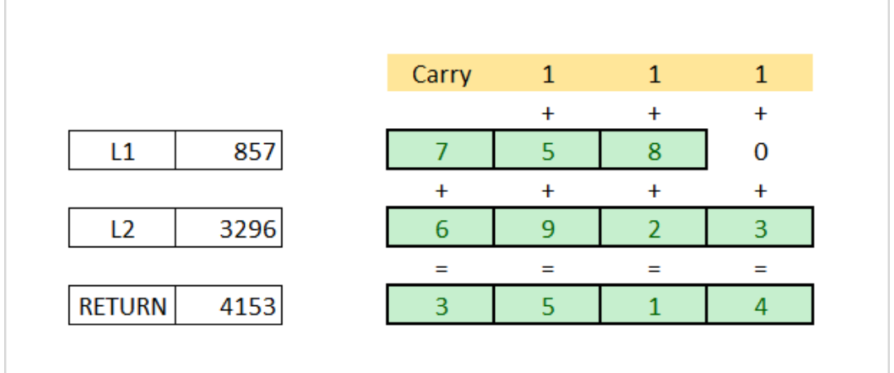

Problem

You are given two non-empty linked lists representing two non-negateive integers. The digits are stored in reverse order and each of their nodes contain a single digit. Add the two numbers and return it as a linkes list.

You may assume the two numbers do not contain any leading zero, excepting the number 0 itself.

Input: (2 -> 4 -> 3) + ( 5 -> 6 ->4)
Output: 7 -> 0 -> 8

Program Structure:

```java
/**
* Definition for singly-linked list.
* public class ListNode{
*   int val;
*   ListNode next;
*   ListNode(int x) {
*       val = x;
*   }
*}
**/

public class Solution {
    public ListNode addTwoNumbers(ListNode l1, ListNode l2) {

    }
}

```

Solution:

Since the digits are stored in reverse, we can solve this problem by traversing both the lists and adding its value(just linke adding any two numbers manually). If the sum exceds 10, store only the last digit and add the carry to the next sum and repeat the process.



