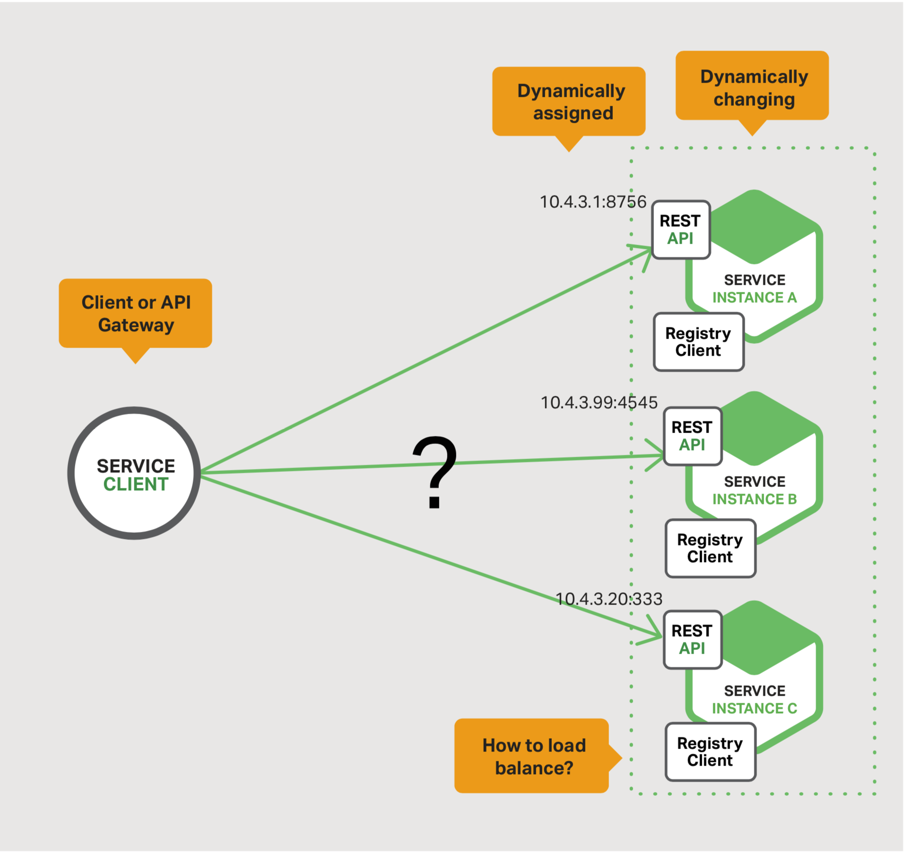
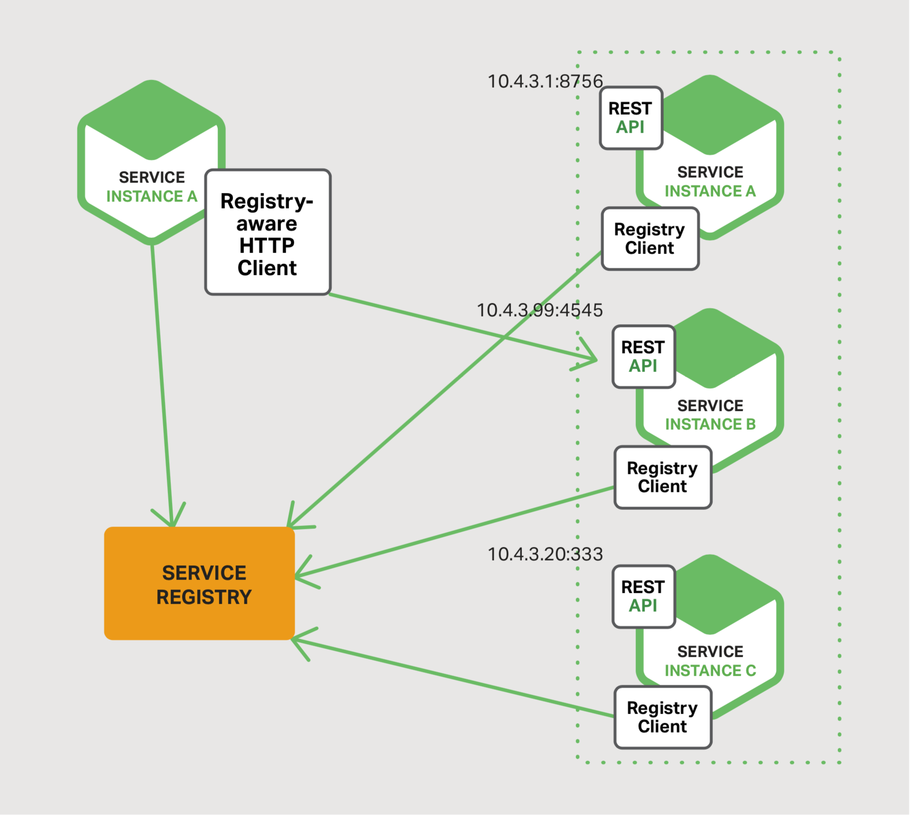
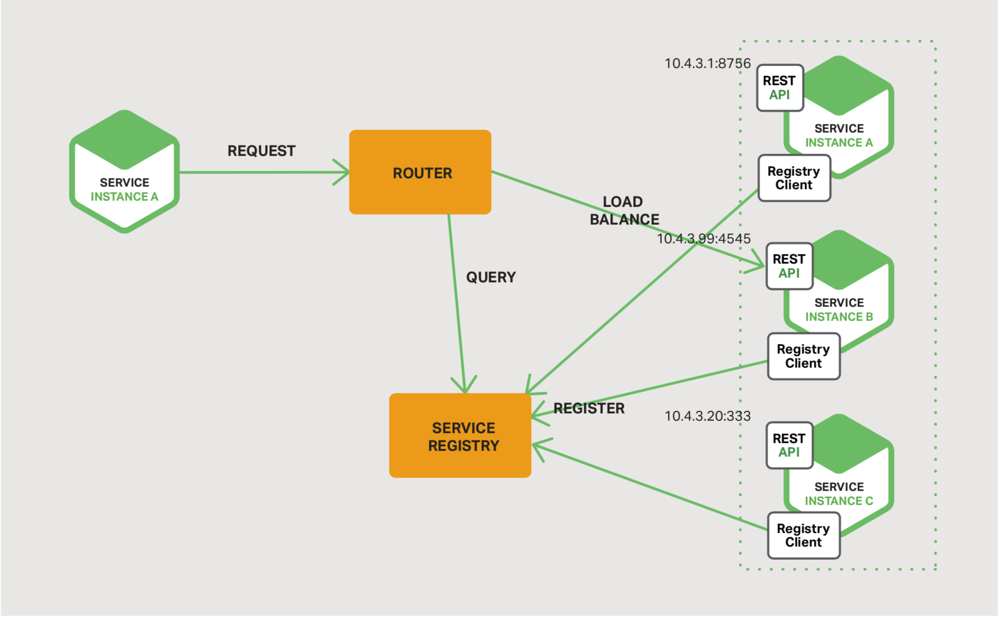
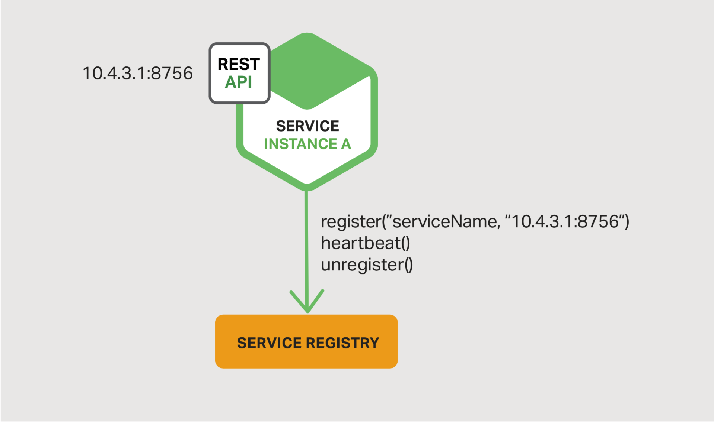
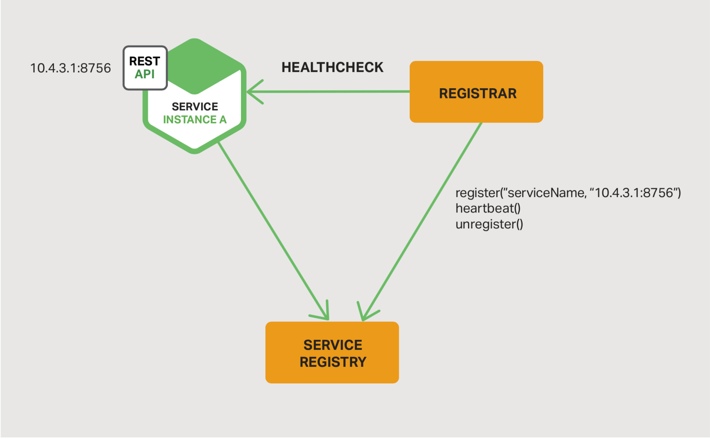

## 服务发现

本章节本电子书的第四章。章节一介绍了微服务架构模式，讨论了使用微服务的优缺点。章节二和章节三，阐述了微服务之间通信不同的层面。在本章节中，我们探讨与服务发现密切相关的问题。

### 为什么使用服务发现
让我们想象下你正在编写代码来调用具有REST API或Thrift API的服务。为了发起请求，你的代码需要知道服务实例的网络位置（IP地址和端口）。在物理硬件上运行的传统应用程序中，服务实例的网络地址相对是静态的。比如，你的代码可以从偶尔更新的配置文件中读取网址地址。

但是，在基于云的现代微服务应用程序中，这是一个更难以解决的问题，如图4-1所示。

图4-1 客户端或者API Gateway需要帮助来查找服务。

服务实例拥有动态分配的网络地址。而且，由于伸缩，失败与升级，服务实例的集合会动态改变。最终，你的客户端代码需要使用一个更精细的服务发现机制。

主要有两种服务发现模式：客户端发现与服务器端发现。我们先来看一下客户端发现。

### 客户端服务发现模式
当使用客户端服务发现模式，客户端负责确定可用服务实例的网络位置以及跨实例负载均衡请求。客户端查询服务注册中心，一个有可用服务实例的数据库。客户端使用负载均衡算法选择其中的一台可用服务实例，然后发起请求。
图4-2 展示了该模式的结构

图4-2 客户端可以承担发现服务的任务

当服务实例启动的时，它网络位置会登记到服务注册中心。当实例终止时，服务注册中心将删除该服务实例。通常使用心跳机制定期刷新服务实例的注册。

[Netflix OSS](https://netflix.github.io/)为客户端服务发现模式提供了一个优秀的例子。[Netflix Eureka](https://github.com/Netflix/eureka)是一个服务注册中心。它提供了一个REST API，用于管理服务实例注册和查询可用实例。[Netflix Ribbon](https://github.com/Netflix/ribbon)是一个IPC客户端，与Eureka一起使用将请求负载均衡到可用的服务实例中。在后续的章节中我们将深入讨论Eureka。

服务端发现模式有很多优点和缺点。这种模式相对简单，除了服务注册中心以外，没有其他移动部分。同样，由于客户端知道可以服务的实例，就可以发起智能，特定与应用的负载均衡决定，比如使用hash一致。该模式的一个显著缺点是将服务注册中心与客户端进行了耦合。你必须为你服务客户端所使用的每一种语言与框架实现客户端服务发现逻辑。

现在我们已经看过了客户端发现，让我们剖析服务器端发现。

### 服务器端发现模式
服务发现的另一个方式是服务器端发现模式。
图4-3 服务器端发现模式的结构

图4-3 也可以在服务器之间处理服务发现
客户端通过负载均衡器向服务发送请求。负载均衡器查询服务注册中心然后将每一个请求路由到可用的服务实例上。与客户端发现一样，服务实例在服务注册中心中登记与撤销。

AWS 弹性负载均衡器（ELB）是服务器端发现路由器的一个案例。ELB通常用于对来自Internet的外部流量进行负载均衡。但是，你也可以使用ELB平衡虚拟私有云（VPC）内部的流量。

客户端使用ELB的DNS名称并向它发送请求（HTTP或者TCP）。ELB在一组已注册的弹性计算云（EC2）实例或EC2容器服务（ECS）容器之间负载均衡流量。没有单独可见的服务注册表。相反，EC2实例和ECS容器本身在ELB注册。

HTTP服务器与负载均衡器，比如NGXIN Plus和NGINX，也可以作为服务端发现负载均衡器使用。比如，此[博客](https://www.airpair.com/scalable-architecture-with-docker-consul-and-nginx)阐述了使用Consul Template动态配置NGINX反向代理。Consul Template是一种可定期从存储在Consul服务注册中心中的配置数据重新生成任意配置文件的工具。每当文件更改时，它都会运行任意shell命令。在博客中描述的例子中，Consul Template生成了一个配置反向代理的nginx.conf文件，然后运行一个命令，告诉NGINX重新加载配置。更复杂的实现可以使用HTTP API或DNS动态重新配置NGINX Plus。

一些部署环境，比如[Kubernetes](https://kubernetes.io/)和[Marathon](https://mesosphere.github.io/marathon/docs/service-discovery-load-balancing.html)，在群集中的每个主机上运行代理。代理扮演服务器端发现负载平衡器的角色。为了向服务发出请求，客户端使用主机的IP地址和服务的分配端口通过代理路由请求。然后，代理将请求透明地转发到一台运行在集群某处的可用服务实例。

服务器端服务发现模式有许多优点和缺点。一个最主要的优点是发现的细节抽象于客户端。客户端只需简单的向负载均衡器发送请求。这消除了为服务的客户端所使用的每种编程语言和框架实现发现逻辑的需要。同样，如上所述，一些部署环境免费提供了该功能。但是，该模式也有一些缺点。除非负载均衡器由部署环境提供，不然它仍然也是一个你需要去创建与管理的高可用系统组件。

### 服务注册中心
服务注册中心是服务发现的核心部分，一个包含服务实力位置的数据库。服务注册中心需要具有高可用性和最新性。客户端可以缓存从服务注册中心获取的网络地址。但是，这些信息最终会过期，客户端无法发现服务实例。最终，服务注册表由一组服务器组成，这些服务器使用复制协议来保持一致性。

如前面提到的那样，[Netflix Eureka](https://github.com/Netflix/eureka)是服务发现的一个优秀案例。提供了REST API一同注册与查询服务实例。服务实例使用POST请求注册它的网络地址。每30s秒中，它必须使用PUT请求刷新注册。通过使用HTTP DELETE请求或实例注册超时机制来删除注册。正如您所料，客户端可以使用HTTP GET请求检索已注册的服务实例。

Netflix通过在每个Amazon EC2可用区域中运行一个或多个Eureka服务器来实现高可用性。每个Eureka服务器都在具有弹性IP地址的EC2实例上运行。DNS TEXT记录用于存储Eureka群集配置，该配置是从可用区域到Eureka服务器的网络位置列表的映射。当Euerka服务器启动时，将查询DNS一检索Eureka集群配置，找到它的同伴们，然后向自己分配一个未被使用的弹性IP地址。

Euerka客户端 - 服务与服务客户 - 查询DNS，发现Euerka服务器的网络地址。客户端偏向于使用同一个可用区的Euerka服务器。但是，如果没有可用的Euerka服务器，客户端会使用另一个可用区的Euerka服务器。

服务注册中心的其他示例：
- [etcd](https://github.com/etcd-io/etcd) - 具有高可用、分布式、一致性特性的键值存储，用于共享配置与服务发现。使用etcd的两个值得注意的项目是Kubernetes和[Cloud Foundry](http://pivotal.io/platform)。
- [Consul](https://www.consul.io/) - 一个发现与配置服务的工具。提供允许客户端注册与发现服务的API。可以执行健康检查，决定服务的可用性。
- [Apache ZooKeeper](http://zookeeper.apache.org/) - 被广泛使用，具有高性能，用于分布式应用的协调服务。Apache ZooKeeper原先是Hadoop的一个子项目，但是现在是一个独立的，顶级项目。
  
同样，如前所述，一些系统，比如Kubernetes，Marathon，AWS没有明显的服务注册中心。相反，服务注册中心只是框架中内置的一部分。

现在我们已经看过了服务注册中心的概念，让我们一起看看如何在服务注册中心中注册服务实例。

### 服务注册选项

如前所述，服务实例必须在服务注册中心中注册与注销。有很多不同的方式可以处理注册与注销。一种选项是服务实例自己注册，自注册模式。另一个选项是某些其他系统组件来管理服务实例的注册，第三方注册模式。我们先来看一下自注册模式。

#### 自注册模式
当使用[自注册模式](https://microservices.io/patterns/self-registration.html)，服务实例自己负责在注册中心中注册与注销它自己。同样，如果需要，服务实例发送心跳请求来防止注册过期。
图4-4 该模式的结构

图4-4 服务可以处理自己的注册

该方案的一个优秀的案例是[Netflix OSS Eureka client](https://github.com/Netflix/eureka)。Eureka客户端处理服务实例注册和注销的所有方面。[Spring Cloud](https://spring.io/projects/spring-cloud)项目实现了各种模式，包括服务发现，可以轻松地使用Eureka自动注册服务实例。你只需简单的为Java配置类添加@EnableEurekaClient注解。

自注册模式有很多优点与缺点。一个优点是它相对简单，不需要其它系统组件。但是，一个主要的缺点是它耦合了服务与服务注册中心。你必须为服务所使用的每一种语言编程语言与框架实现注册代码。

可替代的方案，第三方注册模式，解耦了服务与服务注册中心，

#### 第三方注册模式
当使用[第三方注册模式](https://microservices.io/patterns/3rd-party-registration.html)，服务实例不负责在服务注册中心中注册他们自己。相反，另一个系统组件，服务注册员处理注册。服务注册员要么通过轮询部署环境，要么通过订阅事件来跟踪运行实例集的更改。当服务注册员发现了一个新的可用服务实例，它会向服务注册中心注册该实例。同样，服务注册员也可以注销被移除的服务实例。

图 4-5 该模式的结构

图 4-5 独立的注册服务负责注册其它服务

服务注册员的一个案例是开源的[Registrator](https://github.com/gliderlabs/registrator)项目。自动的注册与注销以Docker容器方式部署的服务实例。注册员支持多种服务注册中心，包括etcd和Consul。

另一个案例是[NetflixOSS Prana](https://github.com/Netflix/Prana)。主要用于以非JVM语言编写的服务，它是一个与服务实例并排运行的sidecar应用程序。Prana在Netflix Eureka中注册与注销服务实例。

在某些部署环境中，服务注册员是内置的组件。通过Autoscalling Group创建的EC2实例会自动注册到ELB。Kubernetes服务会自动注册并可供发现。

第三方注册模式有很多优点与缺点。一个主要的优点是服务与注册中心解耦。不需要为开发者使用的每一种编程语言与框架实现服务注册逻辑。相反，服务实例的注册在专用的服务以中心化的方式处理。

该模式的一个缺点是除非内置在部署环境中，否则它仍然也是一个你需要去创建与管理的高可用系统组件。

## 总结
在微服务应用中，服务运行实例集是动态改变的。实例拥有动态非配的网络地址。因此，必须使用服务发现机制，客户端才能向服务发送请求。

服务发现的一个核心组件是服务注册中心。服务注册中心是可用服务实例的数据库。服务注册中心提供管理API和查询API。服务实例使用管理API以在注册中心中完成注册与注销。系统组件使用查询API发现可用的服务实例。

有两个主要的服务发现模式：客户端发现与服务器端发现。在使用客户端服务发现的系统中，客户端查询服务注册中心，选择可用实例，然后发送请求。在使用服务器端发现模式的系统中，客户端通过路由器发送请求，路由将会查询服务注册中心，然后将请求转发到可用实例。

有两种方式从服务注册中心注册与注销服务实例，一个选项是服务实例自己本身向服务注册中心注册，即自注册模式。另一个选项是其它的系统组件代表服务完成注册与注销，即第三方注册模式。

在一些部署环境中，你需要使用服务注册中心创建自己的服务发现架构，比如 Netflix Eureka, etcd, 或者 Apache ZooKeeper。在其它的部署环境中，服务发现是内置的。比如，Kubernetes和Marathon处理服务实例注册和注销，在每一个集群主机上运行一个代理，扮演服务器端发现路由器的角色。

HTTP反向代理和负载均衡器，比如NGINX，也能作为服务器端服务发现均衡器。服务注册中心向NGINX推送路由信息，触发平滑的配置更新；比如，你可以使用Consul Template。NGINX Plus支持额外的动态重构机制 - 使用DNS，从注册中心拉取服务实例的信息，也为远程重构提供API。
