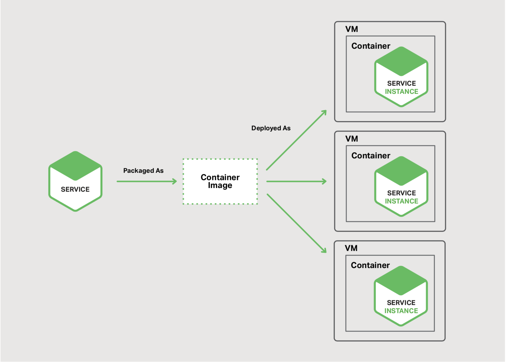

## 微服务部署方案的选择

本章节本电子书的第六章。章节一介绍了微服务架构模式，讨论了使用微服务的优缺点。接下来的章节，讨论了微服务架构图的不同方面：使用API网关，进程间通信，服务发现与事件驱动的数据管理。本章节，我们探讨微服务的部署策略。

## 动机
部署巨石应用意味着运行单个（通常是大型）应用的一个或多个相同副本。你通常提供N台服务器(物理或虚拟)，并在每个服务器上运行M个应用实例。巨石应用程序的部署并不总是那么简单，但是与微服务应用的部署相比简单的多了。

微服务应用包括十个，甚至上百个服务。服务以各种语言和框架编写。每个都是一个迷你应用程序，具有自己的特定部署，资源，伸缩和监控需求。比如，根据对该服务的需求，你需要运行每个服务的特定数量的实例。同样，必须为每个服务实例提供适当的CPU，内存和I/O资源。更具挑战性的是，尽管存在这种复杂性，但服务部署必须快速，可靠且具有成本效益。

有一些不同的微服务部署模式。首先让我们探讨单主机多服务实例模式。

### 单主机多服务实例模式
部署微服务的一个方式是使用单主机多服务实例模式。使用此模式时，你可以配置一个或多个物理或虚拟主机，并在每个主机上运行多个服务实例。该模式是很多方案中的一种传统的应用部署方案。每个服务实例都在一台或多台主机上的一个众所周知的端口上运行。主机通常像宠物一样被对待。

图6-1：该模式的结构

图6-1 主机支持多服务实例

该模式有许多变种。一种变体是每个服务实例是一个进程或一个进程组。比如，你可以将Java服务实例部署为Apache Tomcat服务器上的web应用程序。一个Node js服务实例可能包含一个父进程和一个或者多个子进程。

另一个变种是在单个进程或者进程组中运行多个服务实例。比如，你可以在同一个Apache Tomcat服务器上运行多个Java web应用，或者在同一个OSGI容器上运行多个OSGi包。

单主机多服务实例模式同时具有优点和缺点。一个主要有点是资源使用相对高效。多个服务实例共享服务器及其操作系统。如果进程或组运行多个服务实例，则效率更高，比如，多个web应用共享Apache Tomcat服务器和JVM。

此模式的另一个好处是部署服务实例的速度相对较快。你只需将服务拷贝到主机然后再启动它。如果服务是用Java编写的，则拷贝JAR或WAR文件。对于其他语言，例如Node.js或Ruby，你可以拷贝源代码。在任何一种情况下，通过网络复制的字节数相对较小。

此外，由于缺乏开销，服务动启通常非常快。如果服务运行在自己独立进程，你只需启动它。否则，如果服务是在同一容器进程或进程组中运行的多个实例之一，你要么动态的部署服务到容器中，要么重启容器。

尽管有如此吸引力，该模式仍然有一些显著的缺点。一个主要缺点是服务实例之间很少或没有隔离，除非每一个服务实例是独立的进程。虽然你可以准确地监控每个服务实例的资源利用率，但你无法限制每个实例使用的资源。行为不当的服务实例可能会占用主机的所有内存或CPU。

如果多个服务实例在同一进程中运行，则根本没有隔离。例如，所有实例可能共享相同的JVM堆。行为不当的服务实例可能很容易破坏在同一进程中运行的其他服务。此外，你无法监控每个服务实例使用的资源。

这种方法的另一个重要问题是部署服务的运维团队必须知道如何执行该操作的具体细节。服务可以用各种语言和框架编写，因此开发团队必须与运维团队共享许多细节。这种复杂性增加了部署期间出错的风险。

正如你所看到的，尽管它被大家熟悉，单主机多服务实例模式具有一些显著的缺陷。现在让我们探讨下其他的可以避免该类问题的微服务部署方案。

### 单主机单服务实例模式

部署微服务的另一个方法是[单主机单服务实例](https://microservices.io/patterns/deployment/service-per-vm.html)模式。使用此模式时，可以在其自己的主机上独立运行每个服务实例。此模式有两种不同的特殊化：单虚拟机单服务实例和单容器单服务实例。

#### 单虚拟机单服务实例模式
当你使用[单虚拟机单服务实例](https://microservices.io/patterns/deployment/service-per-vm.html)时，你将每个服务打包为虚拟机（VM）镜像，比如Amazon EC2 AMI。每一个服务实例都是使用该虚拟机镜像启动一个虚拟机（比如，EC2实例）。

图6-2：该模式的结构

图6-2 服务可以各自运行在自己的虚拟机中

这是Netflix用于部署其视频流服务的主要方法。Netflix使用[Aminator](https://github.com/Netflix/aminator)将其每项服务打包为EC2 AMI。每个运行的服务实例都是EC2实例。你可以使用各种工具来构建自己的VM。你可以配置持续集成（CI）服务器（例如，Jenkins）以调用Aminator将你的服务打包为EC2 AMI。[Packer](https://www.packer.io/)是自动创建VM镜像的另一种选择。与Aminator不同，它支持各种虚拟化技术，包括EC2，DigitalOcean，VirtualBox和VMware。

[Boxfuse](https://boxfuse.com/)公司有一种引人注目的方法来构建VM镜像，它克服了我在下面所描述的虚拟机的缺点。Boxfuse将你的Java应用程序打包为最小的VM镜像。这些镜像构建速度快，启动快，并且由于它们暴露有限的攻击面而更安全。

[CloudNative](https://cloudnative.io/)公司拥有Bakery，这是一个用于创建EC2 AMI的SaaS产品。在微服务通过测试后，可以配置CI服务器调用Bakery。然后，Bakery将服务打包为AMI。使用Bakery等SaaS产品意味着你不必浪费宝贵的时间来设置创建AMI的基础架构。

单虚拟机单服务实例有众多优点。VM的主要优点是每个服务实例都完全隔离运行。它具有固定数量的CPU和内存，不能从其他服务中窃取资源。

将微服务部署为虚拟机的另一个好处是可以利用成熟的云基础架构。诸如AWS之类的云提供了有用的特性，比如负载平衡和弹性伸缩。将服务部署为VM的另一个好处是它封装了服务的实现技术。一旦服务被打包为VM，它就变成了黑盒子。VM的管理API成为部署服务的API。部署会变得简单与可靠的多。

但是，单虚拟机单服务实例也有一些缺点。一个缺点是资源利用效率较低。每个服务实例都有整个VM的开销，包括操作系统。此外，在有代表性的公共IaaS中，VM具有固定的大小，并且VM可能未充分利用。

此外，公共IaaS通常对vm的收费，是无论vm是繁忙的还是空闲的。IaaS，比如AWS提供了弹性伸缩，但是很难对需求的变化做出[快速反应](http://techblog.netflix.com/2013/11/scryer-netflixs-predictive-auto-scaling.html)。最终，你最终不得不过度提供VM，这会增加部署成本。

这种方法的另一个缺点是部署新版本的服务通常很慢。VM镜像通常由于其庞大而构建缓慢。同样，还是用于太过庞大，VM通常实例化过程缓慢。而且，操作系统通常需要一些时间来启动。但请注意，这并非普遍适用，因为存在Boxfuse构建的轻量级VM。

该模式的另一个缺点是你（或者你组织中的其他成员）要负责许多无差别的繁重工作。除非你使用像Boxfuse这样的工具来处理构建和管理VM的开销，否则这是你的责任。这项必要但耗时的活动会分散核心业务。

现在让我们看一下部署微服务的另一种方案，这种方法更轻巧，但仍具有VM的许多优点。

#### 单容器单服务实例模式
当你使用[单容器单服务实例模式](https://microservices.io/patterns/deployment/service-per-container.html)时，每一个服务运行在它自己的容器中。容器是[操作系统级别的虚拟化机制](https://en.wikipedia.org/wiki/Operating-system-level_virtualization)。容器由在沙箱中运行的一个或多个进程组成。从进程的角度来看，它们有自己的端口，命名空间和根文件系统。你可以限制容器的内存和CPU资源。某些容器实现也具有I/O速率限制。容器技术的示例包括[Docker](https://www.docker.com/)和[Solaris Zones](https://en.wikipedia.org/wiki/Solaris_Containers)。

图6-3 改模式的结构

图6-2 服务可以各自运行在自己的容器中

要使用此模式，请将服务打包为容器镜像。容器镜像是一个文件系统镜像，由运行服务所需的应用程序和库组成。一些容器镜像由完整的Linux根文件系统组成。其他更轻量。例如，要部署Java服务，你需要构建一个包含Java运行时（可能是Apache Tomcat服务器）和已编译的Java应用程序的容器镜像。

将服务打包为容器镜像后，即可启动一个或多个容器。你通常在每个物理或虚拟主机上运行多个容器。你可以使用集群管理器（如Kubernetes或Marathon）来管理容器。集群管理器将主机视为资源池。它根据容器所需的资源和每个主机上可用的资源决定每个容器的放置位置。

该模式也同时拥有优点与缺点。容器的好处类似于VM的。它们将服务实例彼此隔离。你可以轻松监视每个容器所消耗的资源。同样，类似于VMs，容器封装了用于实现服务的技术。容器管理API也还可用作管理服务的API。

但是，与VM不同，容器是一种轻量级技术。容器镜像的构建通常非常迅速。比如，在我的笔记本电脑上，只需5秒即可将Spring Boot应用程序打包为Docker容器。容器也很快启动，因为没有冗长的操作系统启动机制。当容器启动时，运行的是服务。

使用容器也有一些缺点。虽然容器基础设施正在快速成熟，但它并不像虚拟机的基础设施那样成熟。此外，容器不如VM安全，因为容器彼此共享主机OS的内核。

容器的另一个缺点是，你负责容器镜像管理的无差别的繁重负担。此外，除非你使用托管容器解决方案（如Google容器引擎或Amazon EC2容器服务（ECS）），否则你必须管理容器基础架构以及它所可能运行于的VM基础架构。

同样，容器通常部署在每一个虚拟机单独定价的架构上。因此，正如之前所描述的那样，你可能需要承担过度配置VM的额外成本，以便处理负载峰值。

有趣的是，容器和虚拟机之间的区别可能会模糊。如前所述，Boxfuse VM的构建和启动速度很快。Clear Containers项目旨在创建轻量级VM。人们对[unikernels](https://en.wikipedia.org/wiki/Unikernel)的兴趣也在不断增长。Docker，Inc于2016年初收购了Unikernel Systems。

还有一种更新且越来越流行的无服务器部署概念，回避了将服务部署在容器或者VM之间的问题。让我们在下一节中讨论。

### 无服务器部署

[AWS Lambda](https://aws.amazon.com/lambda/)是无服务器部署技术的一个示例。它支持Java，Node.js和Python服务。要部署微服务，将其打包为ZIP文件并将其上传到AWS Lambda。你还提供元数据，其中包括为处理请求（例如，事件）而调用的函数的名称。AWS Lambda自动运行足够多的微服务实例来处理请求。你只需根据所花费的时间和消耗的内存为每个请求付费。当然，问题隐藏在细节内，你很快就会看到AWS Lambda有局限性。但是，无论是开发人员还是组织中的任何人，都不需要担心服务器，虚拟机或容器的任何方面，这一点令人难以置信。

Lambda函数是无状态服务。它通常通过调用AWS服务来处理请求。将图像上传到S3 bucket时会触发Lambda函数，然后Lambda函数在DynamoDB images表中插入一项，并将消息发布到Kinesis流以触发图像处理。Lambda函数还可以调用第三方Web服务。

有四种方法可以调用Lambda函数：
- 直接调用，使用web服务请求
- 自动地，响应AWS服务，比如S3,DynamoDB, Kinesis, 或者Simple Email Service
- 自动地，通过AWS API Gateway处理来至于应用客户端的请求
- 定期地，根据类似cron的时间表
  
如你所见，AWS Lambda是部署微服务的便捷方式。基于请求的定价意味着你只需为服务实际处理的任务而付费。此外，由于你不负责IT基础架构，因此你可以专注于开发应用。

但是，有一些重大的局限性。Lambda函数不打算用于部署长时间运行的服务，例如从第三方消息中间件消费消息的服务。请求必须在300秒内完成。服务必须是无状态的，因为理论上AWS Lambda可能为每个请求运行单独的实例。服务必须由一种被支持的语言编写。服务也必须迅速启动; 否则，他们可能会被超时并被终止。

## 总结
部署微服务应用具有挑战性。你可能拥有使用各种语言和框架编写的数十甚至数百种服务。每个都是一个迷你应用程序，具有自己的特定部署，资源，扩展和监控要求。有几种微服务部署模式，包括单虚拟机单服务实例，单容器单服务实例。另一个用于部署微服务的有趣选择是AWS Lambda，一种无服务器方法。在本电子书的下一章，也是最后一章中，我们将介绍如何将巨石应用迁移到微服务架构。
