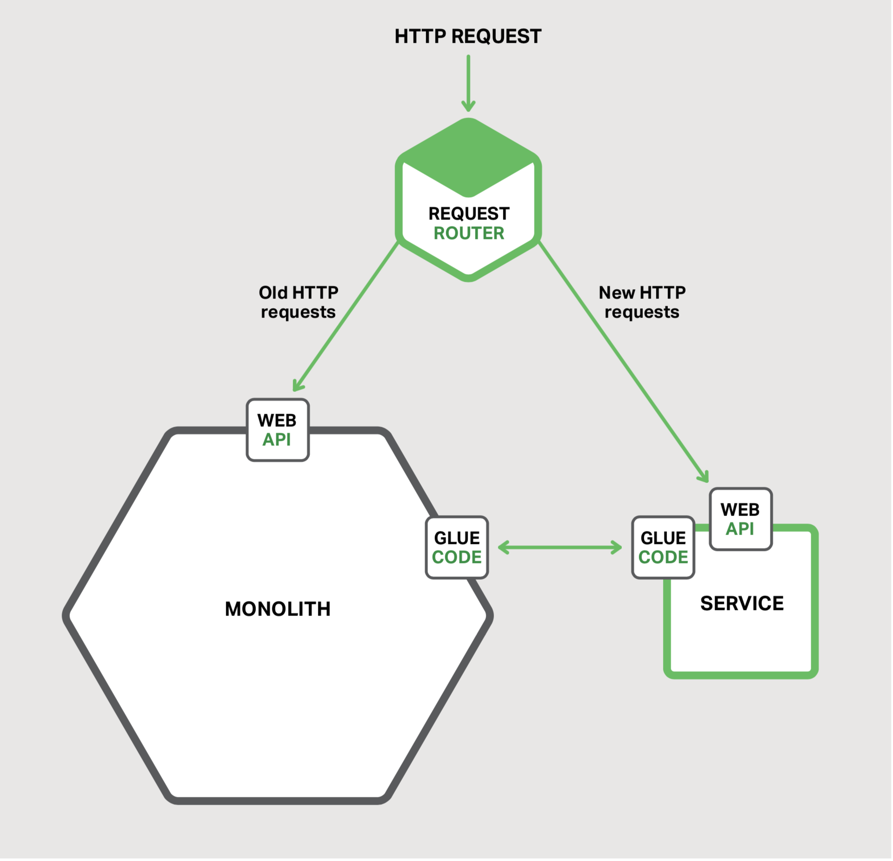
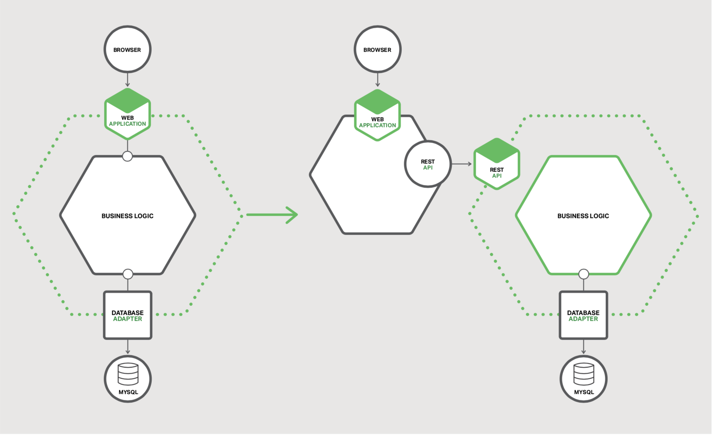
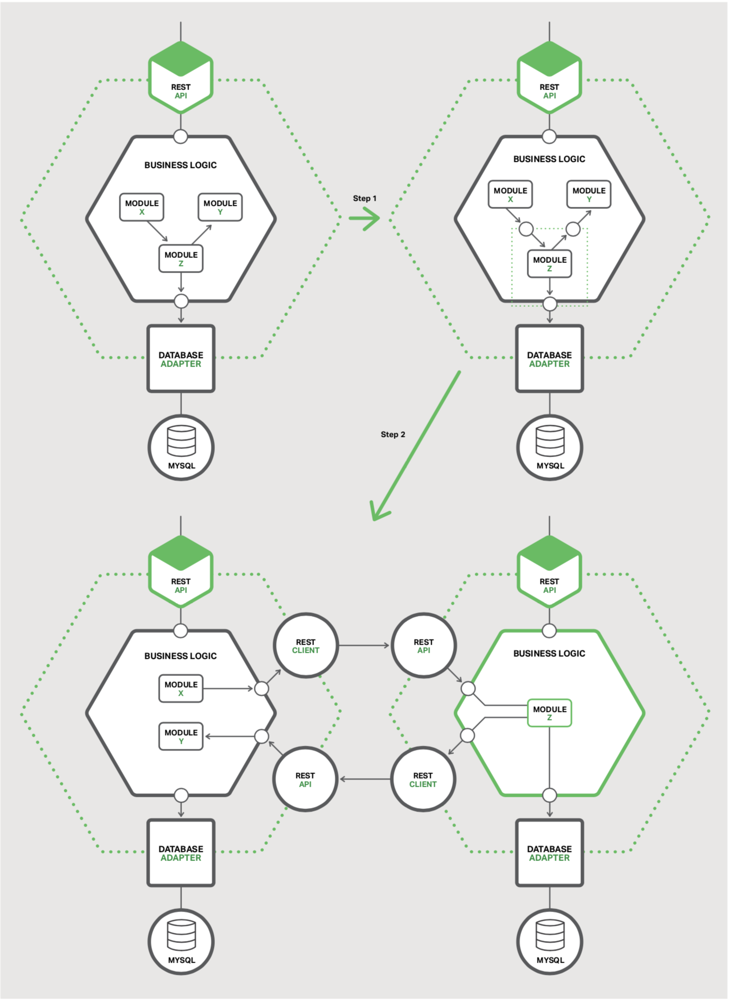

## 重构巨石应用至服务

本章节本电子书的第七章。章节一介绍了微服务架构模式，讨论了使用微服务的优缺点。接下来的章节，讨论了微服务架构图的不同方面：使用API网关，进程间通信，服务发现，事件驱动的数据管理和微服务部署。本章节我们将讨论将巨石应用迁移到微服务的策略方案。

我希望这本电子书能让你充分了解微服务架构，它的优点和缺点，以及何时使用它。也许微服务架构非常适合你的组织。

但是，你很可能正在处理一个大型的、复杂的巨石应用。你每天对开发与部署巨石应用的体验是缓慢与痛苦。微服务看起来是遥不可及的天堂。幸运的是，有一些策略可以用来摆脱巨石的地狱。在本篇中，我将会描述如何循序渐进的将巨石应用重构成一组微服务。

### 微服务重构概述

将巨石应用程序重构成微服务的过程是[应用程序现代化](https://en.wikipedia.org/wiki/Software_modernization)的一种形式。这是开发人员几十年来一直在做的事情。因此，在将应用程序重构为微服务时，我们可以重用一些思想。

一种不应该使用的策略是“大爆炸（Big Bang）”重写。这就是当你将所有开发工作集中在从头开始构建基于微服务的新应用程序的时候。虽然听起来很吸引人，但它风险极大，很可能以失败而告终。正如Martin Fowler所[报道](http://www.randyshoup.com/evolutionary-architecture)的那样，“大爆炸重写保证的唯一一件事就是大爆炸!”

你应该循序渐进的重构巨石应用，而不是大爆炸重写。以微服务的形式逐步添加新功能与创建现有功能的扩展 - 以互补的方式修改巨石程序，并同时运行微服务和修改后的巨石应用。随着时间的推移，巨石应用实现的功能数量逐渐缩小，直到它完全消失或者变成另一个微服务。这种策略类似于在汽车在高速公路上以每小时70英里的速度行驶的同时维修汽车 - 具有挑战性，但风险远低于尝试大爆炸重写。

Martin Fowler将这种应用程序现代化策略称为[Strangler应用](http://www.martinfowler.com/bliki/StranglerApplication.html)。这个名字来自在热带雨林中发现的绞杀藤（亦称 绞杀榕）。绞杀藤围绕着树成长，为了能吸收森林树冠上的阳光。有时，树死了，留下了树形藤蔓。应用程序现代化遵循相同的模式。我们将围绕遗留应用构建一个由微服务组成的新应用，遗留应用程序将会收缩，甚至最终死亡。

让我们讨论下完成该重构的不同策略。

#### 策略一：停止挖掘
洞穴定律说，只要你在洞里，就应该停止挖掘。当巨石应用变得无法管理时，这是一个很好且应该被遵循的建议。换句话说，你应该停止让巨石应用变的更大。这意味着在实现新功能时，不应向巨石应用添加更多代码。相反，这个策略的主要思想是将新代码放在一个独立的微服务中。

图7-1 使用该方案后的系统架构

图7-1 以单独服务的形式实现新功能，而不是将模块添加到巨石应用

除了新服务和传统巨石应用之外，还有另外两个组件。第一个是请求路由器，它处理进来的（HTTP）的请求，类似于在章节二中所描述的API网关。路由器将对应于新功能的请求发送到新服务，将遗留请求路由到巨石应用。

另一个组件是胶水代码，它将服务与巨石应用结合在一起。服务很少能孤立存在，并且通常需要访问巨石应用所拥有的数据。胶水代码，要么存在于巨石应用，服务或两者中，负责数据集成。服务使用胶水代码来读取和写入巨石应用所拥有的数据。

服务可以使用三种策略来访问巨石应用的数据：
- 调用巨石应用提供的远程API
- 直接访问巨石应用的数据库
- 维护自己的数据副本，该数据与巨石应用的数据库同步

胶水代码有时被称为反腐败层，这是因为胶水代码阻止了具有其自己的原始域模型的服务被传统巨石的域模型中的概念污染。胶水代码在两种不同的模型之间进行转换。反腐败层一词首先出现在Eric Evans的必读书“[领域驱动设计](http://www.amazon.com/Domain-Driven-Design-Tackling-Complexity-Software/dp/0321125215/ref=sr_1_1?ie=UTF8&s=books&qid=1238687848&sr=8-1)”中，然后在[白皮书](https://docs.scala-lang.org/overviews/core/futures.html)中进行了细化。制定反腐败层可能是一件非常重要的事情。但是如果你想要从巨石应用的地狱中走出来，那么创造一个是至关重要的。

将新功能实现为轻量级服务有几个好处。它可以防止巨石应用变得更难以管理。该服务可以独立于巨石应用进行开发，部署和扩展。你可以体验微服务架构为你创建的每项新服务带来的好处。

但是，这种方法无法解决巨石应用的问题。要解决这些问题，你需要打破巨石。让我们来看看这样做的策略。

#### 策略二：拆分前端与后端

缩小巨石应用的一个策略是将表示层从业务逻辑层和数据访问层中分开。典型的企业应用包含至少三种不同类型的组件：
- 表示层 - 处理HTTP请求，并实现（REST）API或基于HTML的Web UI的组件。在具有复杂用户界面的应用程序中，表示层通常有大量代码。
- 业务逻辑层 - 应用的核心组成部分，实现业务规则
- 数据访问层 - 访问基础设施组件，例如数据库和消息代理

在表示层与业务逻辑层和数据访问层之间存在清晰的分离。业务层具有粗粒度API，其由一个或多个模式组成，其封装业务逻辑组件。API是一个天然缝隙，你可以沿着该缝隙将巨石应用分割为两个较小的应用程序。一个应用包含表示层。另一个应用程序包含业务和数据访问逻辑。分割后，表示层逻辑应用对业务层逻辑应用进行远程调用。

图7-2 重构前后的架构

图7-2 重构现有应用

以这种方式拆分巨石应用有两个主要好处。你能够独立地开发，部署和扩展这两个应用程序。特别是，它允许表示层开发人员在用户界面上快速迭代并轻松执行A|B测试。这种方法的另一个好处是它暴露了一个可以被你开发的微服务所调用的远程API。

然而，这种策略只是部分解决方案。这两个应用程序中的一个或两个很可能将会成为一个难以管理的巨石应用。你需要使用第三个策略来消除剩余的巨石应用。

#### 策略三：提取服务

第三种重构策略是将巨石应用内的现有模块转变为独立的微服务。每次提取模块并将其转换为服务时，巨石应用都会缩小。一旦你转换了足够的模块，巨石应用将不再是一个问题。它要么完全消失，要么变得足够小以至于它只是另一个服务。

##### 为需要转换为服务的模块确定优先级

一个庞大而复杂的单片应用程序由数十个或数百个模块组成，所有这些模块都是提取的候选模块。确定首先转换哪些模块通常具有挑战性。一个好的方法是从一些易于提取的模块开始。这将为你从整体上提供微服务经验，特别是提取过程。之后，你应该提取那些可以带来最大益处的模块。

将模块转换为服务通常很耗时。你应该按照获得的好处对模块进行排名。提取经常变化的模块通常是有益的。一旦将模块转换为服务后，你可以独立于巨石应用进行开发和部署，这将加速开发。

提取与巨石应用中其它模块相比有明显不同资源需求的模块是有益的。例如，将具有内存数据库的模块转换为服务是有用的，可以将其部署在具有大量内存的主机上，无论是物理服务器，虚拟机还是云实例。类似地，提取实现计算昂贵算法的模块是值得的，因为该服务可以部署在具有大量CPU的主机上。通过将具有特定资源需求的模块转换为服务，你可以使应用程序更容易伸缩，并且成本更低。

在确定要提取哪些模块时，查找现有的粗粒度边界（缝隙）很有用，它们使模块转换为服务变得更容易，成本更低。比如，有个模块，它只能通过异步消息与应用的其余部分进行通信，可以以相对较低的成本与难易度将该模块转换为微服务。

##### 如何提取模块
提取模块的第一步是在模块和巨石应用之间定义粗粒度接口，通常是一个双向API，由于巨石应用需要服务拥有的数据，反之亦然。由于模块与应用其余部分之间存在复杂的依赖关系和细粒度的交互模式，因此实现此类API通常具有挑战性。由于域模型和类之间存在大量关联，因此使用域模型模式实现的业务逻辑对于重构尤其具有挑战性。你通常需要进行显著的代码更改以打破这些依赖关系。

图7-3 重构

图7-3 巨石应用中的模块可以成为微服务

实现粗粒度接口后，即可将模块转换为独立服务。为此，你必须编写代码以使巨石应用和服务能够通过使用进程间通信（IPC）机制的API进行通信。图7-3展示了重构前，中与后的架构。

在此示例中，模块Z是要提取的候选模块。它的组件被模块X使用，同时使用模块Y。重构步骤第一步是定义一对粗粒度的API。第一个接口是入站接口，模块X使用它来调用模块Z。第二个接口是模块Z用于调用模块Y的出站接口。

重构步骤第二步将模块转换为独立服务。入站和出站接口由使用IPC机制的代码实现。你很可能需要通过将模块Z与处理横切关注点(如服务发现)的微服务底盘框架相结合来构建服务。

一旦提取了一个模块，就又有了一个可以独立于巨石应用与其它服务而进行开发，部署与扩展的服务。你甚至可以从头开始重写服务; 在这种情况下，将服务与巨石应用集成的API代码成为一个反腐败层，可在两个域模型之间进行转换。每次提取服务时，你都会朝着微服务的方向迈出新的一步。随着时间的推移，整体结构将缩小，你将拥有越来越多的微服务。

## 总结

将现有应用程序迁移到微服务的过程是应用程序现代化的一种形式。不应该通过从头开始重写应用以转移到微服务。相反，应该逐步将应用程序重构为一组微服务。可以使用三种策略：将新功能实现为微服务; 从业务和数据访问组件中拆分表示组件; 将巨石应用中的现有模块转换为服务。随着时间的推移，微服务的数量将会增长，开发团队的敏捷性和速度将会提高。